.. _vcgit:

*************************
Versionskontrolle mit Git
*************************

==============
Vorbemerkungen
==============

Bei der Entwicklung von Programmen ist es sinnvoll, ein Versionskontrollsystem
zu verwenden, das es erlaubt, alte Programmversionen systematisch aufzubewahren.
Damit wird es beispielsweise möglich, auf definierte ältere Programmstände
zurückzugehen. Es kann auch sinnvoll sein, die Versionsnummer in vom Programm
erzeugten Daten abzuspeichern. Sollte sich später herausstellen, dass ein
Programm fehlerhaft war, lässt sich auf diese Weise entscheiden, ob Daten von
diesem Fehler betroffen sind oder nicht. 

Das erste Versionskontrollsystem war das 1972 entwickelte SCCS. Später folgten
Systeme wie RCS, CVS, Subversion, Git und Mercurial. Bei den aktuellen
Versionskontrollsysteme lassen sich zwei Arten unterscheiden, solche die
die Programmversionen zentral auf einem Server speichern und solche, bei denen
die Programmversionen auf verschiedenen Rechnern verteilt vorliegen können. 
Die zweite Variante schließt den Fall mit ein, bei dem die Programmversionen
ausschließlich lokal auf einem Rechner vorgehalten werden. Während bei einem
zentralen Versionskontrollsystem eine Internetverbindung zum Server zwingend
notwendig ist, lassen sich bei einem dezentralen Versionskontrollsystem
Versionierungen auch ohne Internetanbindung vornehmen.  

Ein Beispiel für ein modernes zentrales Versionskontrollsystem ist Subversion,
während es sich bei Git und Mercurial um dezentrale Versionskontrollsysteme
handelt. Obwohl Mercurial in Python geschrieben ist, wollen wir uns im Folgenden
mit Git beschäftigen, das sich bei der Entwicklung freier Software großer
Beliebtheit erfreut. Auch wenn es im Detail Unterschiede zwischen Mercurial
und Git gibt, sind die beiden Versionskontrollsysteme einander sehr ähnlich.

Die Entwicklung von Git [#git]_ wurde 2005 von Linus Torvalds begonnen, um ein
geeignetes Versionskontrollsystem zur Entwicklung des Betriebssystemkerns von
Linux zur Verfügung zu haben. Die Anforderungen ergaben sich vor allem daraus,
dass Linux von einer sehr großen Zahl von Programmierern entwickelt wird, und
somit die Übertragung von Code möglichst effizient, aber auch sicher vonstatten
gehen muss. Im Hinblick auf den ersten Aspekt ist ein dezentrales System
wesentlich besser geeignet als ein zentrales System. Detaillierte Informationen
über Git findet man im Internet unter `git-scm.com <http://git-scm.com/>`_ im
`Dokumentationsbereich <http://git-scm.com/documentation>`_.

============================
Grundlegende Arbeitsschritte
============================

Um für ein Verzeichnis sowie die darunterliegenden Verzeichnisse eine
Versionierung zu ermöglichen, muss man zunächst die von Git benötigte
Verzeichnisstruktur einrichten. Wir nehmen an, dass in unserem
Benutzerverzeichnis, hier ``/home/gert``, ein Verzeichnis ``wd`` für »working
directory« existiert, in dem wir unsere Programmentwicklung durchführen wollen.
Dieses Verzeichnis kann im Prinzip jeden beliebigen geeigneten Namen haben. Wir
gehen zunächst in dieses Verzeichnis und initialisieren es für die Benutzung
mit Git::

   $ cd ~/wd
   $ git init
   Initialisierte leeres Git-Repository in /home/gert/wd/.git/

Im Unterverzeichnis ``.git`` werden alle relevanten Daten des Archivs liegen. So
lange dieses Verzeichnis nicht modifiziert wird, was man ohnehin nicht tun
sollte, oder gar gelöscht wird, sind die dort abgelegten Daten und damit alle
Versionen noch verfügbar auch wenn alle anderen Dateien im Arbeitsverzeichnis
gelöscht wurden.

Zu diesem Zeitpunkt ist es sinnvoll, Git auch den vollständigen Namen des
Benutzers und eine zugehörige E-Mail-Adresse mitzuteilen::

   $ git config --global user.name "Gert-Ludwig Ingold"
   $ git config --global user.email "gert.ingold@physik.uni-augsburg.de"

Diese Informationen legt Git im Hauptverzeichnis des Benutzers in der Datei
``.gitconfig`` ab und verwendet sie bei der Übernahme von Dateien in das
Versionsarchiv. Lässt man die Option ``--global`` weg, so wird die Information
im lokalen Git-Verzeichnis abgelegt und gilt auch nur dort.

Bei Bedarf lassen sich noch weitere Parameter einstellen, beispielsweise der
Editor, den Git aufrufen soll, um dem Benutzer beim Abspeichern einer neuen
Version die Möglichkeit zu geben, einen Kommentar abzuspeichern. Da es immer
wieder vorkommt, dass defaultmäßig ein Editor verwendet wird, mit dessen
Bedienung man nicht vertraut ist, empfiehlt es sich, die gewünschte Einstellung
vorzunehmen, zum Beispiel ::

   $ git config --global core.editor vim

wenn man den Editor ``vim`` benutzen möchte.

Um das Arbeiten mit Git zu illustrieren, legen wir anschließend eine erste
Version eines Skripts ``hello.py`` mit folgendem Inhalt

.. code-block:: python

   print('Hello world')

in unserem Verzeichnis an. Nun, aber auch zu jeder anderen Zeit, kann man
den Zustand des Arbeitsverzeichnisses abfragen::

   $ git status
   Auf Branch master

   Initialer Commit

   Unbeobachtete Dateien:
     (benutzen Sie "git add <Datei>...", um die Änderungen zum Commit vorzumerken)

           hello.py

   nichts zum Commit vorgemerkt, aber es gibt unbeobachtete Dateien (benutzen Sie
   "git add" zum Beobachten)

Git gibt hier eine ganze Menge an Informationen einschließlich eines Vorschlags, was wir als
Nächstes tun könnten. Doch gehen wir der Reihe nach vor. Wir befinden uns laut der ersten
Zeile der Statusausgabe auf dem ``master``-Zweig. Weiter unten werden wir sehen, dass wir
unter Git weitere Zweige anlegen können, in denen wir beispielsweise bestimmte Aspekte eines
Programms weiterentwickeln wollen. Solche Zweige können später auch wieder zusammengeführt
werden. Ferner weist uns Git darauf hin, dass noch keine Dateien versioniert wurden. Dem
unteren Teil der Ausgabe können wir entnehmen, dass die Versionierung in zwei Stufen vor
sich geht und es demzufolge zwei verschiedene Arten von Dateien gibt.

Git hat sehr wohl bemerkt, dass es eine neue Datei ``hello.py`` gibt, beachtet diese jedoch
zunächst nicht weiter. Es wird aber am Ende darauf hingewiesen, dass sich Dateien mit
Hilfe von ``git add`` für einen *commit*, also eine Versionierung, vormerken lassen.
Diese Dateien werden dabei in eine so genannte *staging area* gebracht. Wir führen diesen
Schritt nun aus und sehen uns den neuen Status an::

  $ git add hello.py
  $ git status
  Auf Branch master

  Initialer Commit

  zum Commit vorgemerkte Änderungen:
    (benutzen Sie "git rm --cached <Datei>..." zum Entfernen aus der Staging-Area)

          neue Datei:     hello.py

Damit ist unsere Datei nun für einen *commit* vorgemerkt. Gleichzeitig gibt uns Git einen
Hinweis, wie wir die Datei wieder aus der *staging area* entfernen können, falls wir doch
keine Versionierung durchführen möchten. Bevor wir mit einem *commit* fortfahren, wollen
wir zunächst erkunden, was es damit auf sich hat, wenn eine Datei in die *staging
area* gebracht wird. Dazu sehen wir uns etwas im ``.git``-Unterverzeichnis um::

   $ ls .git
   branches  config  description  HEAD  hooks  index  info  objects  refs
   $ ls .git/objects
   75  info  pack
   $ ls .git/objects/75
   d9766db981cf4e8c59be50ff01e574581d43fc

Im Unterverzeichnis ``.git/objects/75`` liegt nun eine Datei mit der etwas
merkwürdigen Bezeichnung ``d9766db981cf4e8c59be50ff01e574581d43fc``. Stellt man
noch die ``75`` aus dem Verzeichnisnamen voran, so handelt es sich hierbei um
den so genannten SHA1-Hashwert [#sha1]_ des Objekts, wie wir folgendermaßen
überprüfen können [#so552659]_:

.. code-block:: python

   from hashlib import sha1
   def githash(data):
       s = sha1()
       s.update(("blob %u\0" % len(data)).encode('utf8'))
       s.update(data)
       return s.hexdigest()

   content = "print('hello world')\n"
   print(githash(content))

SHA1-Hashwerte bestehen aus 40 Hexadezimalzahlen und charakterisieren den
Inhalt eines Objekts eindeutig. Immerhin gibt es etwa :math:`10^{48}`
verschiedene Hashwerte. Git benutzt diesen Hashwert, um schnell Objekte
identifizieren und auf Gleichheit testen zu können.  Meistens genügen die
ersten sechs oder sieben Hexadezimalzahlen, um ein Objekt eindeutig
auszuwählen. Wir können uns den Inhalt des erzeugten Objekts mit Hilfe von Git
folgendermaßen ansehen::

   $ git cat-file -p 75d9766
   print('hello world')

Gemäß der obigen Statusanzeige müssen wir in einem zweiten Schritt noch einen *commit*
ausführen::

   $ git commit -m "ein erstes Skript"
   [master (Basis-Commit) f442b34] ein erstes Skript
    1 file changed, 1 insertion(+)
     create mode 100644 hello.py

Mit Hilfe des Arguments ``-m`` haben wir noch einen Kommentar angegeben. Ohne dieses
Argument hätte Git einen Editor geöffnet, um die Eingabe eines Kommentars zu ermöglichen.
Es empfiehlt sich im Hinblick auf die Übersichtlichkeit von späteren längeren Ausgaben,
Kommentare auf nicht zu lange Einzeiler zu beschränken.

Was hat sich durch den *commit* im Verzeichnis der Objekte getan? Wir stellen fest,
dass unser altes Objekt noch vorhanden ist und zwei Objekte hinzugekommen sind::

   $ ls -R .git/objects
   .git/objects:
   75  ed  f4  info  pack

   .git/objects/75:
   d9766db981cf4e8c59be50ff01e574581d43fc

   .git/objects/ed:
   868ae92a213b64de2ad627b27458537539bcdc

   .git/objects/f4:
   42b34f6400811648a3c94a8ddd5bfb417e1cf5

   .git/objects/info:

   .git/objects/pack:

Sehen wir uns die neuen Objekte an::

   $ git cat-file -p f442b34
   tree ed868ae92a213b64de2ad627b27458537539bcdc
   author Gert-Ludwig Ingold <gert.ingold@physik.uni-augsburg.de> 1420469345 +0100
   committer Gert-Ludwig Ingold <gert.ingold@physik.uni-augsburg.de> 1420469345 +0100

   ein erstes Skript
   $ git cat-file -p ed868ae
   100644 blob 75d9766db981cf4e8c59be50ff01e574581d43fc    hello.py

Bei dem ersten Objekt handelt es sich um ein so genanntes *commit*-Objekt, das neben
den Angaben zur Person und dem Kommentar einen Verweis auf ein *tree*-Objekt enthält.
Das zweite neue Objekt ist genau dieses *tree*-Objekt. Es enthält Informationen über
die Objekte, die zu dem betreffenden *commit* gehören. In unserem Fall ist dies das
uns bereits bekannte *blob*-Objekt, das den Inhalt unseres Skripts ``hello.py`` enthält.

Nun ist es Zeit, unser Skript zu überarbeiten. Im Wort »hello« ersetzen wir das kleine
``h`` durch ein großes ``H``. Git meldet dann den folgenden Status::

   $ git status
   Auf Branch master
   Änderungen, die nicht zum Commit vorgemerkt sind:
     (benutzen Sie "git add <Datei>...", um die Änderungen zum Commit vorzumerken)
     (benutzen Sie "git checkout -- <Datei>...", um die Änderungen im Arbeitsverzeichnis
      zu verwerfen)

           geändert:       hello.py

   keine Änderungen zum Commit vorgemerkt (benutzen Sie "git add" und/oder
                                           "git commit -a")

Git hat erkannt, dass wir unser Skript modifiziert haben, führt aber keinerlei
Schritte im Hinblick auf eine Versionierung aus. Diese sind uns überlassen, wobei
uns Git wieder Hilfestellung gibt. Nehmen wir an, dass wir die Änderungen wieder
rückgängig machen wollen. Dies geht wie folgt::

   $ git checkout -- hello.py
   $ git status
   Auf Branch master
   nichts zu committen, Arbeitsverzeichnis unverändert
   $ cat hello.py
   print('hello world')

Tatsächlich liegt jetzt wieder die ursprüngliche Fassung des Skripts vor. Da
wir die neue Fassung nicht zur *staging area* hinzugefügt haben, sind unsere
Änderungen verloren gegangen. Sie können somit nicht wiederhergestellt werden,
wie dies bei einer erfolgten Versionierung der Fall gewesen wäre. Man sollte
daher mit dem beschriebenen Vorgehen besonders vorsichtig sein.

Wir wiederholen nun zur Wiederherstellung der geänderten Version die Umwandlung
des ``h`` in einen Großbuchstaben. Anschließend könnten wir wieder die beiden
Schritte ``git add hello.py`` und ``git commit`` ausführen. Alternativ lässt
sich dies in unserem Fall in einem einzigen Schritt bewältigen::

   $ git commit -a -m "fange mit Großbuchstabe an"
   [master 79ff614] fange mit Großbuchstabe an
    1 file changed, 1 insertion(+), 1 deletion(-)

Zu beachten ist dabei allerdings, dass auf diese Weise alle Dateien, von denen
Git weiß, dem *commit* unterzogen werden auch wenn dies vielleicht nicht
gewünscht ist. Es ist daher oft sinnvoll, zunächst explizit mit ``git add`` die
Dateien für einen *commit* festzulegen. Damit lassen sich gezielt thematisch
zusammenhängende Änderungen auswählen.

Während der Hashwert des ersten *commit*-Objekts mit ``f442b34`` begann, fängt
der Hashwert des neuesten *commit*-Objekts mit ``79ff614`` an. Git bezieht sich
auf Versionen mit Hilfe dieser Hashwerte und nicht mit zeitlich ansteigenden
Versionsnummern. Letzteres ist für ein dezentral organisiertes
Versionskontrollsystem nicht möglich, da im Allgemeinen nicht bekannt sein
kann, ob andere Entwickler in der Zwischenzeit Änderungen am gleichen Projekt
durchgeführt haben.

Einen Überblick über die verschiedenen vorhandenen Versionen kann man sich
folgendermaßen verschaffen::

   $ git log
   commit 79ff6141783ca76a5424271d2cede769ff45fb28
   Author: Gert-Ludwig Ingold <gert.ingold@physik.uni-augsburg.de>
   Date:   Mon Jan 5 16:30:22 2015 +0100

       fange mit Großbuchstabe an

   commit f442b34f6400811648a3c94a8ddd5bfb417e1cf5
   Author: Gert-Ludwig Ingold <gert.ingold@physik.uni-augsburg.de>
   Date:   Mon Jan 5 15:49:05 2015 +0100

       ein erstes Skript

Die Ausgabe kann mit Optionen sehr detailliert beeinflusst werden. Wir geben
hier nur ein Beispiel::

   $ git log --pretty=oneline
   79ff6141783ca76a5424271d2cede769ff45fb28 fange mit Großbuchstabe an
   f442b34f6400811648a3c94a8ddd5bfb417e1cf5 ein erstes Skript

Diese einzeilige Ausgabe funktioniert dann besonders gut, wenn man sich wie
weiter oben bereits empfohlen bei der Beschreibung der Version auf eine
einzige, möglichst informative Zeile beschränkt. Informationen über weitere
Optionen von Git-Befehlen erhält man grundsätzlich mit ``git help`` und der
anschließenden Angabe des gewünschten Befehls, in unserem Falle also ``git help
log``.

Details zu einer Version, im Folgenden die Version ``79ff614``, erhält man 
folgendermaßen::

   $ git show 79ff614
   commit 79ff6141783ca76a5424271d2cede769ff45fb28
   Author: Gert-Ludwig Ingold <gert.ingold@physik.uni-augsburg.de>
   Date:   Mon Jan 5 16:30:22 2015 +0100

       fange mit Großbuchstabe an

   diff --git a/hello.py b/hello.py
   index 75d9766..f7d1785 100644
   --- a/hello.py
   +++ b/hello.py
   @@ -1 +1 @@
   -print('hello world')
   +print('Hello world')

Dieser Ausgabe kann man entnehmen, dass das Objekt ``75d9766...`` in das
Objekt ``f7d1785...`` umgewandelt wurde. Aus den letzten Zeilen kann man die
Details der Änderung ersehen.

Wir hatten weiter oben darauf hingewiesen, dass man im Detail beeinflussen
kann, welche Dateien beim nächsten *commit* berücksichtigt werden. Dazu
werden die betreffenden Dateien mit einem ``git add`` in die *staging area*
aufgenommen.  In diesem Zusammenhang kann es passieren, dass man eine Datei
versehentlich zu diesem Index hinzufügt. Im folgenden Beispiel sei dies eine
Datei namens ``spam.py``::

   $ git add spam.py
   $ git status
   Auf Branch master
   zum Commit vorgemerkte Änderungen:
     (benutzen Sie "git reset HEAD <Datei>..." zum Entfernen aus der Staging-Area)

           neue Datei:     spam.py

Diese Datei lässt sich nun wie angegeben wieder aus der *staging area* entfernen::

   $ git reset HEAD spam.py
   $ git status
   Auf Branch master
   Unbeobachtete Dateien:
     (benutzen Sie "git add <Datei>...", um die Änderungen zum Commit vorzumerken)

           spam.py

   nichts zum Commit vorgemerkt, aber es gibt unbeobachtete Dateien (benutzen Sie
   "git add" zum Beobachten)

Im Arbeitsverzeichnis ist die Datei ``spam.py`` weiterhin vorhanden. Im ``reset``-Befehl
verweist ``HEAD`` hier auf die Arbeitsversion im aktuellen Zweig, deren Hashwert
wir somit nicht explizit kennen müssen.

=============================
Verzweigen und Zusammenführen
=============================

Bei der Entwicklung von Software ist es häufig sinnvoll, gewisse
Weiterentwicklungen vom Hauptentwicklungsstrang zumindest zeitweise
abzukoppeln. Dies erreicht man durch Verzweigungen. Ein typischer Fall wäre ein
öffentliches Release, das im Hauptzweig zum nächsten Release weiterentwickelt
wird. Daneben kann es aber noch einen Zweig geben, in dem ausschließlich Fehler
des Releases korrigiert und dann wieder veröffentlicht werden. In einem anderen
Szenario behinhaltet der Hauptzweig, der in Git unter dem Namen *master* läuft,
immer eine lauffähige Version, während zur Entwicklung gewisser Programmaspekte
separate Zweige benutzt werden. Um ein auf diese Weise entwickeltes Feature in
die Version des Hauptzweiges einfließen zu lassen, muss man Zweige auch wieder
zusammenführen können. Das Verzweigen und Zusammenführen geht in Git sehr
einfach, da lediglich Markierungen gesetzt werden. Daher gehört das Verzweigen
und Zusammenführen bei der Arbeit mit Git zu den Standardverfahren, die
regelmäßig zum Einsatz kommen.

Zu Beginn gibt es nur einen Zweig, der, wie wir bereits wissen, den Namen ``master``
besitzt. Im vorigen Kapitel haben wir in diesem Zweig zwei Versionen erzeugt. Eine
graphische Darstellung, die hier mit dem Git-Archive-Betrachter ``gitg`` erzeugt
wurde, sieht dann folgendermaßen aus:

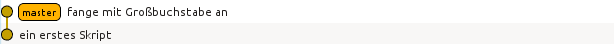

Die Information über die vorhandenen Zweige lässt sich auch direkt auf der
Kommandzeile erhalten. In der folgenden Ausgabe ist zu erkennen, dass es nur
einen Zweig, nämlich ``master`` gibt. Der Stern zeigt zudem an, dass wir uns
gerade in diesem Zweig befinden.

::

   $ git branch
   * master

Die Situation wird interessanter, wenn wir einen weiteren Zweig anlegen, der
von ``master`` abzweigt. Wir nennen ihn ``develop``, da dort die
Programmentwicklung erfolgen soll, während in ``master`` immer eine lauffähige
Version enthalten sein soll. Damit ist es unproblematisch, wenn das Programm
im ``develop``-Zweig zeitweise nicht funktionsfähig ist.
   
::

   $ git branch develop
   $ git branch
     develop
   * master

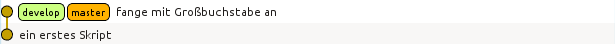
   
Der neue Zweig ``develop`` tritt zunächst nur als weitere Bezeichnung neben
``master`` in Erscheinung. Die Verzweigung wird erst später deutlich werden,
wenn wir Dateien in den jeweiligen Zweigen verändern.

Um nun in ``develop`` arbeiten zu können, müssen wir in diesen Zweig wechseln::

   $ git checkout develop
   Zu Branch 'develop' gewechselt
   $ git branch
   * develop
     master

Der Stern zeigt an, dass der Zweigwechsel tatsächlich vollzogen wurde.

Bearbeitet man nun eine Datei im ``develop``-Zweig und führt ein *commit* durch,
so wird die Trennung der beiden Zweige deutlich.

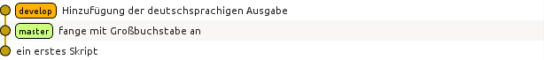

Wir wechseln nun in den ``master``-Zweig zurück und führen ein *merge*, also eine
Vereinigung von zwei Zweigen durch. Git sucht in diesem Fall nach dem gemeinsamen
Vorfahren der beiden Zweige und baut die im ``develop``-Zweig durchgeführten
Änderungen auch im ``master``-Zweig ein::

   $ git checkout master
   Zu Branch 'master' gewechselt
   $ git merge develop
   Aktualisiere 79ff614..79f695b
   Fast-forward
    hello.py | 1 +
     1 file changed, 1 insertion(+)

Da im ``master``-Zweig in der Zwischenzeit keine Änderungen vorgenommen wurden,
linearisiert Git die Vorgeschichte. Es sind aber nach wie vor beide Zweige
vorhanden.

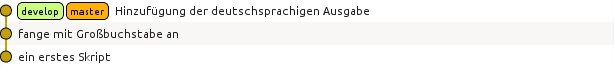

Möchte man festhalten, dass die Entwicklung im ``develop``-Zweig durchgeführt
wurde, so kann man dieses so genannte *fast forward* mit der Option ``--no-ff``
beim Zusammenführen der beiden Zweige verhindern. Um dies zu zeigen, wechseln
wir zunächst in den ``develop``-Zweig.

::

   $ git checkout develop
   Zu Branch 'develop' gewechselt

Dort führen wir die gewünschten Änderungen und einen anschließenden *commit* durch.
Nach dem Wechsel in den ``master``-Zweig benutzen wir nun beim Zusammenführen die
Option ``--no-ff``.

::

   $ git commit -a -m 'dreifache Ausgabe'
   [develop d2bfce0] dreifache Ausgabe
    1 file changed, 3 insertions(+), 2 deletions(-)
   $ git checkout master
   Zu Branch 'master' gewechselt
   $ git merge --no-ff develop
   Merge made by the 'recursive' strategy.
    hello.py | 5 +++--
    1 file changed, 3 insertions(+), 2 deletions(-)

Die folgende Abbildung zeigt, dass die Versionsgeschichte jetzt den Zweig darstellt,
in dem die Änderung tatsächlich erfolgte.

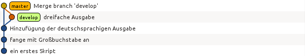

Genauso wie man Änderungen aus dem ``develop``-Zweig in den ``master``-Zweig übernehmen
kann, kann man auch Änderungen vom ``master``-Zweig in den ``develop``-Zweig übernehmen.
Eine typische Situation besteht darin, dass im ``master``-Zweig ein Fehler korrigiert
wird, der auch in der Entwicklungsversion vorliegt. Zunächst nehmen wir an, dass im
``develop``-Zweig weiter gearbeitet wird. Im ``master``-Zweig wird der Fehler korrigiert,
so dass jetzt in beiden Zweigen Änderungen vorliegen.

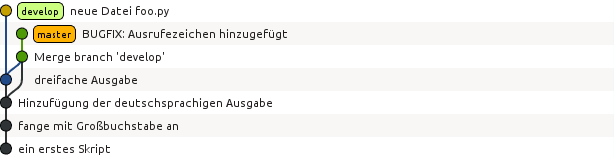

Um Änderungen aus dem ``master``-Zweig in den ``develop``-Zweig zu übernehmen, wechseln
wir in Letzteren und führen dort ein *merge* des ``master``-Zweigs durch::

   $ git checkout develop
   Zu Branch 'develop' gewechselt
   $ git merge master
   Merge made by the 'recursive' strategy.
    hello.py | 4 ++--
    1 file changed, 2 insertions(+), 2 deletions(-)

Damit sieht unser Verzweigungsschema folgendermaßen aus:

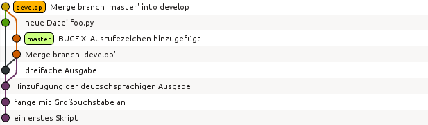

Um ein neues Feature für ein Programm zu entwickeln, wird häufig ein Zweig vom
``develop``-Zweig abgespalten und nach der Entwicklung mit Letzterem wieder
zusammengeführt. Sollte die Entwicklung nicht erfolgreich gewesen sein, so
verzichtet man auf die Zusammenführung oder löscht den überflüssig gewordenen
Zweig. Bei dieser Gelegenheit zeigen wir, wie man das Anlegen eines neuen Zweigs
und das Wechseln in diesen Zweig mit einem Kommando erledigen kann::

   $ git checkout -b feature1
   Gewechselt zu einem neuen Branch 'feature1'

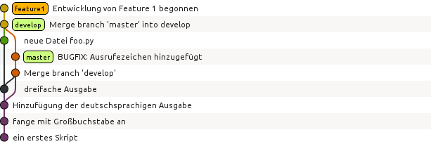

Unabhängig von der Entwicklung im ``feature1``-Zweig kann man nun Änderungen
zwischen dem ``master``- und dem ``develop``-Zweig austauschen::

   $ git branch
     develop
   * feature1
     master
   $ git checkout master
   Zu Branch 'master' gewechselt
   $ git merge develop
   Aktualisiere 70f9136..5b5d1e9
   Fast-forward
    foo.py | 1 +
    1 file changed, 1 insertion(+)
    create mode 100644 foo.py

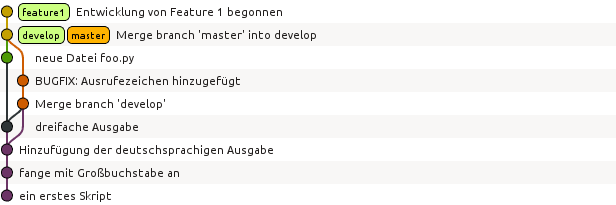

Bis jetzt gingen alle Zusammenführungen problemlos von statten. Es kann aber
durchaus zu Konflikten kommen, die sich für Git nicht eindeutig auflösen
lassen. Dann muss der Konflikt von Hand gelöst werden. Um dies zu illustrieren,
führen wir im ``develop``-Zweig eine Änderung ein, die beim Zusammenführen mit
dem ``feature1``-Zweig zu einem Konflikt führt.

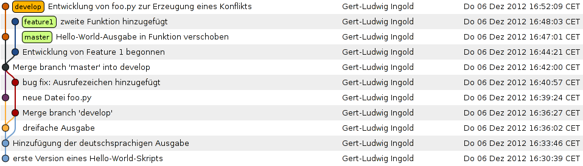

Die folgende Ausgabe zeigt, wie Git einen Konflikt anzeigt. In der konfliktbehafteten
Datei ``hello.py`` sind die kritischen Stellen gegenübergestellt. Zunächst wird die
problematische Codestelle in der Arbeitsversion des ``develop``-Zweigs angezeigt.
Getrennt von ``=======`` folgt dann der Code aus dem ``feature1``-Zweig, der im
``develop``-Zweig aufgenommen werden soll.

::

   $ git branch
   * develop
     feature1
     master
   $ git merge feature1
   automatischer Merge von hello.py
   KONFLIKT (Inhalt): Merge-Konflikt in hello.py
   Automatischer Merge fehlgeschlagen; beheben Sie die Konflikte und committen Sie
   dann das Ergebnis.
   $ cat hello.py
   <<<<<<< HEAD
   for n in range(4):
       print('Hello world!')
       print('Hallo Welt!')
   =======
   def myfunc1(n):
       for _ in range(3):
           print('Hello world!')
           print('Hallo Welt!')
   >>>>>>> feature1

In einer solchen Situation muss der Benutzer entscheiden, welche Version die gewünschte
ist. Unter Umständen kann es erwünscht, Teile jeweils aus dem einen oder dem anderen
Zweig zu entnehmen. Hat man eine zufriedenstellende Version erstellt, kann man einen
*commit* durchführen.

::

   $ git add hello.py
   $ git commit -m'Konflikt behoben'
   [develop ef71e70] Konflikt behoben

Um abschließend die drei Zweige zu zeigen, die in der Diskussion eine Rolle gespielt haben,
führen wir noch je eine Änderung im ``master``- und im ``feature1``-Zweig durch und erhalten
damit das folgende Bild:

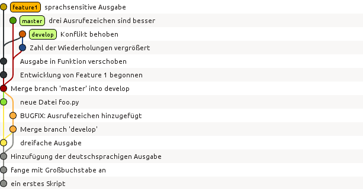

Der Umstand, dass wir bereits in wenigen Schritten ein relativ komplexes
Verzweigungsdiagramm erhalten haben, legt es inbesondere für größere Projekte
nahe, sich eine Strategie für das Anlegen von Zweigen und die darin
auszuführenden Aufgaben zu überlegen. Bei Projekten mit mehreren Entwicklern ist
andererseits gerade die Möglichkeit, Zweige einzurichten, nützlich, um die anderen
Entwickler nicht unnötig mit Code zu belasten, der nur lokal für einen Entwickler
von Bedeutung ist.

==============================
Umgang mit entfernten Archiven
==============================

Bis jetzt haben wir uns nur mit der Arbeit mit einem lokalen Archiv
beschäftigt. Wenn mehrere Entwickler zusammenarbeiten, muss es jedoch die
Möglichkeit des Austauschs von Code geben. Unter einem zentralen
Versionskontrollsystem wie Subversion dient hierzu das Archiv auf dem zentralen
Server, über den ohnehin die gesamte Versionskontrolle läuft. Auch unter Git
ist es sinnvoll, ein zentrales Archiv zu haben, das jedoch vor allem für den
Datenaustausch und nicht so sehr für die Versionskontrolle herangezogen wird.
Somit benötigt man nur für den Datenaustausch mit dem zentralen Archiv eine
funktionierende Internetanbindung, während die Versionskontrolle auch ohne sie
möglich ist.

Je nachdem welches Protokoll für den Datenzugriff zugelassen ist und welche
Zugriffsrechte man besitzt, kann man auf das zentrale Archiv lesend oder
eventuell auch schreibend zugreifen. In den folgenden Beispielen wollen wir
einen Zugriff per ``ssh``, also *secure shell*, annehmen, der uns, nach
entsprechender Authentifizierung, sowohl Lese- als auch Schreibzugriff
ermöglicht. Das zentrale Archiv soll auf dem Rechner ``nonexistent`` liegen,
der, wie der Name schon andeutet, in Wirklichkeit nicht existiert. Der Name
ist also entsprechend anzupassen. Der Zugriff erfolge über einen Benutzer
namens ``user``. Auch der Benutzername muss an die tatsächlichen Gegebenheiten
angepasst werden.

Als erstes erzeugen wir uns lokal ein Git-Arbeitsverzeichnis, indem wir das
zentrale Archiv klonen. Zur Illustration haben wir dort zunächst wieder nur
eine Version eines einfachen Skripts abgelegt.

::

   $ git clone ssh://user@nonexistent.physik.uni-augsburg.de/home/user/dummy.git dummy
   Klone nach 'dummy'...
   remote: Counting objects: 3, done.
   remote: Total 3 (delta 0), reused 0 (delta 0)
   Empfange Objekte: 100% (3/3), Fertig.
   Prüfe Konnektivität... Fertig
   $ cd dummy
   $ git branch -va
   * master                96ffbf6 hello world Skript
     remotes/origin/HEAD   -> origin/master
     remotes/origin/master 96ffbf6 hello world Skript
   $ cat hello.py
   print('hello world')

Nach dem Wechsel in das Arbeitsverzeichnis sehen wir, dass neben dem gewohnten
``master``-Zweig noch zwei ``remote``-Zweige existieren. Hierbei handelt es
sich um Zweige, die auf das zentrale Archiv verweisen, das standardmäßig mit
``origin`` bezeichnet wird. Um die ``remote``-Zweige angezeigt zu bekommen,
muss die Option ``-a`` angegeben werden. Andernfalls beschränkt sich die
Ausgabe auf die lokal vorhandenen Zweige. Informationen über entfernte Archive
und den zugehörigen Zugriffsweg erhält man mit::

   $ git remote -v
   origin  ssh://user@nonexistent.physik.uni-augsburg.de/home/user/dummy.git (fetch)
   origin  ssh://user@nonexistent.physik.uni-augsburg.de/home/user/dummy.git (push)

Nehmen wir an, dass auf dem zentralen Server eine Datei verändert wurde, so
können wir diese von dort in unser Arbeitsverzeichnis holen::

   $ git fetch origin
   remote: Counting objects: 5, done.
   remote: Total 3 (delta 0), reused 0 (delta 0)
   Entpacke Objekte: 100% (3/3), Fertig.
   Von ssh://user@nonexistent.physik.uni-augsburg.de/home/user/dummy.git
      96ffbf6..26f3c10  master     -> origin/master

Dabei wird nur der ``origin``-Zweig aktualisiert, wie am Ausrufezeichen, das in
der aktuellen Version von ``hello.py`` hinzugefügt wurde, zu sehen ist::

   $ git branch -a
   * master
     remotes/origin/HEAD -> origin/master
     remotes/origin/master
   $ cat hello.py
   print('hello world')
   $ git checkout origin
   Note: checking out 'origin'.

   You are in 'detached HEAD' state. You can look around, make experimental
   changes and commit them, and you can discard any commits you make in this
   state without impacting any branches by performing another checkout.

   If you want to create a new branch to retain commits you create, you may
   do so (now or later) by using -b with the checkout command again. Example:

     git checkout -b new_branch_name

   HEAD ist jetzt bei 26f3c10... mit Ausrufezeichen
   $ cat hello.py
   print('hello world!')

Wie uns Git informiert, können wir im ``origin``-Zweig keine Änderungen
vornehmen.  Wir können uns dort aber umsehen und uns auf diese Weise davon
überzeugen, dass das Skript dort das Aufrufezeichen enthält. Die Änderung
können wir wie im vorigen Kapitel beschrieben in den ``master``-Zweig unseres
lokalen Archivs übernehmen::

   $ git checkout master
   Vorherige Position von HEAD war 26f3c10... mit Ausrufezeichen
   Zu Branch 'master' gewechselt
   Ihr Branch ist zu 'origin/master' um 1 Commit hinterher, und kann vorgespult werden.
     (benutzen Sie "git pull", um Ihren lokalen Branch zu aktualisieren)
   $ git merge origin
   Aktualisiere 96ffbf6..26f3c10
   Fast-forward
    hello.py | 2 +-
    1 file changed, 1 insertion(+), 1 deletion(-)
   $ cat hello.py
   print('hello world!')

Die Aktualisierung auf den Stand des zentralen Archivs haben wir hier in zwei
Schritten durchgeführt.  Es ist jedoch auch möglich, dies in einem Schritt zu
erledigen. Wir nehmen an, dass ein anderer Entwickler das Skript mit einem
weiteren Ausrufezeichen versehen hat, und führen dann eine so genannte
*pull*-Operation aus::

   $ git pull origin
   remote: Counting objects: 5, done.
   remote: Total 3 (delta 0), reused 0 (delta 0)
   Entpacke Objekte: 100% (3/3), Fertig.
   Von ssh://user@nonexistent.physik.uni-augsburg.de/home/user/dummy.git
      26f3c10..10f6489  master     -> origin/master
   Aktualisiere 26f3c10..10f6489
   Fast-forward
    hello.py | 2 +-
    1 file changed, 1 insertion(+), 1 deletion(-)
   $ cat hello.py
   print("hello world!!")

Schreibzugriff vorausgesetzt kann man umgekehrt auch neue Dateiversionen im
zentralen Archiv ablegen. Hierzu dient die *push*-Operation. Hierzu ändern wir
den Ausgabetext unseres Skripts und legen das neue Skript in unser lokales
Archiv. Anschließend kann die Übertragung in das zentrale Archiv erfolgen::

   $ cat hello.py
   print "Hallo Welt!!"
   $ git commit hello.py -m"deutsche Variante"
   [master d2b98d1] deutsche Variante
    1 file changed, 1 insertion(+), 1 deletion(-)
   $ git push origin
   Zähle Objekte: 3, Fertig.
   Schreibe Objekte: 100% (3/3), 290 bytes | 0 bytes/s, Fertig.
   Total 3 (delta 0), reused 0 (delta 0)
   To ssh://user@nonexistent.physik.uni-augsburg.de/home/user/dummy.git
      10f6489..d2b98d1  master -> master

Problematisch wird die Situation, wenn zwischen einer *pull*-Operation und einer *push*-Operation ein
anderer Entwickler das zentrale Archiv verändert hat::

   $ git commit hello.py -m"Ausgabe deutsch und englisch"
   [master 8e5577d] Ausgabe deutsch und englisch
    1 file changed, 1 insertion(+)
   $ git push origin
   To ssh://user@nonexistent.physik.uni-augsburg.de/home/user/dummy
    ! [rejected]        master -> master (fetch first)
   error: Fehler beim Versenden einiger Referenzen nach
                  'ssh://user@nonexistent.physik.uni-augsburg.de/home/user/dummy.git'
   Hinweis: Aktualisierungen wurden zurückgewiesen, weil das Remote-Repository Commits
   Hinweis: enthält, die lokal nicht vorhanden sind. Das wird üblicherweise durch einen
   Hinweis: "push" von Commits auf dieselbe Referenz von einem anderen Repository aus
   Hinweis: verursacht. Vielleicht müssen Sie die externen Änderungen zusammenzuführen
   Hinweis: (z.B. 'git pull ...') bevor Sie erneut "push" ausführen.
   Hinweis: Siehe auch die Sektion 'Note about fast-forwards' in 'git push --help'
   Hinweis: für weitere Details.

Wir folgen dem Hinweis und holen uns zunächst die veränderte Version::

   $ git pull origin
   remote: Counting objects: 10, done.
   remote: Compressing objects: 100% (2/2), done.
   remote: Total 6 (delta 0), reused 0 (delta 0)
   Entpacke Objekte: 100% (6/6), Fertig.
   Von ssh://user@nonexistent.physik.uni-augsburg.de/home/user/dummy.git
      d2b98d1..a2e308b  master     -> origin/master
   automatischer Merge von hello.py
   KONFLIKT (Inhalt): Merge-Konflikt in hello.py
   Automatischer Merge fehlgeschlagen; beheben Sie die Konflikte und committen Sie dann
   das Ergebnis.

Dabei kommt es zu einem Konflikt, da das gleiche Skript in verschiedener Weise verändert wurde.
Zunächst muss nun dieser Konflikt beseitigt werden, damit anschließend die gewünschte Fassung
der Datei versioniert werden kann::

   $ git add hello.py
   $ git commit
   [master c189281] Merge branch 'master' of
      ssh://user@nonexistent.physik.uni-augsburg.de/home/user/dummy.git

Anschließend kann diese Version erfolgreich im zentralen Archiv abgelegt werden::

   $ git push origin
   Zähle Objekte: 4, Fertig.
   Delta compression using up to 4 threads.
   Komprimiere Objekte: 100% (2/2), Fertig.
   Schreibe Objekte: 100% (4/4), 515 bytes | 0 bytes/s, Fertig.
   Total 4 (delta 1), reused 0 (delta 0)
   To ssh://user@nonexistent.physik.uni-augsburg.de/home/user/dummy.git
      a2e308b..c189281  master -> master

An diesem Beispiel wird deutlich, dass es durchaus problematisch sein kann,
wenn viele Entwickler Schreibzugriff auf ein zentrales Archiv haben. Daher wird
häufig einem breiteren Personenkreis lediglich Lesezugriff gewährt. Nur ein
einzelner Entwickler oder eine kleine Gruppe hat Schreibzugriff auf das
zentrale Archiv und kann so neuen Code dort ablegen. Dies geschieht mit einer
*pull*-Operation von einem Archiv des Entwicklers, der den Code zur Verfügung
stellt. Hierzu ist wiederum eine Leseberechtigung nötig. Möchte ein Entwickler
bei diesem Verfahren Code für das zentrale Archive zur Verfügung stellen, so
stellt er eine *pull*-Anfrage (*pull request*).  Eventuell nach einer
Diskussion und Prüfung entscheidet der Verantwortliche für das zentrale Archiv
über die Aufnahme in das zentrale Archiv und führt die *pull*-Operation durch
(oder auch nicht). Eine häufig verwendete Infrastruktur, die in dieser Weise
insbesondere auch für die Entwicklung freier Software benutzt wird, ist `GitHub
<http://github.com/>`_.

.. [#git] Zur Namensgebung sagte Linus Torvalds unter anderem „I'm an egoistical bastard, and I name
          all my projects after myself. First Linux, now git.“ Die Ironie dieses Satzes wird deutlich
          wenn man bedenkt, dass *git* im Englischen so viel wie Blödmann oder Depp bedeutet.
.. [#sha1] Siehe zum Beispiel `en.wikipedia.org/wiki/SHA-1 <http://en.wikipedia.org/wiki/SHA-1>`_.
.. [#so552659] Der folgende Code basiert auf einem Vorschlag auf `stackoverflow.com/questions/552659/assigning-git-sha1s-without-git
      <http://stackoverflow.com/questions/552659/assigning-git-sha1s-without-git>`_.
