***********************
Erstellung von Grafiken
***********************

Hat man mit Hilfe eines Pythonskripts Daten erzeugt, so möchte man diese häufig
grafisch darstellen. Eine Möglichkeit hierfür besteht darin, die Daten in einer
Datei abzuspeichern, um sie anschließend mit einem unabhängigen Programm
grafisch aufzubereiten. Ein Programm, das im wissenschaftlichen Bereich gerne
benutzt wird, ist beispielsweise ``gnuplot`` [#gnuplot]_.

Ein anderer Zugang besteht darin, die Grafik direkt in dem Programm zu
erzeugen, das die Daten berechnet.  Hierfür gibt es eine Reihe von
Programmpaketen. Am häufigsten benutzt wird wohl ``matplotlib`` [#matplotlib]_,
das eng mit den wissenschaftlichen Paketen ``NumPy`` und ``SciPy``
zusammenhängt. Ein weiteres Paket, das zudem sehr gut geeignet ist, um
Schemazeichnungen und ähnliche Abbildungen zu erzeugen, ist ``PyX`` [#pyx]_. In
diesem Kapitel werden wir eine Einführung in diese beiden Programmpakete geben.
Beide sind jedoch so mächtig, dass es nicht möglich ist, alle Aspekte zu
besprechen. Um eine Vorstellung von den jeweiligen Möglichkeiten zu bekommen,
empfiehlt es sich, die entsprechenden Projektseiten im Internet zu besuchen und
einen Blick auf die dort vorhandenen Beispielgalerien zu werfen.

Möchte man seine Daten mit einem Pythonprogramm grafisch aufbereiten, so sollte
man sich Gedanken darüber machen, ob man dies innerhalb eines einzigen
Programms tun möchte. Dies gilt insbesondere dann, wenn die Erzeugung der Daten
zeitlich sehr aufwändig ist. Ist die Grafikerstellung nämlich fehlerhaft, so hat
man nicht nur nicht die gewünschte Grafik, sondern zudem die erzeugten Daten
verloren. In einem solchen Fall ist es sinnvoll, die Erzeugung von Daten und
Grafiken zu trennen. Zumindest sollte man aber die Daten nach ihrer Erzeugung in
einer Datei sichern.

.. _mpl:

======================================
Erstellung von Grafiken mit matplotlib
======================================

Bei matplotlib gibt es verschiedene Wege zur Erstellung einer Grafik. Man kann
entweder das zu matplotlib gehörige ``pylab``-Modul laden oder in IPython das
magische Kommando ``%pylab`` verwenden. Dieser Weg führt dazu, dass umfangreiche
Namensräume importiert werden, was einerseits der Bequemlichkeit dient,
andererseits aber den Nachteil besitzt, dass häufig schwer nachzuvollziehen ist,
woher eine bestimmte Funktion stammt. Daher ist von der Benutzung des
``pylab``-Moduls eher abzuraten, und wir werden es im Folgenden auch nicht
verwenden.

Eine zweite Variante besteht in der Benutzung des ``pyplot``-Moduls aus 
matplotlib. Dieses Modul erlaubt es, den Zustand einer Grafik zu verändern und
eignet sich daher besonders für die interaktive Entwicklung von Grafiken, zum
Beispiel in einer IPython-Shell oder einem IPython-Notebook. Die Verwendung
von pyplot ist aber genauso in einem normalen Python-Skript möglich. Die meisten
der im Folgenden besprochenen Beispiele verwenden pyplot.

Schließlich bietet matplotlib einen objektorientierten Zugang, den wir in den
letzten Beispiele dieses Kapitels etwas kennenlernen werden.

Um mit matplotlib arbeiten zu können, müssen zunächst die benötigten Module
importiert werden:

.. sourcecode:: ipython

   In [1]: import numpy as np
      ...: import matplotlib as mpl
      ...: import matplotlib.pyplot as plt
      ...: %matplotlib
   Using matplotlib backend: Qt4Agg

In den meisten Fällen wird hierzu das NumPy-Modul gehören, das wir wie gewohnt
unter der Abkürzung ``np`` in der ersten Zeile importieren. Für die Arbeit mit
pyplot wird der Importbefehl in der dritten Zeile benötigt, wobei wir uns hier
an die Konvention halten, für pyplot die Abkürzung ``plt`` zu verwenden.
Da wir gelegentlich das matplotlib-Modul selbst benötigen, um die Fähigkeiten
von matplotlib zu demonstrieren, importieren wir es in der zweiten Zeile.
Hierauf kann man in vielen Fällen verzichten.

Für die interaktive Arbeit in der IPython-Shell wird abschließend noch das
magische Kommando ``%matplotlib`` verwendet. Arbeitet man mit einem
Python-Skript, so entfällt dieser Schritt. Wenn man mit einem IPython-Notebook
arbeitet, so hat man noch die Möglichkeit, Grafiken direkt in das Notebook
einzubetten. In diesem Fall lautet das magische Kommando ``%matplotlib inline``.

Wir wollen nun eine einfache Grafik erstellen, deren Eigenschaften wir im
Weiteren schrittweise verändern werden. Zunächst erzeugen wir drei NumPy-Arrays,
die die Daten für zwei Funktionen enthalten, die wir grafisch darstellen
wollen.

.. sourcecode:: ipython

   In [2]: x = np.linspace(0, 10, 30)
      ...: y1 = np.cos(x)
      ...: y2 = np.sin(x)

Nun können wir leicht eine Grafik erzeugen, die die beiden Funktionen darstellt.

.. sourcecode:: ipython

   In [3]: plt.plot(x, y1)
      ...: plt.plot(x, y2)
   Out[3]: [<matplotlib.lines.Line2D at 0x7f48b0a01320>]

Führt man diese beiden Kommandos aus, so öffnet sich ein Fenster, das neben der
Grafik auch einige Icons enthält, die es erlauben, die Darstellung zu
modifizieren.

.. image:: images/matplotlib/mpl1.png
   :height: 5cm
   :align: center

Die acht Icons haben von links nach rechts die folgenden Funktionen:

 * Nachdem man mit Hilfe der anderen Icons Veränderungen an der Grafik
   vorgenommen hat, kann man mit diesem Icon wieder zur ursprünglichen
   Darstellung zurückkehren.

 * Mit diesem Icon kommt man zur vorhergehenden Darstellung zurück.

 * Ist man zu einer früheren Darstellung zurückgegangen, so kommt man mit
   diesem Icon zu neueren Darstellungen.

 * Mit diesem Icon lässt sich der Bildausschnitt verschieben.

 * Mit diesem Icon lässt sich ein kleinerer Bildausschnitt durch Aufziehen
   eines Rechtecks wählen. Man kann also bei Bedarf in die Abbildung
   hineinzoomen.

 * Dieses Icon erlaubt es, die Seitenverhältnisse der Abbildung und die
   Größe der Ränder zu verändern.

 * Dieses Icon dient dazu, die Grafik in einer Datei zu speichern, sei es
   in einem Bitmap-Format wie zum Beispiel ``png`` oder in einem
   Vektorgrafik-Format wie ``eps``, ``pdf`` oder ``svg``.

 * Das letzte Icon ist nicht bei jedem Backend vorhanden, wird aber bei dem hier
   verwendeten Qt-Backend angezeigt. Es erlaubt die Wahl des *x*- und
   *y*-Achsenabschnitts, das Setzen von Beschriftungen sowie die Wahl von
   logarithmischen Achsen. Diese Funktionalität ist aber auch durch
   entsprechende pyplot-Funktionen verfügbar, wie wir im Folgenden sehen werden.

Bevor wir uns aber mit der Beschriftung der Grafik beschäftigen, wollen wir uns
zunächst der Darstellung der Daten zuwenden. Standardmäßig werden die Daten mit
Hilfe einer durchgezogenen Kurve dargestellt, deren Farbe von einem Datensatz
zum nächsten automatisch wechselt. Wir wollen nun die Darstellung dieser Kurven
verändern. Dazu beschaffen wir uns zunächst die beiden Linien

.. sourcecode:: ipython

   In [4]: line1, line2 = plt.gca().lines

``gca`` steht hier für »get current axes«, das die aktuelle Untergrafik
zurückgibt. In unserem Fall handelt es sich einfach um die aktuelle Grafik. Da
aber eine Abbildung, wie wir später noch sehen werden, aus mehreren
Untergrafiken bestehen kann, ist es im Prinzip wichtig, zwischen einer
Untergrafik und der gesamten Abbildung zu unterscheiden. Mit Hilfe des
``lines``-Attributes kann man eine Liste der aktuell vorhandenen Linien
erhalten. Da wir wissen, dass es sich um zwei Linien handelt, können wir die
Liste direkt entpacken.

Nachdem wir nun Zugriff auf die Linien haben, können wir deren Eigenschaften
ändern. Dazu gibt es zwei Möglichkeiten, wie wir hier am Beispiel der
Linienbreite zeigen wollen. Man kann die Linienbreite durch eine entsprechende
Methode setzen, wobei man anschließend die Grafik mit einer ``draw``-Anweisung
in dem noch geöffneten Fenster neu erzeugen muss.

.. sourcecode:: ipython

   In [5]: line1.set_linewidth(5)
      ...: plt.draw()

Das Ergebnis sieht dann folgendermaßen aus:

.. image:: images/matplotlib/mpl2.png
   :height: 5cm
   :align: center

Alternativ kann man die ``setp``-Methode verwenden, die es erlaubt, Eigenschaften
zu setzen (»set properties«), in diesem Fall die Linienbreite der zweiten Linie.

.. sourcecode:: ipython

   In [6]: plt.setp(line2, linewidth=10)

Die Grafik hat danach das folgende Aussehen:

Im nächsten Schritt wollen wir die Farben der beiden Linien verändern und
verwenden dafür wieder die ``setp``-Methode,

.. sourcecode:: ipython

   In [7]: plt.setp(line1, color='m')

und erhalten folgende Ausgabe:

.. image:: images/matplotlib/mpl4.png
   :height: 5cm
   :align: center

In diesem Beispiel haben wir ausgenutzt, dass sich eine Reihe von Farben mit Hilfe
eines Buchstabens auswählen lassen. Eine Liste dieser Farben lässt sich 
folgendermaßen ausgeben:

.. sourcecode:: ipython

   In [8]: mpl.colors.ColorConverter.colors
   Out[8]: {'y': (0.75, 0.75, 0),
    'w': (1.0, 1.0, 1.0),
    'g': (0.0, 0.5, 0.0),
    'm': (0.75, 0, 0.75),
    'r': (1.0, 0.0, 0.0),
    'c': (0.0, 0.75, 0.75),
    'k': (0.0, 0.0, 0.0),
    'b': (0.0, 0.0, 1.0)}

Es stehen auf diese Weise also die Farben Gelb (``y``), Weiß (``w``), Grün
(``g``), Magenta (``m``), Rot (``r``), Cyan (``c``), Schwarz (``k``) und Blau
(``b``) zur Verfügung. Die aufgelisteten Tupel geben die RGB-Darstellung der
jeweiligen Farben an, das heißt den Anteil der Farben Rot, Grün und Blau.
Dieses ist direkt an den Farben Rot und Blau nachvollziehbar. Bei Grün ist die
Helligkeit reduziert, da diese Farbe bei voller Helligkeit im Allgemeinen
schlecht zu sehen ist. Bei Weiß haben alle drei Kanäle ihren Maximalwert,
während bei Schwarz keiner der Kanäle beiträgt.  Bei den Komplementärfarben
Cyan, Magenta und Gelb sind zwei der drei Kanäle beteiligt.

Eine große Zahl von Farben lässt sich durch Angabe eines Farbnamens erhalten,
wobei man sich eine vollständige Liste der verfügbaren Namen anzeigen lassen
kann.

.. sourcecode:: ipython

   In [9]: mpl.colors.cnames
   Out[9]: {'gold': '#FFD700', 'darkorchid': '#9932CC', 'silver': '#C0C0C0',
   'aquamarine': '#7FFFD4', 'mediumseagreen': '#3CB371', 'gray': '#808080',
   ...
   'mediumspringgreen': '#00FA9A', 'darkturquoise': '#00CED1','darkblue': '#00008B',
   'deeppink': '#FF1493', 'sage': '#87AE73', 'mediumorchid': '#BA55D3'}

Jeder Farbe ist wieder ein RGB-Wert zugeordnet, der in diesem Fall
hexadezimal kodiert ist. Der RGB-Wert besteht hier aus drei zweistelligen
Hexadezimalzahlen, die demnach Werte zwischen 0 und 255 repräsentieren. Um auf
die obige RGB-Darstellung zu kommen, muss man das Intervall von 0 bis 255 auf
das Intervall von 0 bis 1 abbilden,  also durch 255 teilen.

Die obige Liste der verfügbaren Farbnamen ist nicht vollständig wiedergegeben.
Für die Farbauswahl praktischer ist die folgende, daraus erstellte Farbtabelle,
die mit Hilfe des Skripts ``named_colors.py`` aus der matplotlib-Galerie erzeugt
werden kann.

.. image:: images/matplotlib/named_colors_hires.png
   :width: 16cm
   :align: center

Als Beispiel ändern wir die Farbe der zweiten Linie auf ``darksalmon``

.. sourcecode:: ipython

   In [10]: plt.setp(line2, color='darksalmon')

und erhalten damit die folgende Ausgabe

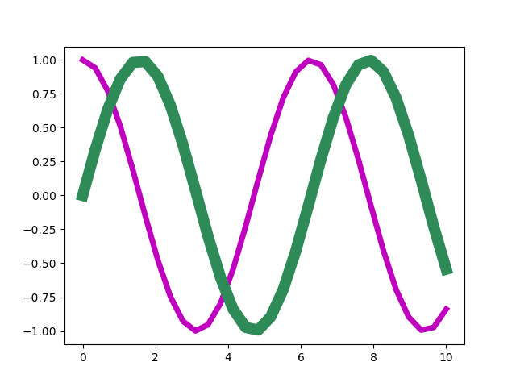

Falls die bisher genannten Farben nicht ausreichen sollten, kann man Farben
auch stufenlos wählen, wenn man von der endlichen Auflösung der Gleitkommazahlen
in Python absieht. So lassen sich Grautöne kontinuierlich von
Schwarz bis Weiß mit Hilfe einer Zahl zwischen 0 und 1 festlegen. In dem
folgenden Beispiel wird für die erste Linie ein Grauton vorgegeben.

.. sourcecode:: ipython

   In [11]: plt.setp(line1, color='0.5')

.. image:: images/matplotlib/mpl6.png
   :height: 5cm
   :align: center

Wie bereits weiter oben beschrieben, lassen sich Farben in der RGB-Darstellung
hexadezimal oder durch ein aus drei Zahlen bestehendes Tupel auswählen, wie
die folgenden beiden Beispiele zeigen.

.. sourcecode:: ipython

   In [12]: plt.setp(line1, color='#FFC000')

.. image:: images/matplotlib/mpl7.png
   :height: 5cm
   :align: center

.. sourcecode:: ipython

   In [13]: plt.setp(line1, color=(0, 0.7, 1))

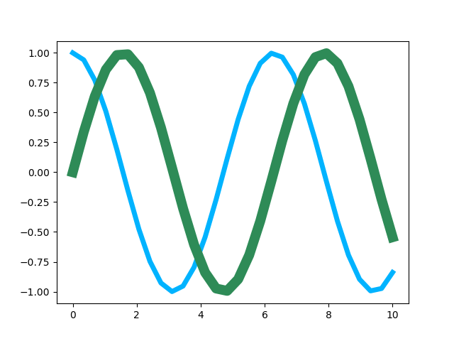

Alternativ zum RGB-System lassen sich Farben auch mit Hilfe des HSV-Systems
darstellen, in dem die Farben ebenfalls durch ein Tupel aus drei
Gleitkommazahlen zwischen 0 und 1 charakterisiert werden. Der erste Wert
steht für den Farbton (»hue«) und gibt die Position im Farbkreis an. Dabei
sind die Werte 0 und 1 der Farbe Rot zugeordnet. Grün liegt bei 1/3 und
Blau bei 2/3. Der zweite Wert gibt die Farbsättigung (»saturation«) an.
Verringert man diesen Wert, so geht man von der Farbe zu einem entsprechenden
Grauton über. Der dritte Wert (»value«) schließlich beeinflusst die Helligkeit
der Farbe.

Im folgenden Beispiel setzen wir den ersten Wert auf 0.3 und wählen so einen
Grünton aus. Wie schon weiter oben erwähnt, besteht bei Grüntönen die Gefahr,
dass sie zu hell erscheinen. Daher haben wir für die zweite Linie den dritten
Wert des Tupels reduziert.

.. sourcecode:: ipython

   In [14]: plt.setp(line1, color=mpl.colors.hsv_to_rgb((0.3, 1, 1)))
      ...: plt.setp(line2, color=mpl.colors.hsv_to_rgb((0.3, 1, 0.6)))

.. image:: images/matplotlib/mpl9.png
   :height: 5cm
   :align: center

Um Unterschiede zwischen verschiedenen Linien hervorzuheben, kann man nicht
nur verschiedene Farben einsetzen, sondern auch unterschiedliche Linienarten.
Dies ist besonders dann sinnvoll, wenn man davon ausgehen muss, dass die 
Abbildung in schwarz/weiß gedruckt wird, so dass Farben auf Grautöne abgebildet
würden.

Die Linienart wird in matplotlib durch einen String charakterisiert, der sich
aus der folgenden Auflistung ergibt.

.. sourcecode:: ipython

   In [15]: mpl.lines.Line2D.lineStyles
   Out[15]: {'--': '_draw_dashed',
    '-': '_draw_solid',
    '': '_draw_nothing',
    ' ': '_draw_nothing',
    'None': '_draw_nothing',
    '-.': '_draw_dash_dot',
    ':': '_draw_dotted'}

Möchte man eine Linie gestrichelt darstellen, kann man wie bei den Farben
die ``setp``-Methode verwenden und übergibt mit Hilfe des Schlüsselworts
``linestyle`` den entsprechenden Wert ``'--'``.

.. sourcecode:: ipython

   In [16]: plt.setp(line2, linestyle='--')

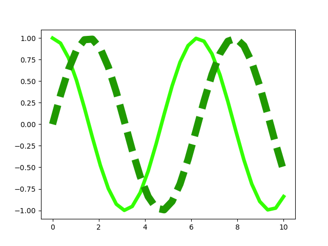

Bei Bedarf kann man die Strichlänge anpassen oder auch die Form der Strichenden
festlegen.

.. sourcecode:: ipython

   In [17]: plt.setp(line2, dashes=(20, 10))

.. sourcecode:: ipython

   In [18]: plt.setp(line2, dashes=(10, 20), dash_capstyle='round')

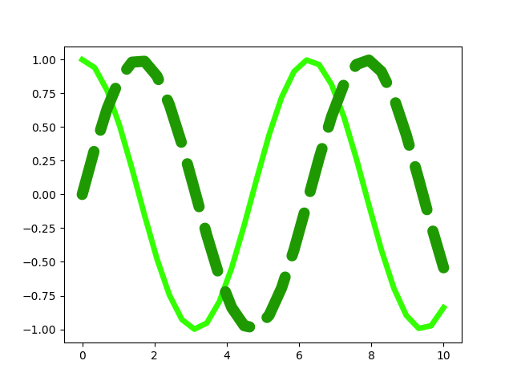

Vor allem bei Linienverläufen, die Spitzen enthalten, kann es interessant
sein, die Form vorzugeben, mit der Linien aneinander gefügt werden. Es gibt
hierfür drei Möglichkeiten, die im Folgenden dargestellt sind.

.. sourcecode:: ipython

   In [19]: plt.cla()
      ...: xdata = np.array([0, 0.1, 0.5, 0.9, 1])
      ...: ydata = np.array([0, 0, 1, 0, 0])
      ...: for n in range(3):
      ...:     plt.plot(xdata, ydata+0.2*n)
      ...: line = plt.gca().lines
      ...: plt.setp(line, linewidth=20)
      ...: plt.ylim(0, 1.5)
      ...: for n, joinstyle in enumerate(('round', 'bevel', 'miter')):
      ...:     plt.setp(line[n], solid_joinstyle=joinstyle)

.. image:: images/matplotlib/mpl13.png
   :height: 5cm
   :align: center

In dem obigen Codebeispiel haben wir eine Funktion verwendet, die bis jetzt noch
nicht besprochen wurde, nämlich ``cla()``. Der Name steht für »clear current
axes« und löscht die aktuellen Unterabbildung, die in unserem Fall einfach der
aktuellen Abbildung entspricht.

Bis jetzt haben wir die Datenpunkte lediglich durch Linien dargestellt. Dies
ist jedoch häufig entweder nicht gewünscht oder nicht ausreichend. Insbesondere
bei Messdaten sollen die Datenpunkte oft einzeln markiert werden. In vielen
Fällen kann man bei matplotlib auf eine sehr einfache Syntax zurückgreifen.
Um dies zu illustrieren, erstellen wir unsere Beispielgrafik, mit der wir bisher
überwiegend gearbeitet haben, neu. Im ersten ``plot``-Aufruf verwenden wir
als drittes Argument die Zeichenkette ``'ro-'``. Das erste Zeichen, ``r``, wird
als Farbe interpretiert und bedeutet, wie wir bereits wissen, Rot. Das zweiten
Zeichen, ``o``, wird als Symbol interpretiert, in diesem Fall als Kreis. Der
abschließende Bindestrich gibt an, dass nicht nur Symbole dargestellt werden
sollen, sondern die Symbole außerdem durch eine durchgezogene Linie verbunden
werden sollen. Für den zweiten Datensatz verlangen wir mit ``'yD-'`` statt roten
Kreisen gelbe Rauten (»diamonds«).

.. sourcecode:: ipython

   In [20]: plt.cla()
      ...: plt.plot(x, y1, 'ro-')
      ...: plt.plot(x, y2, 'yD-')
   Out[20]: [<matplotlib.lines.Line2D at 0x7f48b0110860>]

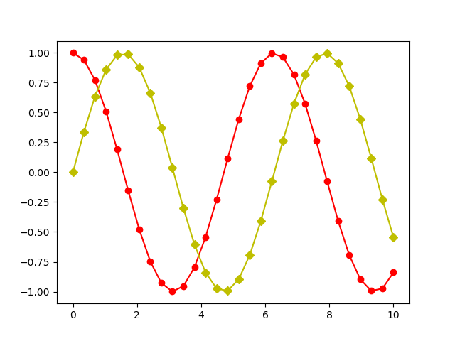

Um die Symbole modifizieren zu können, verschaffen wir uns Zugriff auf die
einzelnen Linie, wie wir dies früher schon getan haben.

.. sourcecode:: ipython

   In [21]: line1, line2 = plt.gca().lines

Zunächst verändern wir die Größe der Symbole. Dazu beschaffen wir uns zunächst
den aktuellen Wert, um eines der Symbole relativ zu diesem Wert vergrößern und
das andere verkleinern zu können. Hierzu verwenden wir die Partnermethode zu
``setp``. nämlich ``getp``, das für »get property« steht, es also erlaubt,
Eigenschaften in Erfahrung zu bringen.

.. sourcecode:: ipython

   In [22]: plt.getp(line1, 'markersize')
   Out[22]: 6.0

Die Standardgröße der Symbole beträgt also 6, so dass wir davon ausgehend
nun mit der bewährten ``setp``-Methode neue Sybolgrößen setzen können.

.. sourcecode:: ipython

   In [23]: plt.setp(line1, markersize=4)
      ...: plt.setp(line2, markersize=10)

.. image:: images/matplotlib/mpl15.png
   :height: 5cm
   :align: center

Neben Kreisen und Rauten stellt matplotlib natürlich noch weitere Symbole zur
Verfügung, die man sich als Dictionary ausgeben lassen kann.

.. sourcecode:: ipython

   In [24]: mpl.lines.Line2D.markers
   Out[24]: {'v': 'triangle_down', 0: 'tickleft', 2: 'tickup', 's': 'square',
    ...
    'h': 'hexagon1', '1': 'tri_down', 'p': 'pentagon', '2': 'tri_up'}

Das Dictionary ist hier nur auszugsweise wiedergegeben, da die folgende grafische
Darstellung nützlicher ist. Zu beachten ist, dass zwar die meisten Symbole mit
einem Zeichen ausgewählt werden, es aber dennoch einige Symbole gibt, auf die
mit einer Ziffer Bezug genommen wird. So bezeichnen ``4`` und ``'4'``
unterschiedliche Symbole.

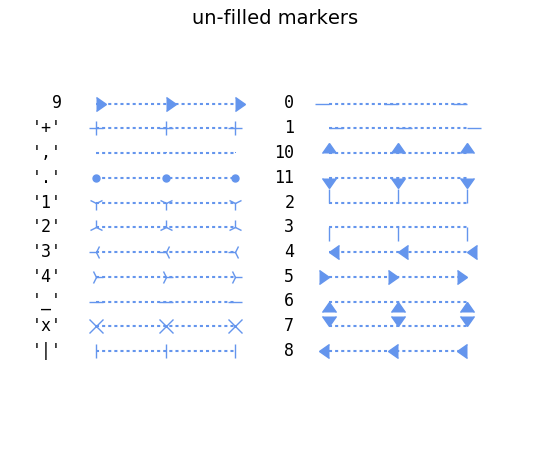

Bei Bedarf lassen sich die Eigenschaften von Symbolen im Detail festlegen.
Das folgende Beispiel erzeugt auf der Linie 2 quadratische blaue Symbole mit
einem roten Rand von 3 Punkten Breite.

.. sourcecode:: ipython

   In [25]: plt.setp(line2, marker='s', markerfacecolor='b',
      ...:          markeredgewidth=3, markeredgecolor='r')

.. image:: images/matplotlib/mpl16.png
   :height: 5cm
   :align: center

Zu einem ordentlichen Funktionsgraphen gehört selbstverständlich auch eine
Achsenbeschriftung. Im einfachsten Fall verwendet man ``xlabel`` und ``ylabel``
und gibt den Text als Argument in Form einer Zeichenkette an. Häufig muss man
allerdings die Schriftgröße anpassen. Dies kann mit Hilfe eines entsprechenden
Bezeichners geschehen, wie es hier für die *x*-Achse erfolgt, oder aber durch
Angabe einer Schriftgröße in Punkten, wie es hier für die *y*-Achse gezeigt ist.

.. sourcecode:: ipython

   In [26]: plt.xlabel('t', fontsize='x-large')
   Out[26]: <matplotlib.text.Text at 0x7f48b0a30668>

.. sourcecode:: ipython

   In [27]: plt.ylabel('cos(t), sin(t)', fontsize=30)
   Out[27]: <matplotlib.text.Text at 0x7f48b015a780>

.. image:: images/matplotlib/mpl18.png
   :height: 5cm
   :align: center

Einen besseren Mathematiksatz erhält man, wenn man die TeX-Syntax verwendet
[#latex]_. Dabei werden mathematische Teile in Dollarzeichen eingeschlossen,
was unter anderem zur Konsequenz hat, dass mathematische Symbole kursiv dargestellt
werden. TeX- und LaTeX-Kommandos beginnen mit ``\`` und so lassen sich
beispielsweise griechische Buchstaben durch Voranstellen dieses Zeichens vor den
Namen des Buchstabens erzeugen. ``\omega`` wird so zu einem ω.

.. sourcecode:: ipython

   In [28]: plt.xlabel('$t$')
      ...: plt.ylabel(r'$\cos(\omega t), \sin(\omega t)$')
   Out[28]: <matplotlib.text.Text at 0x7f48b015a780>

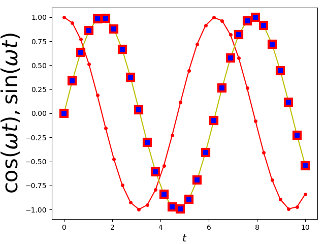

Standardmäßig interpretiert matplotlib selbst die in TeX-Syntax übergebenen
Zeichenketten. Dabei wird nur ein Teil der äußerst umfangreichen Möglichkeiten
von TeX unterstützt. Man kann jedoch auch verlangen, dass der Text von der lokal
vorhandenen TeX-Installation gesetzt wird.

.. sourcecode:: ipython

   In [29]: mpl.rc('text', usetex = True)
      ...: plt.ylabel(r'$\cos(\omega t), \sin(\omega t)$')
   Out[29]: <matplotlib.text.Text at 0x7f48b015a780>

.. image:: images/matplotlib/mpl20.png
   :height: 5cm
   :align: center

Dadurch verbessert sich in unserem Beispiel unter anderem die Platzierung des
Kommas deutlich.

Gelegentlich ist es sinnvoll, eine Grafik mit einer Legende zu versehen, die
die Bedeutung der einzelnen Kurven erläutert. Eine Möglichkeit, den
Beschriftungstext vorzugeben, besteht darin, dies gleich bei der Erzeugung der
Kurven mit Hilfe der Variable ``label`` zu tun.

.. sourcecode:: ipython

   In [30]: plt.cla()
      ...: plt.plot(x, y1, 'o-', label='Kosinus')
      ...: plt.plot(x, y2, 's-', label='Sinus')
   Out[30]: [<matplotlib.lines.Line2D at 0x7f48b09f9828>]

Die ``legend``-Methode wird anschließend benutzt, um die Legende im Graphen zu
setzen.

.. sourcecode:: ipython

   In [31]: plt.legend()
   Out[31]: <matplotlib.legend.Legend at 0x7f48af928080>

.. image:: images/matplotlib/mpl22.png
   :height: 5cm
   :align: center

Bei einer recht vollen Grafik, wie es hier der Fall ist, kann es sinnvoll
sein, den Ort der Legende explizit vorzugeben.

.. sourcecode:: ipython

   In [32]: plt.legend(loc='lower left')
   Out[32]: <matplotlib.legend.Legend at 0x7f48af946ba8>

Steht ausreichend horizontaler Platz zur Verfügung, so kann es im vorliegenden
Fall günstig sein, die Legende außerhalb der Grafik anzuordnen, wie das folgende
Beispiel zeigt.

.. sourcecode:: ipython

   In [33]: plt.legend(bbox_to_anchor=(1.02, 1), loc='upper left', borderaxespad=0)
   Out[33]: <matplotlib.legend.Legend at 0x7f48af8d4780>

Hier wird festgelegt, dass die Legende mit der oberen linken Ecke etwas außerhalb
des rechten oberen Randes der Grafik platziert wird. Der genaue Punkt wird relativ
zur so genannten »bounding box« angegeben, die hier immer die horizontale und
vertikale Länge 1 besitzt, also unabhängig von den Problemkoordinaten ist, die
hier in horizontaler Richtung von 0 bis 10 und in vertikaler Richtung von -1 bis
1 laufen. Der Punkt ``(1.02, 1)`` liegt somit wie behauptet leicht rechts von
der oberen rechten Ecke der Grafik.

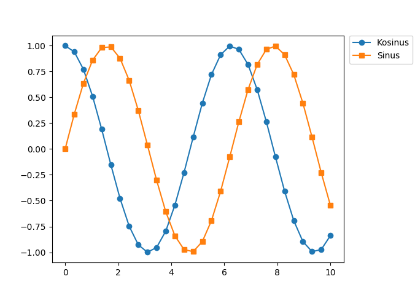

Die Achsen haben neben der bereits besprochenen Achsenbeschriftung noch weitere
Eigenschaften, die sich in matplotlib einstellen lassen. So kann es sinnvoll
sein, den Umfang der Achsen in Problemkoordinaten unabhängig von dem Bereich
festzulegen, in dem sich die Daten befinden. Im folgenden Beispiel wird die
*x*-Achse auf einen kleinen Ausschnitt der bisherigen Achse eingeschränkt.

.. sourcecode:: ipython

   In [34]: plt.xlim(4, 6)
   Out[34]: (4, 6)

.. sourcecode:: ipython

   In [35]: plt.xlim(0, 10)
   Out[35]: (0, 10)

Nachdem wir wieder zum ursprünglichen Achsenumfang zurückgekehrt sind, wollen
wir die *y*-Achse logarithmisch darstellen. Dies hat in unserem Fall den
Nebeneffekt, dass die Bereiche, in denen negative *y*-Werte auftreten, nicht
dargestellt werden. Außerdem wollen wir ein Koordinatengitter für beide Achsen
anzeigen lassen.

.. sourcecode:: ipython

   In [36]: plt.yscale('log')
      ...: plt.grid(which='both')

.. image:: images/matplotlib/mpl26.png
   :height: 5cm
   :align: center

Der Wechsel zwischen linearer und logarithmischer Achse kann auch direkt im
Grafikfenster mit Hilfe der Tasten ``k`` für die *x*-Achse und ``l`` für die
*y*-Achse erfolgen. Dies ist besonders dann praktisch, wenn man nur schnell
überprüfen möchte, wie Daten in einer einfach- oder doppelt-logarithmischen
Auftragung aussehen.

.. sourcecode:: ipython

   In [37]: plt.yscale('linear')

Wieder zu einer linearen Skala zurückgekehrt, wollen wir noch an einem
einfachen Beispiel zeigen, wie man die Achseneinteilung den jeweiligen
Bedürfnissen anpassen kann. Eine genauere Diskussion der verschiedenen
Möglichkeiten, die matplotlib zu diesem Zweck zur Verfügung stellt, würde hier
zu weit führen. 

Nachdem wir in unserer Beispielgrafik trigonometrische Funktionen darstellen,
wollen wir gerne die *x*-Achse in Vielfache von π einteilen. Dies kann dadurch
geschehen, dass wir der ``xticks``-Methode eine Liste von Punkten auf der
*x*-Achse sowie ein Tupel mit den entsprechenden Beschriftungen übergeben.
Außerdem können wir Schrifteigenschaften festlegen, zum Beispiel die
Schriftgröße und die Schriftfarbe, die wir hier rot wählen.

.. sourcecode:: ipython

   In [38]: plt.xticks(np.pi*np.arange(0, 4), ('0', r'$\pi$', r'$2\pi$', r'$3\pi$'),
      ...:            size='x-large', color='r')
   Out[38]: ([<matplotlib.axis.XTick at 0x7f48b0a011d0>,
     <matplotlib.axis.XTick at 0x7f48b0178908>,
     <matplotlib.axis.XTick at 0x7f48b016ada0>,
     <matplotlib.axis.XTick at 0x7f48af92f8d0>],
    <a list of 4 Text xticklabel objects>)

Das Ergebnis sieht dann folgendermaßen aus:

.. image:: images/matplotlib/mpl27.png
   :height: 5cm
   :align: center

Hat man die optimale Form für die Grafik erreicht, so möchte man diese häufig
auch abspeichern. Wie wir schon gesehen haben, lässt sich das mit dem
entsprechenden Icon im Grafikfenster erreichen. Genauso gut kann man die Grafik
aber auch mit Hilfe der ``savefig``-Funktion in einer Datei speichern. Dabei
ist zunächst das gewünschte Format festzulegen.

Für die Darstellung auf einem Bildschirm oder zum Beispiel für die Einbindung
in eine Webseite eignet sich ein Bitmapformat, das die Abbildung in einer
gerasterten Form abspeichert. Hierfür gibt es sehr viele verschiedene Formate.
In matplotlib bietet sich die Verwendung des ``png``-Formats [#png]_ an.

.. sourcecode:: ipython

   In [39]: plt.savefig('example.png')

Der Nachteil von Bitmapformaten ist, dass die Pixelstruktur der Abbildung bei
einer vergrößerten Darstellung mehr oder weniger stark sichtbar wird. Benötigt
man eine höher aufgelöste Ausgabe, beispielsweise zum Druck, so wird man eher
zu einem Vektorformat greifen. matplotlib bietet hier das Postscript-Format an,
das sich im Encapsulated Postscript-Format für die Einbettung in andere Dokumente
eignet. Ein heute weit verbreitetes Format ist PDF (»portable document format«).
Dieses Format kann auch Bitmap-Anteile enthalten, die dann natürlich der
beschriebenen Skalierungsproblematik unterliegen. SVG (»scalable vector graphics«)
ist ein Vektorgrafikformat, das für die Verwendung von Vektorgrafiken im Internet
entwickelt wurde und von modernen Webbrowsern zumindest zu großen Teilen dargestellt
werden kann.

.. sourcecode:: ipython

   In [40]: plt.savefig('example.pdf')

Die ``savefig``-Funktion benötigt als zwingendes Argument den Namen der Datei,
in der die Abbildung gespeichert werden soll. Sie akzeptiert außerdem eine Reihe
weiterer Argumente, mit denen man zum Beispiel die Auflösung einer Bitmapgrafik
oder die Hintergrundfarbe der Abbildung beeinflussen kann. Bei Bedarf empfiehlt
sich ein Blick in die matplotlib-Dokumentation.

Abschließend wollen wir aus dem breiten Spektrum der Möglichkeiten von
matplotlib noch drei Problemstellungen ansprechen, die in einem
wissenschaftlichen Umfeld häufig vorkommen. Als erstes wollen wir uns mit der
Darstellung von zweidimensionalen Daten mit Hilfe eines Konturplots beschäftigen.

Zunächst löschen wir die noch vorhandene Abbildung mit Hilfe der ``clf``-Funktion
(»clear figure«) und fangen auf diese Weise neu an.

.. sourcecode:: ipython

   In [41]: plt.clf()

Um Daten zur Verfügung zu haben, die wir darstellen können, verwenden wir NumPy,
mit dem wir zunächst ein regelmäßiges Koordinatengitter zu erzeugen, über dem
dann eine Funktion von zwei Variablen ausgewertet wird.

.. sourcecode:: ipython

   In [42]: x, y = np.mgrid[-3:3:100j, -3:3:100j]
      ...: z = (1-x+x**5+y**3)*np.exp(-x**2-y**2)

Um eine Vorstellung vom Verhalten dieser Funktion anhand von Konturlinien
zu erhalten, genügt es im einfachsten Fall, die *x*- und *y*-Koordinaten
des Gitters und die zugehörigen Funktionswerte an die ``contour``-Funktion
zu übergeben.

.. sourcecode:: ipython

   In [43]: contourset = plt.contour(x, y, z)

Wenn man jedoch nicht weiß, welche Farbe welchem Wert der Funktion zugeordnet
ist, ist so ein Bild häufig nur eingeschränkt nützlich. Es ist daher sinnvoll,
jede Konturlinie mit dem zugehörigen Funktionswert zu beschriften. Hierzu haben
wir in der vorhergehenden Anweisung bereits die Konturlinien in der Variable
``contourset`` gespeichert, mit deren Hilfe wir nun die Beschriftung vornehmen
können.

.. sourcecode:: ipython

   In [44]: plt.clabel(contourset, inline=1)
   Out[44]: <a list of 8 text.Text objects>

Ist das Argument ``inline`` gleich ``True`` oder gleich 1, so wird die Kontur
unter der Beschriftung entfernt. Dies ist die Standardeinstellung und müsste
daher nicht unbedingt explizit angegeben werden.

.. image:: images/matplotlib/mpl29.png
   :height: 5cm
   :align: center

Eine andere Möglichkeit, eine Verbindung zwischen der Farbe der Konturlinien
und dem entsprechenden Funktionswert herzustellen, besteht in der Verwendung
eines Farbstreifens neben der eigentlichen Abbildung. Im Falle von Konturlinien
sind hier nur einzelne Linien bei den entsprechenden Werten zu sehen. Füllt man
die Flächen zwischen den Konturlinien, so ist dieser Farbstreifen durchgehend
farbig dargestellt, wie wir gleich noch sehen werden.

.. sourcecode:: ipython

   In [45]: plt.colorbar(contourset)
   Out[45]: <matplotlib.colorbar.Colorbar at 0x7f48aeda8a20>

Bis jetzt hatten wir es matplotlib überlassen, die Werte für die einzelnen
Konturlinien zu bestimmen. Es ist aber auch möglich, die entsprechenden
Werte in einer Liste vorzugeben, wie das nächste Beispiel zeigt.

.. sourcecode:: ipython

   In [46]: plt.clf()
      ...: contourset = plt.contour(x, y, z, [-0.25, 0, 0.25, 1])
      ...: plt.clabel(contourset, inline=1)
   Out[46]: <a list of 4 text.Text objects>

Der Zusammenhang zwischen Funktionswert und Farbe wird durch eine Farbpalette,
eine so genannte »color map«, vermittelt. Die bisher verwendete
Standardeinstellung läuft unter dem Namen ``jet``. matplotlib stellt eine ganze
Reihe verschiedener Farbpaletten zur Verfügung, von denen einige auch gut
für Konturplots geeignet sind. Eine Zusammenstellung der Farbpaletten aus der
matplotlib-Galerie ist nachfolgend abgebildet.

Im folgenden Beispiel wählen wir die Farbpalette ``hot`` und füllen mit Hilfe
der Funktion ``contourf`` die Flächen zwischen den Konturlinien. Damit die
Linien deutlicher sichtbar werden, werden sie in schwarz dargestellt.

.. sourcecode:: ipython

   In [47]: plt.clf()
      ...: levels = 10
      ...: contourset = plt.contourf(x, y, z, levels, cmap='hot')
      ...: plt.colorbar(contourset)
      ...: contourlines = plt.contour(x, y, z, levels, colors=('k',))
      ...: plt.clabel(contourlines, inline=1)
   Out[47]: <a list of 11 text.Text objects>

Vor allem bei der Erstellung von Grafiken für Publikationen steht man
gelegentlich vor der Aufgabe, mehrere Abbildungen zu einer einzigen Abbildung
zusammenzufassen. Man verwendet hierfür die ``subplots``-Funktion, die in den
ersten beiden Argumenten die Zahl der Zeilen und der Spalten enthält. Wir wollen
zwei Grafiken übereinandersetzen und wählen daher 2 Zeilen und 1 Spalte. Neben
der Gesamtgröße der Abbildung geben wir noch an, dass die *x*-Achse aus der
unteren Abbildung auch für die obere Abbildung gelten soll. ``subplots`` gibt
ein ``figure``-Objekt zurück, das sich auf die ganze Abbildung bezieht sowie in
unserem Fall zwei ``axes``-Objekte, die sich jeweils auf die Unterabbildungen
beziehen.  Hier wird die Unterscheidung zwischen Abbildung und Unterabbildungen
deutlich, die weiter oben bereits angedeutet wurde. Nachdem die
Unterabbildungen angelegt wurden, können mit Hilfe des entsprechenden
``axes``-Objekts Änderungen an den Unterabbildungen vorgenommen werden.  Wir
zeichnen hier konkret in jeder Unterabbildung einen Funktionsgraphen und nehmen
eine Achsenbeschriftung vor.

.. sourcecode:: ipython

   In [48]: tvals = np.linspace(0, 10, 200)
      ...: x0vals = np.exp(-0.2*tvals)*np.sin(3*tvals)
      ...: x1vals = tvals*np.exp(-tvals)
      ...: fig, (ax0, ax1) = plt.subplots(2, 1, figsize=(8, 5), sharex=True)
      ...: ax0.plot(tvals, x0vals)
      ...: ax1.plot(tvals, x1vals)
      ...: ax1.set_xlabel('$t$', size='xx-large')
      ...: ax0.set_ylabel('$x$', size='xx-large')
      ...: ax1.set_ylabel('$x$', size='xx-large')
   Out[48]: <matplotlib.text.Text at 0x7f48aeb96278>

.. image:: images/matplotlib/mpl33.png
   :height: 5cm
   :align: center

Mit matplotlib sind auch dreidimensionale Darstellungen möglich, zumindest
in einem gewissen Umfang, der für viele Zweck ausreicht. In dem folgenden
Beispiel wird eine Funktion zweier Variablen dreidimensional dargestellt.
Zusätzlich wird in der *x*-*y*-Ebene eine Projektion der Funktionsdaten
gezeigt. Dreidimensionale Darstellungen erfordern einen Import aus dem
matplotlib Toolkit, der zunächst vorgenommen wird. Anschließend wird die
darzustellende Funktion auf einem Gitter ausgewertet. Zudem wählen wir eine
Farbpalette, die wir sowohl für die dreidimensionale Darstellung als auch
für die Projektion verwenden.

Nachdem wir eine Abbildung unter der Variable ``fig`` erzeugt haben, können
wir für eine darin enthaltene Unterabbildung ``ax`` eine dreidimensionale
Projektionsdarstellung festlegen. Anschließend können wir mit Hilfe der
zuvor berechneten Funktionsdaten eine dreidimensionale Darstellung der Funktion
zeichnen lassen. Die Argumente ``rstride`` und ``cstride`` geben an, in 
welchen Abständen bezogen auf die Gitterweite Schnittlinien gezeichnet werden.
Das letzte Argument, ``alpha``, betrifft einen Aspekt der Farbdarstellung, den
wir bis jetzt noch nicht besprochen hatten. Der Alphakanal gibt zusätzlich 
beispielsweise zu den Farbkanälen R, G und B die Transparenz der Farbe an.
Im Beispiel wird die Oberfläche also teilweise transparent dargestellt.

Die Projektion in die *x*-*y*-Ebene stellen wir wie bereits besprochen mit
Hilfe der Funktion ``contourf`` dar, wobei wir in diesem Beispiel auf die
Darstellung von Konturlinien verzichten. Bei der Anwendung in einer
dreidimensionalen Darstellung müssen wir noch die Ausrichtung der Projektsebene
mit Hilfe der Normalenrichtung ``zdir`` und die Lage mit Hilfe von ``offset``
spezifizieren. Durch eine entsprechende Wahl von ``zdir`` wäre es auch möglich,
Projektionen in die *x*-*z*- und die *y*-*z*-Ebene vorzunehmen. 

Abschließend setzen wir in unserem Beispiel die Achsenbeschriftung und
erweitern den Wertebereich der *z*-Achse, um die Projektion darstellen
zu können. Zum Schluss wird die Abbildung, die hier im Gegensatz zu
den meisten Beispielen dieses Kapitels objektorientiert erstellt wurde,
dargestellt.

.. sourcecode:: ipython

   In [49]: from mpl_toolkits.mplot3d import Axes3D
      ...: x, y = np.mgrid[-3:3:30j, -3:3:30j]
      ...: z = (x**2+y**3)*np.exp(-x**2-y**2)
      ...: cmap = 'coolwarm'
      ...: 
      ...: fig = plt.figure()
      ...: ax = fig.gca(projection='3d')
      ...: ax.plot_surface(x, y, z, rstride=1, cstride=1, cmap=cmap, alpha=0.5)
      ...: cset = ax.contourf(x, y, z, zdir='z', offset=-0.8, cmap=cmap)
      ...: ax.set_xlabel('$x$', size='xx-large')
      ...: ax.set_ylabel('$y$', size='xx-large')
      ...: ax.set_zlabel('$z$', size='xx-large')
      ...: ax.set_zlim(-0.8, 0.5)
      ...: 
      ...: plt.draw()

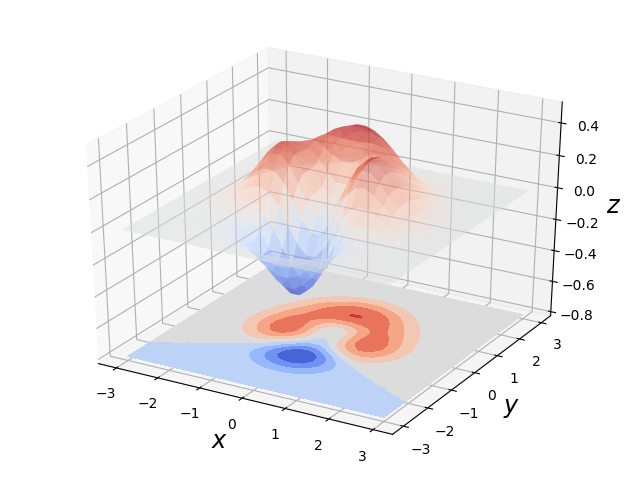

Es sei noch angemerkt, dass sich die dreidimensionale Darstellung im grafischen
Benutzerinterface nach Belieben in alle Richtungen drehen lässt, so dass sich
bequem eine geeignete Blickrichtung finden lässt, die eine instruktive Sicht
auf die dargestellten Daten ermöglicht.

In diesem Kapitel mussten wir uns auf einige für die Anwendung wichtige
Problemstellungen konzentrieren und konnten daher keinen vollständigen
Überblick über die Möglichkeiten von matplotlib geben. Um einen detaillierteren
Einblick zu bekommen, bietet sich ein Blick in die bereits mehrfach erwähnte
Beispielgalerie an. Dort ist auch der Code verfügbar, mit dem die in der
Galerie gezeigten Beispiele erzeugt wurden. Weitere Informationen über die
verfügbaren Funktionen und die jeweiligen Argumente liefert die umfangreiche
Dokumentation, die ebenfalls auf der matplotlib-Webseite `www.matplotlib.org
<http://www.matplotlib.org>`_ bereitgestellt ist.

===============================
Erstellung von Grafiken mit PyX
===============================

In diesem Kapitel wollen wir als zweites Paket zur Erzeugung von Abbildungen
``PyX`` besprechen. Es handelt sich dabei um ein Paket, das zunächst von
André Wobst und Jörg Lehmann während ihrer Doktorandenzeit an der Universität
Augsburg entwickelt wurde. Zwischenzeitlich leistete Michael Schindler einige
interessante Beiträge, und heute wird PyX von den beiden Erstgenannten
weiterentwickelt.

PyX eignet sich im Gegensatz zu dem zuvor besprochenen matplotlib-Paket auch
sehr gut zur Erstellung von schematischen Darstellungen. Wir wollen diesen
Aspekt daher als erstes besprechen. Anschließend werden wir zeigen, wie in PyX
auch grafische Darstellungen von Daten erzeugt werden können. Interessant ist,
dass man für beide Anwendungen nur ein einziges Paket benötigt und die beiden
Darstellungsarten auch kombinieren kann. Wie schon bei matplotlib würde es
zu weit führen, alle Möglichkeiten von PyX zu diskutieren. Wir treffen daher im
Folgenden eine Auswahl wichtiger anwendungsrelevanter Aspekte und verweisen
ansonsten auf die Dokumentation unter `pyx.sf.net <http://pyx.sf.net>`_ sowie
die Beispielseiten und die Galerie. Letztere ist derzeit weniger umfangreich als
bei matplotlib, was jedoch nichts über den Funktionalitätsumfang aussagt.

Bis zur Version 0.12.1 war PyX nur unter Python 2 lauffähig und seit der Version
0.13 ist es ausschließlich unter Python 3 funktionsfähig. Die installierte
Version von PyX kann man folgendermaßen herausfinden:

.. sourcecode:: ipython

   In [1]: import pyx
      ...: pyx.__version__
   Out[1]: '0.13'

Die folgende Diskussion bezieht sich auf die Version 0.13 für Python 3. Zu
Beginn eines Pythonskripts wird man zuerst PyX sowie bei Bedarf weitere 
Pakete importieren. Im Gegensatz zu matplotlib importieren wir alle Module,
da die Auswirkung auf den Namensraum wesentlich überschaubarer ist als bei
matplotlib. Natürlich kann man sich aber auch darauf beschränken, nur die
jeweils benötigten Module zu importieren.

.. sourcecode:: ipython

   In [2]: from pyx import *

Ein wesentlicher Aspekt bei der Erstellung schematischer Abbildungen ist das
Zeichnen von Pfaden, eine eventuelle Dekorierung von Pfaden sowie das Füllen
von Flächen, die durch gegebene Pfade begrenzt werden. In PyX erfolgt das
Zeichnen grundsätzlich auf einem »canvas«, also einer Leinwand. Wir werden
später noch sehen, dass ein Canvas eine sehr flexible Struktur darstellt, die
transformiert, also beispielsweise skaliert, gespiegelt oder geschert werden
kann. Zudem kann ein Canvas in einen anderen Canvas eingefügt werden. Bei PyX
wird man im Allgemeinen sehr früh einen Canvas bereitstellen, um darin zeichnen
zu können. In unserem ersten Beispiel definieren wir uns einen Canvas. Diese
Klasse ist im ``canvas``-Modul definiert, so dass die Initialisierung mit der
ersten Zeile aus dem folgenden Code erfolgt. Der Code in der zweiten Zeile
verlangt, dass auf dem gerade definierten Canvas ein Kreis um den Ursprung mit
Radius 1 gemalt wird. So lange nichts anderes angegeben wird, wird der Kreis
mittels einer schwarzen durchgezogenen Linie mit der Defaultbreite dargestellt.

.. sourcecode:: ipython

   In [3]: c = canvas.canvas()
      ...: c.stroke(path.circle(0, 0, 1))

Abweichungen von den Defaulteinstellungen kann man in einer Attributliste
angeben. Zu beachten ist, dass hier immer eine Liste anzugeben ist, selbst
dann, wenn nur ein einziges Attribut neu definiert wird. Mit Hilfe der
folgenden Codezeile wird auf dem bereits existierenden Canvas ein weiterer
Kreis gemalt, der nun durch eine dickere, gestrichelte Linie dargesellt
wird.

.. sourcecode:: ipython

   In [4]: c.stroke(path.circle(2.2, 0, 1),
      ...:          [style.linestyle.dashed, style.linewidth.THIck])

.. image:: images/pyx/pyx2.png
   :height: 1cm
   :align: center

Neben durchgezogenen und gestrichelten Linien gibt es auch punktierte und
strichpunktierte Linien, wobei sich die Strichlänge bei Bedarf einstellen
lässt. Die Liniendicke wird umso größer, je mehr Buchstaben des Wortes
»thick« groß geschrieben werden. Von »THIN« bis »THICK« ändert sich die
Linienbreite in Schritten von :math:`\sqrt{2}` und umfasst dabei einen Umfang
von etwa einem Faktor 45.

Ein weiterer Parameter beim Malen des Pfades ist die Farbe, die man ganz
ähnlich wie bei matplotlib auf verschiedene Weisen festlegen kann. Im
``rgb``-System sind wenige Farben per Namen ansprechbar. Es handelt sich um
rot (``red``), grün (``green``), blau (``blue``), weiß (``white``) und
schwarz (``black``). Eine wesentlich größere Anzahl von Farbnamen ist im
``cmyk``-System definiert, wobei ``cmyk`` für Cyan, Magenta, Gelb (``Yellow``)
und Schwarz (``blacK``) steht. Einen roten Kreis kann man also folgendermaßen
erhalten:

.. sourcecode:: ipython

   In [5]: c.stroke(path.circle(4.4, 0, 1), [color.rgb.red])

Man kann aber Pfade nicht nur zeichnen, sondern auch füllen. Hierfür gibt es
zwei Möglichkeiten, die wir nun ansehen wollen. Man kann den Pfad durch Füllen
dekorieren, indem man zu den Attributen ``deco.filled()`` hinzufügt. Die Füllung
kann man wiederum mit einer Liste von Attributen genauer spezifizieren. In
unserem Beispiel wollen wir als Farbe ein helles Grau festlegen. Lässt man in
``color.grey()`` das Argument von 0 bis 1 laufen, so erhält man Graustufen
zwischen Schwarz und Weiß. Anhand der Linienfarbe demonstriert unser Beispiel
auch die Möglichkeit, Farben mit Hilfe des ``hsb``-Systems festzulegen, wobei
der »value« in dieser Bezeichnung durch »brightness« ersetzt wurde, ein
ebenfalls übliches Akronym für dieses zusätzlich auf dem Farbwert und der
Sättigung basierenden Farbsystems.

.. sourcecode:: ipython

   In [6]: c.stroke(path.circle(6.6, 0, 1),
      ...:          [color.hsb(0.11, 1, 1), style.linewidth.THICK,
      ...:           deco.filled([color.grey(0.7)])])

.. image:: images/pyx/pyx4.png
   :height: 1cm
   :align: center

Ein alternativer Weg, einen gefüllten Kreis zu malen, der vollkommen äquivalent
zu dem vorherigen Vorgehen ist, besteht darin, das Füllen des Kreises in den
Vordergrund zu stellen. Dabei verwendet man statt der ``stroke``-Methode die
``fill``-Methode. Dabei hat man die Wahl, den Pfad selbst durch Angabe des
``deco.stroked()``-Methode zu malen oder dies nicht zu tun. Das folgende
Beispiel unterscheidet sich von dem vorhergehenden lediglich durch die Wahl
der Farben, wobei wir hier noch die Verwendung des ``rgb``-Systems
demonstrieren, das wir bereits von matplotlib kennen.

.. sourcecode:: ipython

   In [7]: c.fill(path.circle(8.8, 0, 1), [color.rgb(1, 0.5, 0.5),
      ...:         deco.stroked([style.linewidth.THICK, color.rgb(0.5, 0.5, 1)])])

Selbstverständlich stehen als Pfade nicht nur Kreise zur Verfügung. Im folgenden
Beispiel finden zwei weitere Pfade Verwendung, nämlich Linien (``path.line``)
und Rechtecke (``path.rect``). Im ersten Fall sind die *x*- und *y*-Koordinate
von Anfangs- und Endpunkt anzugeben, während im zweiten Fall die ersten beiden
Argumente einen Eckpunkt angeben und die beiden folgenden Punkte die Breite und
die Höhe des Rechtecks spezifizieren. 

Zusätzlich zu diesen Pfaden demonstriert das Beispiel noch eine weitere
Pfaddekoration, nämlich das Platzieren von Pfeilen am Anfang (``barrow``)
und/oder Ende (``earrow``) eines Pfades. Dabei lässt sich die Größe des
Pfeils festlegen. Hier verlangen wir mit ``large`` Pfeile, die etwas größer
als die Defaultpfeile sind. Mit Hilfe von Großbuchstaben lässt sich die
Pfeilgröße weiter erhöhen, ähnlich wie dies bei der Linienbreite der Fall
war. Kleinere Pfeile erhält man mit Hilfe von ``small``. Schließlich
demonstriert das Beispiel die Verwendung von benannten Farben im
``cmyk``-System, das oben schon kurz erläutert wurde.

.. sourcecode:: ipython

   In [8]: c = canvas.canvas()
      ...: c.fill(path.rect(-1, -0.5, 2, 1),
      ...:        [color.cmyk.Orange, deco.stroked([color.cmyk.PineGreen,
      ...:                                          style.linewidth.THick])])
      ...: c.stroke(path.line(-2, 0, 2.5, 0), [deco.earrow.large])
      ...: c.stroke(path.line(0, 2.5, 0, -2), [deco.barrow.large])

.. image:: images/pyx/pyx6.png
   :height: 3cm
   :align: center

Neben der Verwendung vordefinierter Pfade erlaubt es PyX auch, Pfade aus
mehreren Pfadsegmenten zu bilden. Im folgenden Beispiel wird ein Pfad aus vier
geraden Linien zusammengesetzt. Zunächst wird mit ``path.moveto()`` ein
Startpunkt gewählt, der hier im Koordinatenursprung liegt. Von diesem Punkt
ausgehend wird dann eine Linie zu einem weiteren Punkt gezogen, der in absoluten
Koordinaten angegeben wird und als nächster Ausgangspunkt dient.  Auf diese
Weise wird hier ein Pfad konstruiert, der ein Quadrat beschreibt.

Obwohl der Pfad schließlich an den Ausgangspunkt zurückkehrt, handelt es
sich nicht um einen geschlossenen Pfad. Dies wird deutlich, wenn man die
Linienbreite sehr groß wählt, wie es hier der Fall ist. Die Funktionsweise
von ``wscale`` und weiteren Längenskalen wird etwas weiter unten genauer
besprochen. Die letzte Zeile in dem folgenden Beispiel führt zwar dazu,
dass der eingangs definierte Pfad ``p`` gezeichnet wird, aber die Linie ist
offenbar nicht geschlossen.

.. sourcecode:: ipython

   In [9]: p = path.path(path.moveto(0, 0),
      ...:               path.lineto(2, 0),
      ...:               path.lineto(2, 2),
      ...:               path.lineto(0, 2),
      ...:               path.lineto(0, 0))
      ...: unit.set(wscale=40)
      ...: c = canvas.canvas()
      ...: c.stroke(p)

.. image:: images/pyx/pyx7.png
   :height: 2cm
   :align: center

Das Schließen eines Pfades erreicht man durch Anhängen von ``path.closepath()``,
wobei es nicht einmal notwendig ist, zum Ausgangspunkt zurückzukehren.
``closepath`` fügt bei Bedarf selbstständig das fehlende Liniensegment zum
Ausgangspunkt des Pfades ein. Die Quadratkontur wird jetzt vollständig
dargestellt.

.. sourcecode:: ipython

   In [10]: p = path.path(path.moveto(0, 0),
      ...:               path.lineto(2, 0),
      ...:               path.lineto(2, 2),
      ...:               path.lineto(0, 2),
      ...:               path.closepath())
      ...: c = canvas.canvas()
      ...: c.stroke(p)

.. image:: images/pyx/pyx8.png
   :height: 2cm
   :align: center

Für die folgenden Beispiele stellen wir die stark erhöhte Linienbreite zunächst
einmal wieder auf die Defaultbreite zurück.

.. sourcecode:: ipython

   In [11]: unit.set(wscale=1)

In den beiden vorhergehenden Beispielen haben wir die Pfadsegmente mit Hilfe von
absoluten Koordinaten festgelegt. Statt ``lineto`` kann man aber auch
``rlineto`` verwenden, in dem eine Linie relativ zum aktuellen Endpunkt des Pfades
angegeben wird. Das folgende Beispiel demonstriert dies anhand der Simulation einer
Zufallsbewegung, bei der in jedem Schritt um einen festen Abstand in eine zufällige
Richtung weitergegangen wird.

.. sourcecode:: ipython

   In [12]: from numpy import random
      ...: from math import pi, cos, sin
      ...: 
      ...: directions = 2*pi*random.random(1000)
      ...: pathelems = [path.rlineto(0.1*cos(dir), 0.1*sin(dir)) for dir in directions]
      ...: p = path.path(path.moveto(0, 0), *pathelems)
      ...: 
      ...: c = canvas.canvas()
      ...: c.stroke(p)

.. image:: images/pyx/pyx9.png
   :height: 4cm
   :align: center

Neben Geraden kann man auch Kreissegmente verwenden, um Pfade zu konstruieren. Dies
wird hier an einer stadionförmigen Kontur gezeigt.

.. sourcecode:: ipython

   In [13]: p = path.path(path.moveto(-1, -1), path.lineto(1, -1),
      ...:                path.arc(1, 0, 1, 270, 90), path.lineto(-1, 1),
      ...:                path.arc(-1, 0, 1, 90, 270), path.closepath())
      ...: c = canvas.canvas()
      ...: c.stroke(p, [deco.filled([color.rgb(1, 0.5, 0.5)])])

Zu Beginn hatten wir bereits darauf hingewiesen, dass es die Möglichkeit gibt,
einen Canvas zu transformieren. Dabei müssen die Objekte im Canvas transformiert
werden, also letztendlich die Pfade. Es ist auch möglich, Pfade vor dem Zeichnen
einer Transformation zu unterwerfen, wie wir anhand einiger Beispiel
demonstrieren wollen.

Aus dem vordefinierten Kreispfad lassen sich sehr einfach auch Ellipsen
erzeugen, indem man die Skalierungstransformation anwendet und dabei
unterschiedliche Skalierungsfaktoren in *x*- und *y*-Richtung verwendet. Das
folgende Beispiel zeigt eine Reihe von Ellipsen mit unterschiedlicher
Exzentrizität.

.. sourcecode:: ipython

   In [14]: p = path.circle(0, 0, 1)
      ...: ncircs = 5
      ...: c = canvas.canvas()
      ...: for n in range(ncircs):
      ...:     c.stroke(p, [trafo.scale(n+1, 1/(n+1)), color.hsb(1, 1, n/(ncircs-1))])

Will man die Hauptachsen der Ellipse nicht in Richtung der Koordinatenachsen
legen, so kann man die Ellipse anschließend rotieren. Wir zeigen das Rotieren
von Pfaden am Beispiel eines Quadrats, dessen Mittelpunkt im Ursprung liegt.
Da die Rotation immer um den Ursprung herum erfolgt, wird das Quadrat um seinen
Mittelpunkt gedreht.

.. sourcecode:: ipython

   In [15]: p = path.rect(-2, -2, 4, 4)
      ...: nrects = 8
      ...: c = canvas.canvas()
      ...: for n in range(nrects):
      ...:     c.stroke(p, [trafo.rotate(90*n/nrects), color.hsb(n/nrects, 1, 1)])

Möchte man stattdessen das Quadrat beispielsweise um seine linke untere Ecke
drehen, so muss man diese Ecke zunächst in den Ursprung verschieben, um dann
die Drehung durchzuführen. Anschließend erfolgt die Rückverschiebung an die
ursprüngliche Position oder, wie in diesem Beispiel, an eine verschobene
Position rechts neben der bereits existierenden Abbildung.

.. sourcecode:: ipython

   In [16]: for n in range(nrects):
      ...:     c.stroke(p, [trafo.translate(2, 2).rotated(
                            90*n/nrects).translated(8, -2),
                            color.hsb(n/nrects, 1, 1)])

Dieses Beispiel zeigt die Hintereinanderausführung von Transformationen, wobei
die Transformationen von links nach rechts abgearbeitet werden. Außerdem ist zu
beachten, dass die erste Verschiebung hier mit ``translate`` aufgerufen wird,
während die zweite sowie eventuell noch weiter folgende Verschiebungen mit
``translated`` aufgerufen werden. Entsprechend ist in dem obigen Beispiel auch
statt ``rotate`` die Methode ``rotated`` zu verwenden.

Neben Verschiebungen, Skalierungen und Drehungen stehen in PyX auch noch
Scherungen (``slant``) und Spiegelungen (``mirror``) zur Verfügung. Das folgende
Beispiel zeigt, wie man aus einem einzigen Liniensegment durch Drehung und 
Spiegelung einen sternförmigen Pfad erzeugen kann. Das Argument der
``mirror``-Methode gibt dabei den Winkel an, unter der die Spiegelachse durch
den Ursprung verläuft.

.. sourcecode:: ipython

   In [17]: nstar = 7
      ...: alpha = 360/nstar
      ...: p = path.line(1, 0, 2*cos(pi*alpha/360), 2*sin(pi*alpha/360))
      ...: c = canvas.canvas()
      ...: for n in range(nstar):
      ...:     c.stroke(p.transformed(trafo.rotate(alpha*n)))
      ...:     c.stroke(p.transformed(trafo.mirror(alpha/2).rotated(alpha*n)))

Gelegentlich ist es nützlich, Schnittpunkte von zwei Pfaden oder Pfadsegmente
zwischen zwei vorgegebenen Schnittpunkten zur Verfügung zu haben. Zur
Veranschaulichung zeichnen wir zunächst die beiden Pfade, die geschnitten werden
sollen. Das sind hier ein Kreis und ein Rechteck.

.. sourcecode:: ipython

   In [18]: c = canvas.canvas()
      ...: p1 = path.circle(0, 0, 1)
      ...: p2 = path.rect(-3, -0.5, 6, 1)
      ...: c.stroke(p1)
      ...: c.stroke(p2)

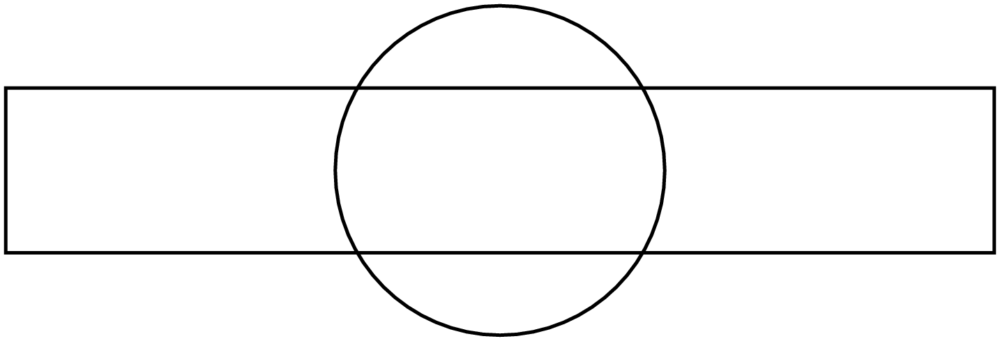

In der ersten Zeile des folgenden Codes wird der Pfad ``p1``, also der Kreis,
mit dem Pfad ``p2``, dem Rechteck, geschnitten. Dabei werden zwei Tupel, hier
``intersect_circle`` und ``intersect_rect`` genannt, erzeugt, die entsprechend
den vier Schnittpunkten jeweils vier Werte enthalten, die in einer
Parametrisierung der Pfade die Schnittpunkte angeben. In der zweiten und dritten
Zeile werden die beiden Pfade an den Schnittpunkten aufgetrennt, so dass zweimal
vier Teilpfade entstehen. Diese werden anschließend so zusammengefügt, dass am
Ende der Schnittbereich der beiden Pfade farbig gefüllt werden kann.

.. sourcecode:: ipython

   In [19]: intersect_circle, intersect_rect = p1.intersect(p2)
      ...: circle_subpaths = p1.split(intersect_circle)
      ...: rect_subpaths = p2.split(intersect_rect)
      ...: p = (circle_subpaths[0] << rect_subpaths[1]
      ...:      << circle_subpaths[2] << rect_subpaths[3])
      ...: c.fill(p, [color.rgb.red])

.. image:: images/pyx/pyx16.png
   :height: 2cm
   :align: center

Bei komplizierteren Pfaden ist es unter Umständen nicht ganz einfach, die
Tangenten- oder Normalenrichtung zu bestimmen. In solchen Fällen kann man
sich von PyX helfen lassen. Zur Illustration konstruieren wir zunächst eine
kubische Bézierkurve, die durch vier Punkte charakterisiert ist. Dabei handelt
es sich um eine kubische Kurve, für die der erste und vierte Punkt den Anfangs-
und den Endpunkt festlegen. Die Verbindungslinien vom ersten zum zweiten sowie
vom dritten zum vierten Punkt bestimmen zudem die Kurvensteigung im Anfangs-
und Endpunkt, wie im Beispiel durch die blauen Geraden dargestellt ist.

.. sourcecode:: ipython

   In [20]: x = (0, 3, 6, 6)
      ...: y = (0, 3, 3, 0)
      ...: p = path.curve(x[0], y[0], x[1], y[1], x[2], y[2], x[3], y[3])
      ...: c = canvas.canvas()
      ...: c.stroke(p)
      ...: for xc, yc in zip(x, y):
      ...:     c.fill(path.circle(xc, yc, 0.1), [color.rgb.blue])
      ...: c.stroke(path.line(x[0], y[0], x[1], y[1]), [color.rgb.blue])
      ...: c.stroke(path.line(x[2], y[2], x[3], y[3]), [color.rgb.blue])

.. image:: images/pyx/pyx17.png
   :height: 2.3cm
   :align: center

Im folgenden Beispiel soll bei der Hälfte der Kurve der Tangenten- und der
Normalenvektor eingezeichnet werden. Dazu wird in der dritten Zeile zunächst
mit ``p.arclen()`` die Länge des Pfads ``p`` bestimmt und dann mittels
``p.arclentoparam()`` der Parameter berechnet, der der Hälfte der Pfadlänge
entspricht. An diesem Punkt kann man dann mit ``p.tangent()`` ein Geradenstück
mit vorgegebener Länge in Tangentialrichtung erzeugen, das hier mit einem
Pfeil am Ende gezeichnet wird. Um den Normalenvektor zu zeichnen, wird der
Tangentialvektor einfach um 90° im Gegenuhrzeigersinn gedreht. Dabei ist
allerdings zu beachten, dass der Vektor zunächst in den Ursprung verschoben,
dort gedreht, und anschließend wieder in den Ausgangspunkt zurückverschoben
werden muss.

.. sourcecode:: ipython

   In [21]: c = canvas.canvas()
      ...: c.stroke(p)
      ...: paramhalf = p.arclentoparam(0.5*p.arclen())
      ...: x, y = p.at(paramhalf)
      ...: mycolor = color.rgb(0.8, 0, 0)
      ...: c.fill(path.circle(x, y, 0.1), [mycolor])
      ...: c.stroke(p.tangent(paramhalf, length=2), [deco.earrow, mycolor])
      ...: c.stroke(p.tangent(paramhalf, length=2), [deco.earrow, mycolor,
      ...:                 trafo.translate(-x, -y).rotated(90).translated(x, y)])

PyX bietet auch die Möglichkeit, mit Hilfe von Pfaden aus einem Canvas einen
Teil herauszuschneiden. Zunächst zeigen wir den vollständigen Canvas, der
eine matrixförmige Anordnung von gefärbten Quadraten im hsb-System enthält.

.. sourcecode:: ipython

   In [22]: c = canvas.canvas()
      ...: for nx in range(10):
      ...:     for ny in range(10):
      ...:         c.fill(path.rect(nx, ny, 1, 1), [color.hsb(nx/9, 1, ny/9)])

Nun legen wir beim Initialisieren des Canvas einen so genannten »clipping path«
fest, in unserem Fall einen Kreis, der die Darstellung des Canvas auf das Innere
dieses Pfads begrenzt. Damit wird innerhalb des Kreises der entsprechende
Ausschnitt aus der zuvor dargestellten Farbmatrix gezeigt.

.. sourcecode:: ipython

   In [23]: c = canvas.canvas([canvas.clip(path.circle(4, 7, 2))])
      ...: for nx in range(10):
      ...:     for ny in range(10):
      ...:         c.fill(path.rect(nx, ny, 1, 1), [color.hsb(nx/9, 1, ny/9)])

.. image:: images/pyx/pyx20.png
   :height: 2cm
   :align: center

Text ist ein wichtiger Bestandteil von grafischen Darstellungen, ganz gleich ob
in Schemazeichnungen oder in Graphen. PyX überträgt die Aufgabe des Textsatzes
an TeX oder LaTeX, woher auch das X im Namen des Pakets stammt. Damit bietet PyX
die Möglichkeit, Grafiken mit komplexen Texten, bei Bedarf auch ganzen
Paragraphen zu versehen. So ist es zum Beispiel möglich, Poster mit Hilfe von
PyX zu gestalten. Im Folgenden werden wir einige grundlegende Aspekte von Text
in PyX betrachten.

Im folgenden Beispiel wird zunächst ein Achsenkreuz am Ursprung gezeichnet, das
hier lediglich zur Orientierung dienen soll. Von Bedeutung ist vor allem die
letzte Zeile, in der der Text mit Hilfe der ``text``-Methode gesetzt wird. Die
ersten beiden Argumente geben den Punkt an, an dem der Text gesetzt wird, hier
also der Koordinatenursprung. Das dritte Argument enthält den Text, der hier
zunächst in einer Variable gespeichert wurde. Wie wir weiter unten noch sehen
werden, kann dieser Text beispielsweise auch Mathematikanteile entsprechend der
TeX- oder LaTeX-Syntax enthalten. Abschließend folgt eine Liste von Attributen.
In diesem Fall wird lediglich dafür gesorgt, das der Text etwas größer
dargestellt wird. Die möglichen Größenattribute folgen dabei der Vorgabe von
TeX wo in aufsteigender Größe die Einstellungen ``tiny``, ``scriptsize``, 
``footnotesize``, ``small``, ``normalsize``, ``large``, ``Large``, ``LARGE``,
``huge`` und ``Huge`` definiert sind. Wie an der Ausgabe zu sehen ist, wird
der Text mit dem linken Ende der Basislinie an dem im ``text``-Aufruf
angegebenen Punkt positioniert.

.. sourcecode:: ipython

   In [24]: c = canvas.canvas()
      ...: mytext = 'Augsburg'
      ...: mycolor = color.grey(0.7)
      ...: c.stroke(path.line(-1, 0, 1, 0), [mycolor])
      ...: c.stroke(path.line(0, -1, 0, 1), [mycolor])
      ...: c.text(0, 0, mytext, [text.size.huge])

Die Attributliste von ``text`` kann neben der Größenabgabe vor allem auch
Angaben zur Positionierung des Textes relativ zum angegebenen Referenzpunkt
enthalten. Im nächsten Beispiel werden jeweils drei wichtige Varianten der
horizontalen und vertikalen Positionierung dargestellt. ``halign.right``,
``halign.center`` und ``halign.left`` sorgen dafür, dass der Referenzpunkt
rechts vom Text, in dessen Mitte oder links vom Text liegt. Die vertikale
Positionierung mit ``valign.top``, ``valign.middle`` und ``valign.bottom``
führt dazu, dass der Referenzpunkt am oberen Ende, in der Mitte bzw. am
unteren Ende des den Text umschließenden Rahmens liegt. Auf diese Weise sind
sehr flexible Positionierungen möglich.

.. sourcecode:: ipython

   In [25]: c = canvas.canvas()
      ...: mytext = 'Augsburg'
      ...: mycolor = color.grey(0.7)
      ...: for nx in range(3):
      ...:     c.stroke(path.line(2*nx, 0, 2*nx, 6), [mycolor])
      ...: for ny in range(3):
      ...:     c.stroke(path.line(-1.5, 2*ny+1, 5.5, 2*ny+1), [mycolor])
      ...: for nx, xpos in enumerate((text.halign.right,
      ...:                            text.halign.center,
      ...:                            text.halign.left)):
      ...:     for ny, ypos in enumerate((text.valign.top,
      ...:                                text.valign.middle,
      ...:                                text.valign.bottom)):
      ...:         c.text(2*nx, 2*ny+1, mytext, [xpos, ypos, text.size.huge])

.. image:: images/pyx/pyx22.png
   :height: 4cm
   :align: center

Natürlich können Texte auch transformiert werden, wie wir hier anhand der
Drehung des Textes illustrieren. Dabei wird der Text zunächst aus dem Ursprung,
der als Drehpunkt fungiert, etwas herausgerückt.

.. sourcecode:: ipython

   In [26]: c = canvas.canvas()
      ...: for n in range(9):
      ...:     c.text(0, 0, mytext, [text.valign.middle,
                                     trafo.translate(0.3, 0).rotated(40*n)])

Wie bereits erwähnt, unterstützt PyX sowohl den Textsatz mit TeX als auch mit
LaTeX. Letzteres basiert auf TeX und stellt Funktionalität zur Verfügung, die
den Textsatz erleichtert. In LaTeX kann man die TeX-Syntax verwenden, aber
umgekehrt wird spezifische LaTeX-Syntax nicht von TeX verstanden. Daher sollte
man sich zunächst überlegen, welche Syntax man verwenden möchte. Defaultmäßig
ist TeX voreingestellt, das auch explizit mit Hilfe von
``text.set(text.TexRunner)`` verlangt werden kann. LaTeX wählt man mit Hilfe
von ``text.set(text.LatexRunner)`` aus. Die folgenden beiden Beispiele sind
äquivalent. Allerdings wird im ersten Beispiel die TeX-Syntax für einen Bruch
benutzt, während im zweiten Beispiel die LaTeX-Syntax verwendet wird.

.. sourcecode:: ipython

   In [27]: text.set(text.TexRunner)
      ...: c = canvas.canvas()
      ...: c.text(0, 0, '$x = {1\over2}$')

.. image:: images/pyx/pyx24.png
   :height: 0.5cm
   :align: center

.. sourcecode:: ipython

   In [28]: text.set(text.LatexRunner)
      ...: c = canvas.canvas()
      ...: c.text(0, 0, r'$x = \frac{1}{2}$')

.. image:: images/pyx/pyx25.png
   :height: 0.5cm
   :align: center

Das letzte Textbeispiel zeigt, wie in LaTeX eine etwas komplexere mathematische
Formel gesetzt werden kann. Außerdem ist in der letzten Zeile zu sehen, wie man
die Textgröße ohne Verwendung der auf TeX zurückgehenden Schlüsselworte bei
Bedarf stufenlos einstellen kann.

.. sourcecode:: ipython

   In [29]: c = canvas.canvas()
      ...: formula = r'$\displaystyle m\ddot{\vec r} = -\gamma\frac{Mm}{r^3}\vec r$'
      ...: c.text(0, 0, formula, [text.size(2)])

Wir haben in verschiedenen Beispielen immer wieder Längen explizit festgelegt,
zum Beispiel die Textgröße, die Linienbreite oder die Pfeilgröße. PyX stellt
jedoch auch die Möglichkeit zur Verfügung, Längenskalen global zu definieren.
Dabei wird Wert darauf gelegt, visuell unterschiedliche Längen auch unabhängig
voneinander verändern zu können. So gibt es ``uscale``, ``vscale``, ``wscale``
und ``xscale``, die wir jetzt ausgehend von einer Referenzabbildung, in der alle
Skalen auf Eins gesetzt sind, verändern wollen, um ihre Auswirkung vorzustellen.

.. sourcecode:: ipython

   In [30]: def testfigure():
      ...:     c = canvas.canvas()
      ...:     c.stroke(path.path(path.moveto(2, 0), path.lineto(0, 0),
      ...:              path.lineto(0, 2)), [deco.barrow, deco.earrow])
      ...:     c.fill(path.circle(1, 1, 0.1), [color.rgb.red])
      ...:     c.text(2, 0.2, '$x$', [text.halign.right])
      ...:     c.text(0.2, 2, '$y$', [text.valign.top])
      ...:     return c

.. sourcecode:: ipython

   In [31]: unit.set(uscale=1, vscale=1, wscale=1, xscale=1)
      ...: testfigure()

Zunächst verändern wir den Wert von ``uscale``, wodurch Distanzen verändert
werden. Dies betrifft in unserer Testabbildung die Länge der Achsen und die
Größe der roten Kreisfläche. Unverändert bleiben die Linienbreite der Achsen,
die Pfeilgröße sowie die Schriftgröße. Allerdings ist der Abstand der
Achsenbeschriftung von der jeweiligen Achse nun größer geworden.

.. sourcecode:: ipython

   In [32]: unit.set(uscale=2, vscale=1, wscale=1, xscale=1)
      ...: testfigure()

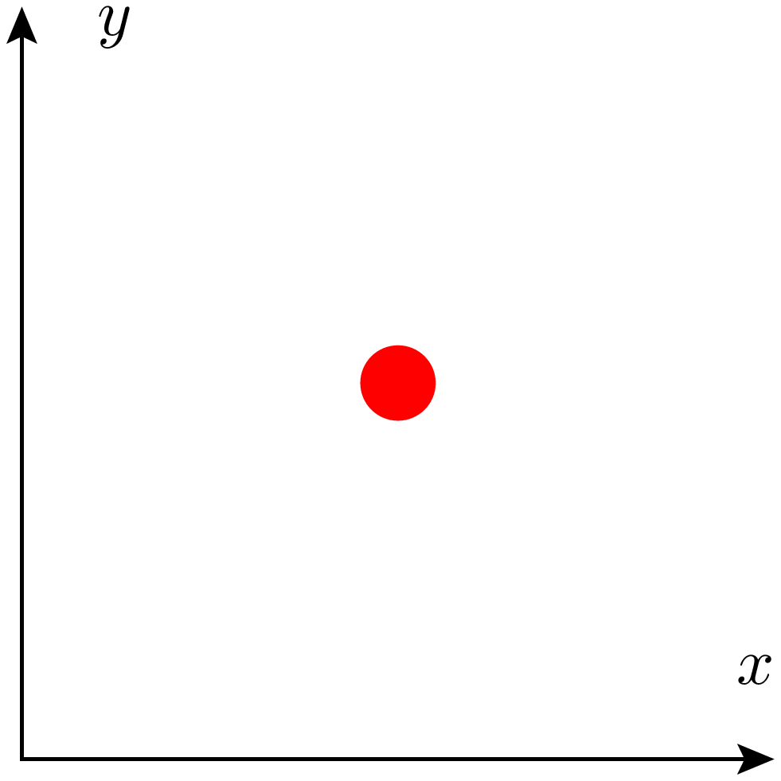

Im nächsten Beispiel wird ``uscale`` auf seinen ursprünglichen Wert
zurückgesetzt und dafür ``vscale`` verdoppelt. Dadurch werden visuelle
Elemente doppelt so groß dargestellt. In unserem Fall betrifft dies die
Pfeile. Es würden aber zum Beispiel auch Symbole in einer Grafik oder
Achsenticks vergrößert dargestellt werden.

.. sourcecode:: ipython

   In [33]: unit.set(uscale=1, vscale=2, wscale=1, xscale=1)
      ...: testfigure()

Der Parameter ``wscale`` beeinflusst alle Linienbreiten. Möchte man gleichzeitig
auch die Pfeilgröße heraufsetzen, so könnte man zusätzlich noch ``vscale``
verändern.

.. sourcecode:: ipython

   In [34]: unit.set(uscale=1, vscale=1, wscale=2, xscale=1)
      ...: testfigure()

Als letztes verdoppeln wir den Wert von ``xscale`` und erreichen auf diese
Weise, dass der gesamte Text in doppelter Größe ausgegeben wird. Damit spart
man sich unter Umständen, Größenangaben in vielen ``text``-Aufrufen
zu ändern. Zudem sind die besprochenen Skalen nützlich, um über mehrere
Abbildungen hinweg konsistente Längen zu verwenden.

.. sourcecode:: ipython

   In [35]: unit.set(uscale=1, vscale=1, wscale=1, xscale=2)
      ...: testfigure()

Für die folgenden Beispiele stellen wir alle Skalen wieder auf ihren
Standardwert zurück.

.. sourcecode:: ipython

   In [36]: unit.set(xscale=1)

PyX stellt so genannte Deformer zur Verfügung, die es erlauben, Pfade zu deformieren.
Dies kann in bestimmten Fällen sehr nützlich sein. Mit Hilfe eines Deformers ist es
zum Beispiel sehr leicht möglich, Kanten mit einem vorgegebenen Radius abzurunden.
Zu diesem Zweck fügen wir in der Attributliste im folgenden Beispiel einen Aufruf
der ``smoothed``-Methode hinzu.

.. sourcecode:: ipython

   In [37]: box = path.rect(0, 0, 3, 2)
      ...: c = canvas.canvas()
      ...: c.stroke(box)
      ...: c.stroke(box, [deformer.smoothed(radius=0.5), trafo.translate(3.5, 0)])
      ...: c.stroke(box, [deformer.smoothed(radius=1), trafo.translate(7, 0)])

Besonders elegant ist die Erzeugung der Darstellung einer Feder aus einem
Liniensegment durch die Verwendung des ``cycloid``-Deformers, die im folgenden
Beispiel dargestellt ist. Um einen optisch ansprechenden Eindruck zu erzielen,
stellt man abhängig von der zur Verfügung stehenden Länge den Radius der
Zykloide sowie die Zahl der halben Schleifen geeignet ein. Außerdem kann man
mit ``skipfirst`` und ``skiplast`` dafür sorgen, dass ein Teil der Linie am
Anfang und am Ende unverändert bleibt. Um den Übergang zwischen dem
deformierten Teil und dem unveränderten Teil etwas zu glätten, kann wiederum
der ``smoothed``-Deformer zum Einstatz kommen.

.. sourcecode:: ipython

   In [38]: c = canvas.canvas()
      ...: c.stroke(path.line(0, 0, 5, 0), [deformer.cycloid(radius=0.3,
      ...:                                      halfloops=21,
      ...:                                      skipfirst=0.3*unit.t_cm,
      ...:                                      skiplast=0.6*unit.t_cm),
      ...:                                  deformer.smoothed(radius=0.2)])

.. image:: images/pyx/pyx33.png
   :height: 0.7cm
   :align: center

Eine Anwendung eines Deformers, bei der der ursprüngliche Pfad mit Hilfe einer
»bounding box« erzeugt wird, zeigt das nächste Beispiel. Zunächst wird ein Text
definiert, der erst später in einen Canvas eingefügt wird. Daher wird in der
ersten Zeile statt ``c.text`` die Methode ``text.text`` verwendet. Dies erlaubt
es uns, die »bounding box« dieses Textes zu bestimmen, anschließend mit
``enlarged`` zu vergrößern und uns mit ``path`` den zugehörigen Pfad zu
beschaffen. Die Vergrößerung der »bounding box« wird hier mit ``0.3*unit.t_cm``
zu 0,3cm spezifiziert. In den Canvas wird dann zunächst der Pfad der vergrößerten
»bounding box« in abgerundeter Form und mit roter Farbe gefüllt eingefügt. 
Anschließend kann dann der weiße Text zum Canvas hinzugefügt werden.

.. sourcecode:: ipython

   In [39]: mytext = text.text(0, 0, r'\textbf{\sffamily Hallo}', [color.grey(1)])
      ...: textbox = mytext.bbox().enlarged(0.3*unit.t_cm).path()
      ...: c = canvas.canvas()
      ...: c.stroke(textbox, [deco.filled([color.rgb.red]),
      ...:                    deformer.smoothed(radius=0.5)])
      ...: c.insert(mytext)

In vielen Fällen wird man die erzeugte Grafik auch in einer Datei speichern
wollen. Dies kann in PyX genauso wie in matplotlib entweder in einem
Vektorgrafik- oder einem Bitmapformat erfolgen. Für ersteres stehen aktuell
die Ausgaben im PDF-Format sowie in Postscript und Encapsulated Postscript
zur Verfügung. Daneben gibt es eine ganze Reihe von Bitmapformaten. Welche
Formate verfügbar sind, hängt von den Fähigkeiten des installierten
``ghostscript``-Interpreters ab. Das folgende Beispiel zeigt das Abspeichern
eines Canvas im PDF-, im EPS- und im PNG-Format. Verzichtet man in den ersten
beiden Fällen auf die Angabe des Dateinamens, so wird der Name des erzeugenden
Python-Skripts herangezogen, wobei die Endung ``py`` je nach Ausgabeformat
durch ``pdf``, ``ps`` oder ``eps`` ersetzt wird. Häufig ist dies ein sinnvolles
Vorgehen, da man beim Kopieren von Skripten auf diese Weise vermeidet, bereits
erzeugte Bilder des ursprünglichen Skripts zu überschreiben, wenn man vergisst,
den Dateinamen anzupassen. Bei den Bitmapformaten wird das zu erzeugende Format
aus der Endung des Dateinamens entnommen, sofern ein Name angegeben wurde. 
Andernfalls muss das Ausgabegerät spezifiziert werden. Unser Beispiel zeigt
außerdem, wie die Auflösung der Bitmapgrafik beeinflusst werden kann.

.. sourcecode:: ipython

   In [40]: c.writePDFfile('hallo.pdf')
      ...: c.writeEPSfile('hallo.eps')
      ...: c.writeGSfile('hallo.png', resolution=300)

Weitere Informationen über mögliche Optionen beim Abspeichern von Grafiken
kann man der Dokumentation entnehmen. Es sei hier nur erwähnt, dass man zum
Beispiel beim PDF- und beim Postscript-Format die Papiergröße festlegen
oder auch mehrseitige Dokumente erzeugen kann.

Bis jetzt haben wir nur Fähigkeiten von PyX besprochen, die von matplotlib nicht
zur Verfügung gestellt werden. Mit PyX kann man jedoch auch genauso gut
grafische Darstellungen von Daten erzeugen. Dies soll im Folgenden demonstriert
werden.

Genauso wie bisher auch benötigt man für Graphen einen Canvas, allerdings mit
erweiterten Fähigkeiten. Für eine gewöhnliche zweidimensionale Darstellung
erzeugt man einen Canvas mit Hilfe von ``graph.graphxy``. Wie wir noch sehen
werden, lässt sich das Aussehen des Graphen durch geeignete Argumente sehr
genau beeinflussen. In dem folgenden, sehr einfachen Beispiel legen wir
lediglich die Breite des Graphen fest. Seine Höhe wird dann, da nichts anderes
angegeben ist, mit Hilfe des goldenen Schnitts bestimmt. In unserem Beispiel
wollen wir eine Reihe von Punkten darstellen, deren Lage durch eine Liste
von Tupeln festgelegt wird.

Um der ``plot``-Methode unseres Graphencanvas ``g`` die Datenquelle mitzuteilen,
verwendet man in diesem Fall die ``graph.data.points``-Methode, die als erstes
Argument die Datenliste erhält. Die Argumente ``x`` und ``y`` geben die Spalte
an. Die *x*-Werte sollen hier die ersten Werte der Tupel sein, die *y*-Werte
die jeweils zweiten Werte. Man könnte aber auch die zweite Spalte gegen die
erste Spalte darstellen oder aus längeren Tupeln die gewünschten Spalten nach
Bedarf auswählen. Standardmäßig erfolgt nun eine Darstellung der Datenpunkte
mit Hilfe von Kreuzen, die nicht durch eine Linie verbunden sind.

.. sourcecode:: ipython

   In [41]: g = graph.graphxy(width=8)
      ...: data = [(0, 0), (1, 0.5), (2, 3), (3, 4), (4, -0.7)]
      ...: g.plot(graph.data.points(data, x=1, y=2))

.. image:: images/pyx/pyx35.png
   :height: 5cm
   :align: center

Im nächsten Beispiel wollen wir die Darstellung verbessern, indem wir die 
Datenpunkte durch blaue gerade Linien verbinden und als Symbole blau umrandete
Dreiecke verwenden, die nicht von den Linien durchschnitten werden. Um dies zu
realisieren, übergibt man der ``plot``-Methode eine Liste von entsprechenden
Attributen, so wie wir es von der ``stroke``- oder der ``fill``-Methode des
Canvas her kennen.

Um die Übersichtlichkeit des Codes zu verbessern, haben wir im folgenden
Beispiel zwei Variablen definiert, die die Eigenschaften der Linie und
der Symbole enthalten. Diese Information könnte man alternativ direkt in der
``plot``-Methode in der letzten Zeile unterbringen. Stattdessen eine Variable
zu verwenden, hat neben der Übersichtlichkeit auch den Vorteil, dass sich die 
Vorgaben in verschiedenen ``plot``-Aufrufen verwenden lassen und so für eine
einheitliche Darstellung sorgen sowie das Programmieren nach dem DRY-Prinzip
[#dry]_ unterstützen.

Mit ``graph.style.line`` werden die Eigenschaften der zu zeichnenden Linien
festgelegt. Diese werden im Argument als Liste angegeben, selbst wenn es sich,
wie im folgenden Beispiel, nur um ein Attribut handelt, das hier die Farbe
festlegt. Man könnte beispielsweise auch eine gestrichelte oder gepunktete
Linie verlangen. Das Symbol wird mit Hilfe von ``graph.style.symbol``
festgelegt, wobei das Argument ``symbol`` die Form des Symbols, hier ein
Dreieck, angibt. Zudem kann man mit ``symbolattrs`` eine Liste von Attributen
übergeben, die das Aussehen des Symbols genauer festlegen. In unserem Fall wird
verlangt, dass der Rand des Symbols blau ist und das Innere weiß gefüllt wird.
Mit letzterem wird sichergestellt, dass die Linien die Symbole nicht schneiden.

.. sourcecode:: ipython

   In [42]: g = graph.graphxy(width=8)
      ...: data = [(0, 0), (1, 0.5), (2, 3), (3, 4), (4, -0.7)]
      ...: myline = graph.style.line([color.rgb.blue])
      ...: mysymbol = graph.style.symbol(symbol=graph.style.symbol.triangle,
      ...:                               symbolattrs=[deco.filled([color.grey(1)]),
      ...:                                            deco.stroked([color.rgb.blue])])
      ...: g.plot(graph.data.points(data, x=1, y=2), [myline, mysymbol])

.. image:: images/pyx/pyx36.png
   :height: 5cm
   :align: center

Im nächsten Beispiel nehmen wir Veränderungen an den Achsen vor. Hierzu
definiert man im Graphencanvas mit Hilfe der Argumente ``x`` und ``y`` die
Eigenschaften der zugehörigen Achsen. Mit ``graph.axis.lin`` erhält man eine
linear eingeteilte Achse, deren Eigenschaften mit den zugehörigen Argumenten
übergeben werden können. Dies ist zum Beispiel der Achsenumfang, der mit
``min`` und/oder ``max`` festgelegt werden kann, oder der Achsentitel, der mit
``title`` übergeben wird, wobei wie beim Text TeX- oder LaTeX-Syntax verwendet
werden kann. In dem folgenden Beispiel wird unter anderem der Wertebereich der
*y*-Achse vergrößert, damit das Symbol bei :math:`x=3` im Innern des
*y*-Wertebereichs liegt.

.. sourcecode:: ipython

   In [43]: g = graph.graphxy(width=8,
      ...:                   x=graph.axis.lin(title='$x$'),
      ...:                   y=graph.axis.lin(min=-1, max=4.5, title='$y$'))
      ...: data = [(0, 0), (1, 0.5), (2, 3), (3, 4), (4, -0.7)]
      ...: myline = graph.style.line([color.rgb.blue])
      ...: mysymbol = graph.style.symbol(symbol=graph.style.symbol.triangle,
      ...:                               symbolattrs=[deco.filled([color.grey(1)]),
      ...:                                            deco.stroked([color.rgb.blue])])
      ...: g.plot(graph.data.points(data, x=1, y=2), [myline, mysymbol])

.. image:: images/pyx/pyx37.png
   :height: 5cm
   :align: center

Bis jetzt haben wir als Datenquelle eine Liste von Tupeln verwendet. PyX kann
alternativ auch Daten aus einer Datei einlesen oder aus vorgegebenen Funktionen
berechnen. Dabei sind auch parametrisch definierte Funktionen möglich.

Wir wollen nun eine Darstellung von verschiedenen Potenzfunktionen erzeugen. Um
eine Funktion darzustellen, wählt man die ``graph.data.function``-Methode, in
der man den funktionalen Zusammenhang zwischen *x* und *y* in einer Zeichenkette
angibt. Normalerweise wählt PyX selbst die Zahl der Punkte, an denen die
Funktion ausgewertet wird. Da wir die zugehörigen Punkte mit Symbolen darstellen
wollen, legen wir jedoch die Zahl der Punkte mit Hilfe des Arguments ``points``
fest.

In unserem Beispiel werden mittels eines einzigen Aufrufs der ``plot``-Methode
mehrere Funktionen gezeichnet. Hierzu wird eine ganze Liste von
``function``-Aufrufen als erstes Argument übergeben. Dabei ist es in PyX sehr
elegant möglich festzulegen, wie die einzelnen Funktionsgraphen dargestellt
werden sollen. Wie schon im vorigen Beispiel benutzen wir ``graph.style.line``,
um die Attribute der Linien festzulegen. Die entsprechende Liste enthält zwei
Aufrufe von ``attr.changelist``, die festlegen, wie sich bestimmte Attribute
beim Wechsel von einer Linie zur nächsten ändern. Der erste Aufruf geht die
in der vierten Zeile definierte Farbliste der Reihe nach durch. Der zweite
Aufruf enthält eine Liste, die nur aus einem Element besteht und in diesem
Fall dazu führt, dass alle Linien durchgezogen sind.

Bei der Symbolart verwenden wir eine vordefinierte Symbolliste, die der Reihe
nach Quadrat, Dreieck, Kreis, Raute, Kreuz und Pluszeichen verwendet. In unserem
Beispiel mit nur vier Funktionen kommen nur die ersten vier Symbole zum Einsatz.
Damit die Farbe der Symbole zur Farbe der Linien passt, übergeben wir unsere
Farbliste auch an die Liste der Symbolattribute. Zudem legen wir, wie schon im
vorigen Beispiel, fest, dass die Symbole weiß zu füllen sind. Damit ergibt
sich ingesamt das unter dem Code dargestellte Bild.

.. sourcecode:: ipython

   In [44]: g = graph.graphxy(width=8,
      ...:                   x=graph.axis.lin(min=0, max=3, title='$x$'),
      ...:                   y=graph.axis.lin(min=0, max=3, title='$y$'))
      ...: colors = [color.hsb(2*n/9, 1, 0.8) for n in range(0, 4)]
      ...: mylines = graph.style.line(lineattrs=[
                attr.changelist(colors), attr.changelist([style.linestyle.solid])
                                                ])
      ...: mysymbols = graph.style.symbol(symbol=graph.style.symbol.changesquare,
      ...:                                symbolattrs=[
                    attr.changelist(colors), deco.filled([color.grey(1)])
                                                      ])
      ...: g.plot([graph.data.function('y(x)=x**{}'.format(exponent/2), points=10)
      ...:                                         for exponent in range(1, 5)],
      ...:        [mylines, mysymbols])

.. image:: images/pyx/pyx38.png
   :height: 5cm
   :align: center

Im nächsten Schritt stellen wir die Abbildung des vorigen Beispiels auf eine
doppelt-logarithmische Darstellung um und fügen zusätzlich eine Legende hinzu.
Logarithmische Achsen erhält man einfach dadurch, dass man im Graphencanvas die
*x*-Achse und/oder *y*-Achse mit Hilfe eines Aufrufs der
``graph.axis.log``-Methode definiert. Beim Achsenumfang ist darauf achten,
dass dieser eine logarithmische Darstellung erlauben muss. Negative Werte
einschließlich der Null müssen also ausgeschlossen sein.

Um eine Legende zu erzeugen, definiert man das ``key``-Argument des
Graphencanvas entsprechend. Im Beispiel führt der Aufruf der
``graph.key.key``-Methode dazu, dass die Legende unten rechts (``br`` = »bottom
right«) positioniert wird und die Angabe des Wertes für das Argument ``dist``
den Abstand zwischen den einzelnen Legendeneinträgen gegenüber dem Standardwert
verringert, die Legende also etwas komprimierter darstellt wird. Schließlich
verlangen wir mit Hilfe der an ``keyattrs`` übergebenen Liste, dass die Legende
grau hinterlegt wird.

Der in der Legende dargestellte Text ist für jeden Datensatz im
``title``-Argument zu übergeben. Im Beispiel haben wir hierfür eine Funktion
definiert, die je nach ganz- oder halbzahligem Argument die Darstellung unter
Verwendung der TeX-Syntax geeignet wählt.

.. sourcecode:: ipython

   In [45]: def keytitle(dblexponent):
      ...:     if dblexponent == 2: return '$x$'
      ...:     if dblexponent % 2:
      ...:         return '$x^{{{}/2}}$'.format(dblexponent)
      ...:     else:
      ...:         return '$x^{}$'.format(dblexponent//2)
      ...:     
      ...: g = graph.graphxy(width=8,
      ...:                   x=graph.axis.log(min=0.1, max=3, title='\Large $x$'),
      ...:                   y=graph.axis.log(min=0.1, max=3, title='\Large $y$'),
      ...:                   key=graph.key.key(pos="br", dist=0.1,
      ...:                             keyattrs=[deco.filled([color.grey(0.9)])]))
      ...: g.plot([graph.data.function('y(x)=x**{}'.format(exponent/2),
      ...:                             points=10, title=keytitle(exponent))
      ...:                                       for exponent in range(1, 5)],
      ...:        [mylines, mysymbols])

Gelegentlich möchte man die Ablesung von Werten in einem Graphen durch
Gitterlinien unterstützen. Dies lässt sich unabhängig voneinander für beide
Achsen mit Hilfe des ``painter``-Arguments festlegen. Dazu geben wir dem
Painter ``graph.axis.painter.regular``, der schon bisher für die Darstellung
der Achsen zuständig war, ein Attributargument mit. Wie sonst auch muss es
sich dabei um eine Liste handeln, die in unserem Fall nur vorgibt, dass die
Gitterlinien gepunktet sein sollen. Außerdem modifizieren wir unser Beispiel
noch dahingehend, dass der Hintergrund der Legende nun weiß gehalten ist. 
Dafür wird der Rahmen mit einer schwarzen Linie gezeichnet. Diese Änderungen
erhält man durch eine entsprechende Anpassung der Liste des
``keyattrs``-Arguments.

.. sourcecode:: ipython

   In [46]: mygridattrs = [style.linestyle.dotted]
      ...: mypainter = graph.axis.painter.regular(gridattrs=mygridattrs)
      ...: g = graph.graphxy(width=8,
      ...:                   x=graph.axis.log(min=0.1, max=3, title='\Large $x$',
      ...:                                    painter=mypainter),
      ...:                   y=graph.axis.log(min=0.1, max=3, title='\Large $y$',
      ...:                                    painter=mypainter),
      ...:                   key=graph.key.key(pos="br", dist=0.1,
      ...:                                     keyattrs=[deco.filled([color.grey(1)]),
      ...:                                               deco.stroked()]))
      ...: g.plot([graph.data.function('y(x)=x**{}'.format(exponent/2),
      ...:                             points=10, title=keytitle(exponent))
      ...:                                               for exponent in range(1, 5)],
      ...:        [mylines, mysymbols])

.. image:: images/pyx/pyx40.png
   :height: 5cm
   :align: center

In matplotlib hatten wir gesehen, dass die Achseneinteilung recht flexibel
gestaltet werden kann. Dies ist auch in PyX möglich. Wir hatten schon im
Zusammenhang mit der Erzeugung von Gitterlinien gesehen, wie sich
Achseneigenschaften beeinflussen lassen. Bei der *y*-Achse modifizieren wir
wieder die Darstellung der Achse, genauer der zugehörigen Ticks, mit Hilfe
der ``graph.axis.painter.regular``-Methode. Um die Ticks nach außen zeigen
zu lassen, setzen wir die ``innerticklength`` auf ``None`` während die
``outerticklength`` auf den Standardwert gesetzt wird, den bisher
``innerticklength`` hatte.

Ein weiterer Aspekt, den wir an der *y*-Achse gegenüber dem Standardverhalten
verändern wollen, ist der Abstand zwischen den Ticks. Für die Einteilung
der Achsen ist der »parter« zuständig. Wir geben dem bereits bisher im
Verborgenen für uns tätigen ``graph.axis.parter.linear`` über das Argument
``tickdists`` eine Liste mit, die den Abstand zwischen Ticks und Subticks
enthält. Durch die Wahl der Werte in unserem Beispiele erreichen wir, dass
der Abstand zwischen zwei Ticks in fünf Intervalle unterteilt wird.

Schließlich wollen wir noch die Beschriftung der *x*-Achse modifizieren. Hierfür
ist der »texter« zuständig. Wir verwenden hier ``graph.axis.texter.rational``,
der die Achsenbeschriftung mit Hilfe von Brüchen darstellt und stellen den
Beschriftungen ein π hintenan. Damit die Beschriftung zum tatsächlichen Wert
passt, müssen wir im Gegenzug die Werte durch π dividieren, was mit Hilfe
des Arguments ``divisor`` eingestellt wird.

.. sourcecode:: ipython

   In [47]: mypainter = graph.axis.painter.regular(
      ...:                     innerticklength=None,
      ...:                     outerticklength=graph.axis.painter.ticklength.normal)
      ...: g = graph.graphxy(width=8,
      ...:                   x=graph.axis.linear(min=0, max=2*pi, divisor=pi,
      ...:                        texter=graph.axis.texter.rational(suffix=r"\pi")),
      ...:                   y=graph.axis.linear(
                                  parter=graph.axis.parter.linear(tickdists=[1,0.2]),
      ...:                        painter=mypainter))
      ...: g.plot(graph.data.function('y(x)=sin(x)'))

Um eine Funktion zweier Variablen darzustellen, eignen sich neben
Konturgrafiken, die wir im Zusammenhang mit matplotlib besprochen haben, auch
zweidimensionale Farbdarstellungen. Der größte Teil des folgenden Beispielcodes
dient dazu, eine Liste von Daten zu erzeugen, die nun aus Tupeln mit jeweils
drei Einträgen besteht. Die ersten beiden Einträge geben den Ort in der Ebene
an und der dritte Eintrag entspricht dem Funktionswert an dieser Stelle.
Wie in unserem ersten Graphenbeispiel verwenden wir wieder
``graph.data.points``. Für die Darstellung benötigen wir jedoch jetzt nicht
mehr nur noch *x*- und *y*-Werte, sondern auch einen Farbwert, der sich aus
dem Funktionswert ergibt. Das Argument ``color`` erhält daher den Wert 3,
entsprechend der dritten Datenspalte. Außerdem müssen wir den Zeichenstil
auf ``graph.style.density`` abändern. Damit wir keine Graustufendarstellung
erhalten, geben wir dort noch den Farbgradienten an, der die Abbildungen von
den Daten auf zugehörige Farben bewerkstelligt.

.. sourcecode:: ipython

   In [48]: import numpy as np
      ...: def f(x, y):
      ...:     return cos(x**2+y**2)*sin(2*y**2)
      ...: 
      ...: xmin = -2
      ...: xmax = 2
      ...: ymin = -2
      ...: ymax = 2
      ...: npts = 100
      ...: data = [(x, y, f(x, y)) for x in np.linspace(xmin, xmax, npts)
      ...:                         for y in np.linspace(xmin, xmax, npts)]
      ...: g = graph.graphxy(height=8, width=8,
      ...:                   x=graph.axis.linear(title=r'$x$'),
      ...:                   y=graph.axis.linear(title=r'$y$'))
      ...: g.plot(graph.data.points(data, x=1, y=2, color=3, title='$f(x,y)$'),
      ...:        [graph.style.density(gradient=color.rgbgradient.Rainbow)])

Konturlinien werden derzeit von PyX nicht unterstützt. Man kann sich allerdings
bis zu einem gewissen Grad damit behelfen, dass man auf das Paket
``scikit-image`` [#scikitimage]_ zurückgreift. Dieses Paket bietet eine Vielzahl
interessanter Methoden zur Bildbearbeitung mit Python. Das ``measure``-Paket
bietet unter anderem die Möglichkeit, in einem zweidimensionalen Datensatz zu
einem vorgegebenen Wert die Konturlinie oder gegebenenfalls mehrere Konturlinien
zu bestimmen. Dabei ist allerdings zu beachten, dass sich die Funktion
``find_contours`` nicht um die in unserem Fall durchaus vorhandenen *x*- und
*y*-Koordinaten kümmert, sondern mit Pixelpositionen arbeitet, wie es für ein
gerastertes Bild adäquat ist. Daher müssen wir unsere in der Liste ``data``
gespeicherten Daten zunächst in ein NumPy-Array umbauen, das die richtigen
Dimensionen besitzt und lediglich die Funktionswerte enthält. Anhand dieser
Daten berechnet ``find_contours`` dann eine Liste von Konturdaten. Diese müssen
wir vor der Verwendung noch in unsere Problemdaten zurückwandeln, was problemlos
gelingt, da wir die Minimal- und Maximalwerte auf der *x*- und der *y*-Achse
sowie die Zahl der Punkte kennen. Anschließend können wir die Konturen mit einem
``plot``-Aufruf in unserem Farbbild einzeichnen lassen.

.. sourcecode:: ipython

   In [49]: from skimage.measure import find_contours
      ...: 
      ...: data = [(x, y, f(x, y)) for x in np.linspace(xmin, xmax, npts)
      ...:                         for y in np.linspace(ymin, ymax, npts)]
      ...: g = graph.graphxy(height=8, width=8,
      ...:                   x=graph.axis.linear(title=r'$x$'),
      ...:                   y=graph.axis.linear(title=r'$y$'))
      ...: g.plot(graph.data.points(data, x=1, y=2, color=3, title='$f(x,y)$'),
      ...:        [graph.style.density(gradient=color.rgbgradient.Rainbow)])
      ...: 
      ...: for level in (-0.5, 0.5):
      ...:     contours = find_contours(np.array([d[2] for d in data]).reshape(
                                                                npts, npts), level)
      ...:     for c in contours:
      ...:         c_rescaled = [(xmin+x*(xmax-xmin)/(npts-1),
      ...:                        ymin+y*(ymax-ymin)/(npts-1)) for x, y in c]
      ...:         g.plot(graph.data.points(c_rescaled, x=1, y=2),
      ...:                                       [graph.style.line()])

Wenn man zwei Graphen in einer Abbildung zusammenfassen will, so sollen
häufig einander entsprechende Achsen gekoppelt werden, also den gleichen
Achsenumfang und die gleiche Achseneinteilung besitzen. Häufig soll zudem
bei einer Achse die Beschriftung entfallen. Im folgenden Beispiel verwenden
wir zwei Graphencanvasse ``g1`` für den unteren Graphen und ``g2`` für den oberen
Graphen, die in einen gemeinsamen Canvas ``c`` eingefügt werden. Dies kann,
wie aus dem nachstehenden Code ersichtlich wird, bereits bei der Instantiierung
der beiden Graphen geschehen. Dabei muss man allerdings darauf achten, dass
die beiden Graphen relativ zueinander geeignet positioniert werden. Nachdem die
untere linke Ecke des unteren Graphen im Ursprung liegt, können wir die
vertikale Position ``ypos`` des oberen Graphen dadurch festlegen, dass wir
die Höhe des unteren Graphen ``g1.height`` noch etwas vergrößern, hier um den
Wert 0,5.

Da die beiden Graphen nun vertikal angeordnet sind, ist es sinnvoll, die
*x*-Achse des oberen Graphen and die *x*-Achse des unteren Graphen zu
koppeln. Dies geschieht, indem man für die *x*-Achse des oberen Graphen
eine ``graph.axis.linkedaxis`` wählt, der man als Argument mit Hilfe von
``g1.axes["x"]`` die *x*-Achse des unteren Graphen übergibt.

Schließlich möchte man häufig die einzelnen Graphen mit einer Bezeichnung
versehen, um auf sie Bezug nehmen zu können. Zur Positionierung eignen
sich die Attribute ``xpos`` und ``ypos``, die die linke untere Ecke eines
Graphen angeben, sowie ``width`` und ``height``, die die Breite und Höhe
des Graphen angeben. In diesem Zusammenhang sei noch darauf hingewiesen,
dass wir in diesem Beispiel von der automatischen Bestimmung der Höhe aus
der Breite mit Hilfe des goldenen Schnitts abgewichen sind, indem wir
die Höhe explizit gesetzt haben.

.. sourcecode:: ipython

   In [50]: c = canvas.canvas()
      ...: g1 = c.insert(graph.graphxy(width=8, height=3,
      ...:                             x=graph.axis.lin(title='\large $t$'),
      ...:                             y=graph.axis.lin(title='\large $x$')))
      ...: g1.plot(graph.data.function("y(x)=x*exp(-x)", min=0, max=10),
      ...:         [graph.style.line(lineattrs=[color.rgb.blue])])
      ...: g1.text(g1.xpos-1, g1.height, '\Large (b)',
      ...:         [text.halign.right, text.valign.top])
      ...: g2 = c.insert(graph.graphxy(width=8, height=3,
      ...:                             ypos=g1.height+0.5,
      ...:                             x=graph.axis.linkedaxis(g1.axes["x"]),
      ...:                             y=graph.axis.lin(title='x')))
      ...: g2.plot(graph.data.function("y(x)=exp(-0.2*x)*sin(3*x)"),
      ...:                 [graph.style.line(lineattrs=[color.rgb.blue])])
      ...: g2.text(g2.xpos-1, g2.ypos+g2.height, '\Large (a)',
      ...:         [text.halign.right, text.valign.top])

.. image:: images/pyx/pyx44.png
   :height: 6cm
   :align: center

Abschließend wollen wir uns noch dreidimensionalen Darstellungen zuwenden und
zu Beginn ein möglichst einfaches Beispiel betrachten. Zunächst werden Daten
auf einem zweidimensionalen Gitter erzeugt und in einer Liste, die hier wieder
den Namen ``data`` besitzt, mit Tupeln zu je drei Einträgen abgelegt. Im
Unterschied zu den vorhergehenden Beispielen müssen wir den Canvas des Graphen
nicht mit ``graph.graphxy`` sondern mit ``graph.graphxyz`` erzeugen, da wir
ja drei Achsen *x*, *y* und *z* benötigen. Entsprechend müssen wir im Argument
von ``graph.data.points`` auch die Spalte angeben, aus der die Daten für die
*z*-Achse genommen werden sollen. In unserem Fall ist dies die Spalte 3.
Schließlich muss man in der Attributliste der ``plot``-Methode mit
``graph.style.surface`` angeben, dass die Daten in Form einer Fläche dargestellt
werden sollen. So lange nichts anderes festgelegt wird, wird diese Fläche in
Grautönen dargestellt.

.. sourcecode:: ipython

   In [51]: data = [(x, y, x**2-y**2)
      ...:          for x in np.linspace(-1, 1, 50) for y in np.linspace(-1, 1, 50)]
      ...: g = graph.graphxyz(size=4)
      ...: g.plot(graph.data.points(data, x=1, y=2, z=3), [graph.style.surface()])

Statt einer grauen Flache kann man auch eine farbige Fläche erhalten, indem man 
eine geeignete Farbpalette in ``graph.style.surface`` mit Hilfe des Arguments
``gradient`` übergibt. Wird nichts Weiteres festgelegt, so wird die Farbe auf
der Basis des lokalen Funktionswerts gewählt. Wir wollen jedoch in der Farbe
noch eine weitere Information kodieren. Dazu erweitern wir die Tupel in unserer
Liste ``data`` um eine weitere Spalte, die wir in ``graph.data.points`` der
Farbachse ``color`` zuordnen. Außerdem haben wir Achsenbeschriftungen in der
gleichen Weise, wie wir das weiter oben schon getan haben, vorgegeben. In
``graph.style.surface`` haben wir noch zwei Argumente auf ``None`` gesetzt.
Mit ``gridcolor`` kann eine Farbe für ein Koordinatengitter vorgegeben werden,
das auf die Fläche gezeichnet wird. Hier verzichten wir explizit auf ein
solches Gitter, auch wenn dies bereits die Defaulteinstellung ist. Zudem
verhindern wir mit der Vorgabe für ``backcolor``, dass die Rückseite der Fläche
schwarz dargestellt wird wie es im vorigen Beispiel der Fall war.

.. sourcecode:: ipython

   In [52]: data = [(x, y, x**2-y**2, x**2+y**2)
      ...:          for x in np.linspace(-1, 1, 50) for y in np.linspace(-1, 1, 50)]
      ...: g = graph.graphxyz(size=4,
      ...:                    x=graph.axis.lin(title='$x$'),
      ...:                    y=graph.axis.lin(title='$y$'),
      ...:                    z=graph.axis.lin(title='$x^2-y^2$'))
      ...: g.plot(graph.data.points(data, x=1, y=2, z=3, color=4, title='$x^2+y^2$'),
      ...:        [graph.style.surface(gradient=color.rgbgradient(
      ...:                                            color.gradient.Rainbow),
      ...:                             gridcolor=None,
      ...:                             backcolor=None)])

.. image:: images/pyx/pyx46.png
   :height: 5cm
   :align: center

Das nächste Beispiel zeigt, dass man den Blick auf die Fläche den jeweiligen
Bedürfnissen anpassen kann. Dazu gibt man im Argument ``projector`` des
Graphencanvas den entsprechenden Projektor an. Dabei kann es sich um eine
Parallelprojektion wie im folgenden Beispiel oder um eine Zentralprojektion wie
im übernächsten Beispiel handeln. Bei der Parallelprojektion gibt man den
Polarwinkel und den Azimutwinkel für den Normalenvektor auf der *x*-*y*-Ebene in
Grad an. Bei der Zentralprojektion kommt noch eine Abstandsvariable hinzu.

.. sourcecode:: ipython

   In [53]: g = graph.graphxyz(size=4,
      ...:                    x=graph.axis.lin(title='$x$'),
      ...:                    y=graph.axis.lin(title='$y$'),
      ...:                    z=graph.axis.lin(title='$x^2-y^2$'),
      ...:                    projector=graph.graphxyz.parallel(-65, 10))
      ...: g.plot(graph.data.points(data, x=1, y=2, z=3, color=4, title='$x^2+y^2$'),
      ...:        [graph.style.surface(gradient=color.rgbgradient(
      ...:                                            color.gradient.Rainbow),
      ...:                             gridcolor=None,
      ...:                             backcolor=None)])

Projektoren kann man auch selbstständig verwenden, um Punkte im
dreidimensionalen Raum auf eine Ebene zu projezieren. Der folgende Code
berechnet für die Ecken eines Würfels die Projektion in die Ebene, und
zeichnet die Achsen und Kanten.

.. sourcecode:: ipython

   In [54]: import itertools
      ...: projector = graph.graphxyz.central(10, -20, 30).point
      ...: a = 2
      ...: cube = list(itertools.product((-a, a), repeat=3))
      ...: c = canvas.canvas()
      ...: for edge in ((0, 1), (1, 3), (3, 2), (2, 0)):
      ...:     x1, y1 = projector(*cube[edge[0]])
      ...:     x2, y2 = projector(*cube[edge[1]])
      ...:     c.stroke(path.line(x1, y1, x2, y2),
      ...:              [style.linewidth.Thick, color.rgb.red])
      ...:     x1, y1 = projector(*cube[edge[0]+4])
      ...:     x2, y2 = projector(*cube[edge[1]+4])
      ...:     c.stroke(path.line(x1, y1, x2, y2),
      ...:              [style.linewidth.Thick, color.rgb.green])
      ...:     x1, y1 = projector(*cube[edge[0]])
      ...:     x2, y2 = projector(*cube[edge[0]+4])
      ...:     c.stroke(path.line(x1, y1, x2, y2),
      ...:              [style.linewidth.Thick, color.rgb.blue])
      ...: for vertex in cube:
      ...:     x, y = projector(*vertex)
      ...:     c.fill(path.circle(x, y, 0.2))

Dieses Beispiel zeigt noch einmal, wie vielseitig man Grafiken mit PyX
erstellen kann, wobei wir hier nur die wichtigsten Aspekte ansprechen konnten.
Weitere Informationen findet man in der Dokumentation von PyX auf der Webseite
des Projekts.

.. [#gnuplot] Für weitere Informationen siehe die `Gnuplot-Webseite
   <http://www.gnuplot.info/>`_.
.. [#matplotlib] Die Programmbibliothek zum Herunterladen und weitere Informationen
   findet man auf der `matplotlib-Webseite <http://matplotlib.sourceforge.net/>`_.
.. [#pyx] Die Programmbibliothek zum Herunterladen und weitere Informationen findet
   man auf der `PyX-Webseite <http://pyx.sourceforge.net/>`_.
.. [#latex] Bei TeX und seiner Variante LaTeX handelt es sich um ein sehr mächtiges
   Textsatzsystem, das im wissenschaftlichen Umfeld stark genutzt wird. Für weitere
   Informationen siehe zum Beispiel `www.dante.de <http://www.dante.de/>`_.
.. [#png] ``png`` steht für »portable network graphics« und speichert die Abbildung
   erlustfrei, aber durch Komprimierung platzsparend.
 
.. [#dry] DRY steht für »don't repeat yourself«. Das DRY-Prinzip fordert dazu
   auf, Codewiederholungen nach Möglichkeit zu vermeiden.

.. [#scikitimage] Scikits sind Erweiterungen von SciPy. Informationen zu 
   ``scikit-image`` findet man unter `scikit-image.org
   <http://scikit-image.org/>`_.
