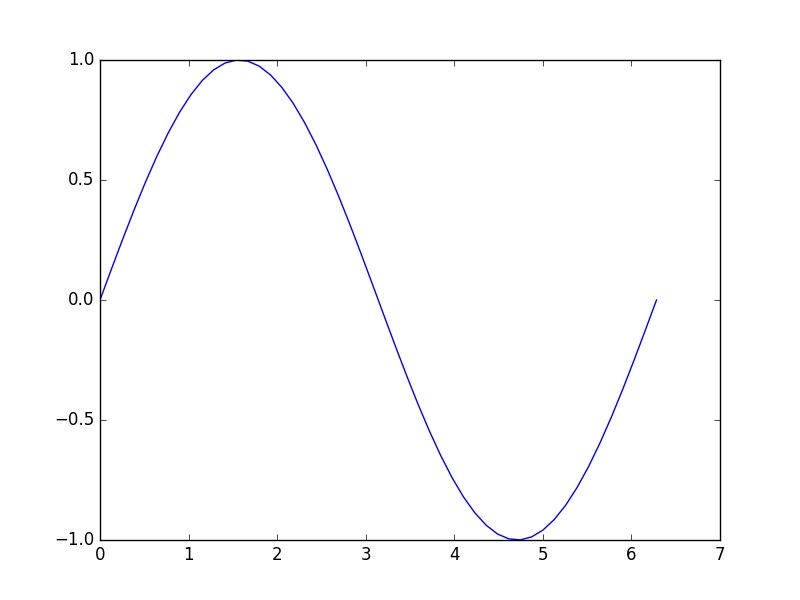

=====
NumPy
=====

In der Vorlesung »Einführung in das Programmieren für Physiker und Naturwissenschaftler«
wurde am Beispiel von NumPy und SciPy eine kurze Einführung in die Benutzung numerischer
Programmbibliotheken gegeben. Dabei wurde an einigen wenigen Beispielen gezeigt, wie man
in Python mit Vektoren und Matrizen arbeiten und einfache Problemstellungen der linearen
Algebra lösen kann. Im Folgenden wollen wir uns etwas genauer mit NumPy beschäftigen, das
die Basis für wichtige wissenschaftliche Programmbibliotheken bildet, wie das
bereits genannte `SciPy <https://www.scipy.org>`_, `Matplotlib <http://matplotlib.org>`_
für die Erstellung von Grafiken, `Pandas <http://pandas.pydata.org>`_ für
die Analyse großer Datenmengen, `Scikit-image <http://scikit-image.org>`_ für die Bildbearbeitung,
`Scikit-learn <http://scikit-learn.org>`_ für maschinenbasiertes Lernen und einige andere
mehr.

Wegen des großen Umfangs der von NumPy zur Verfügung gestellten Funktionalität
werden wir uns auf wesentliche Aspekte beschränken und keine
vollständige Beschreibung anstreben. Bei Bedarf sollte daher die
`NumPy Referenzdokumentation <http://docs.scipy.org/doc/numpy/reference/>`_ herangezogen
werden. Als Informationsquelle sind zudem die `Python Scientific Lecture Notes
<http://scipy-lectures.github.com/>`_ empfehlenswert. Dort werden auch weitere
Programmbibliotheken diskutiert, die in naturwissenschaftlichen Anwendungen hilfreich
sein können.

.. _pythonlisten:

--------------------------
Python-Listen und Matrizen
--------------------------

Viele naturwissenschaftliche Problemstellungen lassen sich in natürlicher Weise mit Hilfe
von Vektoren und Matrizen formulieren. Dies kann entweder eine Eigenschaft des ursprünglichen
Problems sein, beispielsweise bei der Beschreibung eines gekoppelten schwingenden Systems
mit Hilfe von gekoppelten Differentialgleichungen. Es kann aber auch vorkommen, dass erst
die numerische Umsetzung zu einer Formulierung in Vektoren und Matrizen führt, zum Beispiel
bei der Diskretisierung einer partiellen Differentialgleichung.

Will man solche Problemstellungen mit den Standardmitteln bearbeiten, die von
Python zur Verfügung gestellt werden, so wird man auf Listen zurückgreifen
müssen. Um eine zweidimensionale Matrix zu definieren, würde man eine Liste von
Listen anlegen und könnte dann durch eine doppelte Indizierung auf ein einzelnes Element 
zugreifen.

.. sourcecode:: ipython

   In [1]: matrix = [[1.1, 2.2, 3.3], [4.4, 5.5, 6.6], [7.7, 8.8, 9.9]]

   In [2]: matrix[0]
   Out[2]: [1.1, 2.2, 3.3]

   In [3]: matrix[0][2]
   Out[3]: 3.3

Das Beispiel erklärt die doppelte Indizierung. Durch den ersten Index, hier ``[0]``, wird
die erste Unterliste ausgewählt, aus der wiederum ein einzelnes Element, hier das dritte,
ausgewählt werden kann. 

Eine Zeile kann man entweder wie oben in der Eingabe 2 erhalten oder auch etwas umständlicher mit

.. sourcecode:: ipython

   In [4]: matrix[0][:]
   Out[4]: [1.1, 2.2, 3.3]

Hier ist explizit angegeben, dass wir alle Elemente der ersten Zeile haben wollen. Ein
enstprechender Zugriff auf eine Spalte funktioniert jedoch nicht:

.. sourcecode:: ipython

   In [5]: matrix[:][0]
   Out[5]: [1.1, 2.2, 3.3]

Hier gibt ``matrix[:]`` eine Liste mit allen Unterlisten, also einfach die
ursprüngliche Liste zurück. Somit ist ``matrix[:][0]`` nichts anderes als die
erste Unterliste. Wir erhalten also wiederum die erste Zeile und keineswegs die
erste Spalte. Auch wenn es beispielsweise mit Hilfe einer list comprehension
möglich ist, eine Spalte aus einer Matrix zu extrahieren, zeigt das Beispiel,
dass Zeilen und Spalten in einer durch eine Liste dargestellten Matrix nicht in
gleicher Weise behandelt werden können. Für eine Matrix würde man eine 
Gleichbehandlung jedoch auf jeden Fall erwarten.

Ein weiterer Nachteil besteht in der Flexibilität von Listen, die ja bekanntlich beliebige
Objekte enthalten können. Python muss daher einen erheblichen Aufwand bei der Verwaltung
von Listen treiben. Dies betrifft alleine schon die Adressierung eines einzelnen Elements.
Andererseits wird diese Flexibilität bei Matrizen überhaupt nicht benötigt, da dort alle
Einträge vom gleichen Datentyp sind. Es sollte also möglich sein, erheblich effizientere
Programme zu schreiben, indem man Matrizen nicht durch Listen darstellt, sondern durch
einen auf diese Aufgabe zugeschnittenen Datentypen. Hierzu greift man auf das von NumPy
zur Verfügung gestellte ``ndarray``-Objekt, also ein N-dimensionales Array, zurück.

------------
NumPy-Arrays
------------

Bevor wir mit NumPy-Arrays [#array]_ arbeiten können, müssen wir NumPy importieren.
Da der Namensraum von NumPy sehr groß ist, empfiehlt es sich, diesen nicht mit
``from numpy import *`` zu importieren. Auch der Import einzelner Objekte empfiehlt
sich nicht. Importiert man beispielsweise die Sinusfunktion aus NumPy, so ist
weiter unten in einem Pythonskript nicht mehr ohne Weiteres erkennbar, ob es sich
um den Sinus aus NumPy oder aus dem ``math``-Modul handelt. Üblicherweise importiert
man daher NumPy in folgender Weise:

.. sourcecode:: ipython

   In [1]: import numpy as np

Die Abkürzung ``np`` erspart dabei etwas Schreibarbeit, macht aber zugleich die Herkunft
eines Objekts deutlich. Hält man sich an diese Konvention, so trägt man zur Verständlichkeit
des Codes bei.

Um die Eigenschaften von Arrays zu untersuchen, müssen wir zunächst wissen, wie sich ein
Array erzeugen lässt. In NumPy ist es sehr einfach, die Dokumentation nach einem bestimmten
Text zu durchsuchen. Die zahlreichen Möglichkeiten, ein Array zu erzeugen, lassen sich
folgendermaßen erhalten:

.. sourcecode:: ipython

   In [2]: np.lookfor('create array')
   Search results for 'create array'
   ---------------------------------
   numpy.array
       Create an array.
   numpy.memmap
       Create a memory-map to an array stored in a *binary* file on disk.
   numpy.diagflat
       Create a two-dimensional array with the flattened input as a diagonal.
   numpy.fromiter
       Create a new 1-dimensional array from an iterable object.
   ...

Dabei wurde hier nur ein Teil der Ausgabe dargestellt. Gleich der erste Eintrag verrät
uns, wie man aus einer Liste von Listen ein Array erzeugen kann. Details hierzu erhält
man bei Bedarf wie üblich mit ``help(np.array)`` oder alternativ mit
``np.info(np.array)``.

.. sourcecode:: ipython

   In [3]: matrix = [[0, 1, 2],
      ...:           [3, 4, 5],
      ...:           [6, 7, 8]]
   
   In [4]: myarray = np.array(matrix)
   
   In [5]: myarray
   Out[5]: 
   array([[0, 1, 2],
          [3, 4, 5],
          [6, 7, 8]])
   
   In [6]: type(myarray)
   Out[6]: numpy.ndarray

Ein Array besitzt als wesentliche Bestandteile die Daten im
eigentlichen Sinne, also die Werte der einzelnen Matrixelemente, sowie
Information darüber, wie auf ein spezifisches Matrixelement zugegriffen werden
kann. Die Daten sind im Speicher einfach hintereinander, also in
eindimensionaler Form, abgelegt. Dabei gibt es die Möglichkeit, die Matrix
zeilenweise oder spaltenweise abzuspeichern. Ersteres wird von der
Programmiersprache C verwendet, während die zweite Variante von Fortran
verwendet wird.

Nachdem die Daten strukturlos im Speicher abgelegt sind, müssen
``ndarray``-Objekte, wie schon erwähnt, neben den Daten auch Informationen
darüber besitzen, wie auf einzelne Matrixelemente zugegriffen wird. Auf diese
Weise lässt sich sehr leicht die Adresse der Daten eines Matrixelements
bestimmen. Zudem ist es möglich, die gleichen Daten im Speicher auf
verschiedene Weise anzusehen. Damit ist es häufig möglich, unnötige
Kopiervorgänge im Speicher zu vermeiden. Andererseits ist es aus diesem Grunde
wichtig zu wissen, ob NumPy im Einzelfall nur eine andere Sicht auf die Daten
zur Verfügung stellt oder tatsächlich ein neues Array erzeugt.

Um die Informationen über die Struktur eines Arrays besser zu verstehen,
definieren wir uns eine Funktion, die einige Attribute des Arrays ausgibt.

.. sourcecode:: ipython

   In [7]: def array_attributes(a):
      ...:     for attr in ('ndim', 'size', 'itemsize', 'dtype', 'shape', 'strides'):
      ...:         print('{:8s}: {}'.format(attr, getattr(a, attr)))

Zum Experimentieren mit Arrays ist die ``arange``-Methode sehr praktisch, die
ähnlich wie das uns bereits bekannte ``range`` eine Reihe von Zahlen erzeugt,
nun jedoch in einem Array.

.. sourcecode:: ipython

   In [8]: matrix = np.arange(16)

   In [9]: matrix
   Out[9]: array([ 0,  1,  2,  3,  4,  5,  6,  7,  8,  9, 10, 11, 12, 13, 14, 15])

   In [10]: array_attributes(matrix)
   ndim    : 1 
   size    : 16
   itemsize: 8
   dtype   : int64
   shape   : (16,)
   strides : (8,)
               
Das Attribut ``ndim`` gibt an, dass wir es mit einem eindimensionalen Array
zu tun haben, während das Attribut ``size`` anzeigt, dass das Array insgesamt
16 Elemente besitzt. Jedes Element besitzt den Datentyp (``dtype``) ``int64``.
Es handelt sich also um 64-Bit-Integers, die eine Größe von 8 Byte (``itemsize``)
besitzen. Die Attribute können wir auch direkt in der üblichen objektorientierten
Schreibweise ansprechen. Zum Beispiel gibt

.. sourcecode:: ipython

   In [11]: matrix.nbytes
   Out[11]: 128
             
den Speicherplatzbedarf des Arrays in Bytes an.

Für Arrays kommen eine ganze Reihe verschiedener Datentypen in Frage, zum Beispiel
Integers verschiedener Länge (``int8``, ``int16``, ``int32``, ``int64``) oder
auch ohne Vorzeichen (``uint8``, ...), Gleitkommazahlen (``float16``, ``float32``,
``float64``), komplexe Zahlen (``complex64``, ``complex128``), Wahrheitswerte
(``bool8``) und sogar Unicode-Strings als nichtnumerischer Datentyp. Wenn der
Datentyp nicht angegeben oder durch die Konstruktion des Arrays bestimmt ist,
werden die im jeweiligen System standardmäßig verwendeten Gleitkommazahlen
herangezogen, also meistens ``float64``. Bei Integers ist zu beachten, dass
es im Gegensatz zu Python-Integers wegen der endlichen Länge zu einem Überlauf
kommen kann, wie das folgende Beispiel demonstriert.

.. sourcecode:: ipython

   In [12]: np.arange(1, 160, 10, dtype=np.int8)
   Out[12]:
   array([   1,   11,   21,   31,   41,   51,   61,   71,   81,   91,  101,
           111,  121, -125, -115, -105], dtype=int8)

|frage| Wie kann man diese Ausgabe verstehen?

Besonders interessant sind die beiden Attribute ``shape`` und ``strides``. Der
Wert des Attributs ``shape``, in unserem Beispiel das Tupel ``(16,)``, gibt die
Zahl der Elemente in der jeweiligen Dimension an. Um dies besser zu verstehen,
ändern wir dieses Attribut ab, wobei darauf zu achten ist, dass die Zahl der
Elemente des Arrays erhalten bleibt. Wir wandeln das eindimensionale Array mit
16 Elementen in ein 4×4-Array um.

.. sourcecode:: ipython

   In [13]: matrix.shape = (4, 4)

   In [14]: matrix
   Out[14]: 
   array([[ 0,  1,  2,  3],
          [ 4,  5,  6,  7],
          [ 8,  9, 10, 11],
          [12, 13, 14, 15]])

   In [15]: matrix.strides
   Out[15]: (32, 8)

Dabei wird deutlich, dass nicht nur die Form (``shape``) modifiziert wurde, sondern
auch aus dem Tupel ``(8,)`` des Attributs ``strides`` [#strides]_ das Tupel ``(32, 8)`` wurde.
Die *strides* geben an, um wieviel Bytes man weitergehen muss, um zum nächsten Element
in dieser Dimension zu gelangen. Die folgende Abbildung zeigt dies an einem
kleinen Array.

.. image:: images/numpy/strides.*
           :height: 8cm
           :align: center

Greifen wir speziell den mittleren Fall mit den *strides* ``(24, 8)`` heraus.
Bewegt man sich in einer Zeile der Matrix von Element zu Element, so muss man 
im Speicher jeweils um 8 Bytes weitergehen, wenn ein Datentyp ``int64``
vorliegt. Entlang einer Spalte beträgt die Schrittweite dagegen 24 Bytes.

|frage| Wie verändern sich die *strides* in dem 16-elementigen Array ``np.arange(16)``,
wenn man einen ``shape`` von ``(2, 2, 2, 2)`` wählt?

Für die Anwendung ist es wichtig zu wissen, dass die Manipulation der Attribute
``shape`` und ``strides`` nicht die Daten im Speicher verändert. Es wird also
nur eine neue Sicht auf die vorhandenen Daten vermittelt. Dies ist insofern von
Bedeutung als das Kopieren von größeren Datenmengen durchaus mit einem nicht
unerheblichen Zeitaufwand verbunden sein kann.

Um uns davon zu überzeugen, dass tatsächlich kein neues Array erzeugt wird, generieren
wir nochmals ein eindimensionales Array und daraus mit Hilfe von ``reshape`` ein
zweidimensionales Array.

.. sourcecode:: ipython

   In [16]: m1 = np.arange(16)

   In [17]: m1
   Out[17]: array([ 0,  1,  2,  3,  4,  5,  6,  7,  8,  9, 10, 11, 12, 13, 14, 15])

   In [18]: m2 = m1.reshape(4, 4)

   In [19]: m2
   Out[19]: 
   array([[ 0,  1,  2,  3],
          [ 4,  5,  6,  7],
          [ 8,  9, 10, 11],
          [12, 13, 14, 15]])

Nun ändern wir das erste Element in dem eindimensionalen Array ab und stellen in der
Tat fest, dass sich diese Änderung auch auf das zweidimensionale Array auswirkt.

.. sourcecode:: ipython

   In [20]: m1[0] = 99

   In [21]: m1
   Out[21]: array([99,  1,  2,  3,  4,  5,  6,  7,  8,  9, 10, 11, 12, 13, 14, 15])
   
   In [22]: m2
   Out[22]: 
   array([[99,  1,  2,  3],
          [ 4,  5,  6,  7],
          [ 8,  9, 10, 11],
          [12, 13, 14, 15]])

Eine Matrix lässt sich auch transponieren, ohne dass Matrixelemente im Speicher hin
und her kopiert werden müssen. Stattdessen werden nur die beiden Werte der *strides*
vertauscht.

.. sourcecode:: ipython

   In [23]: m2.strides
   Out[23]: (32, 8)

   In [24]: m2.T
   Out[24]: 
   array([[99,  4,  8, 12],
          [ 1,  5,  9, 13],
          [ 2,  6, 10, 14],
          [ 3,  7, 11, 15]])

   In [25]: m2.T.strides
   Out[25]: (8, 32)

Obwohl die Daten im Speicher nicht verändert wurden, kann man jetzt mit der
transponierten Matrix arbeiten. 

Mit Hilfe der Attribute ``shape`` und ``strides`` lässt sich die Sicht auf ein
Array auf sehr flexible Weise festlegen. Allerdings ist der Benutzer selbst für
die Folgen verantwortlich, wie der zweite Teil des folgenden Beispiels zeigt.
Dazu gehen wir zu unserem ursprünglichen 4×4-Array zurück und verändern das
Attribut ``strides`` mit Hilfe der ``as_strided``-Methode.

.. sourcecode:: ipython

   In [26]: matrix = np.arange(16).reshape(4, 4)

   In [27]: matrix1 = np.lib.stride_tricks.as_strided(matrix, strides=(16, 16))

   In [28]: matrix1
   Out[28]:
   array([[ 0,  2,  4,  6],
          [ 2,  4,  6,  8],
          [ 4,  6,  8, 10],
          [ 6,  8, 10, 12]])

   In [29]: matrix2 = np.lib.stride_tricks.as_strided(matrix, shape=(4, 4), strides=(16, 4))

   In [30]: matrix2
   Out[30]: 
   array([[            0,  4294967296,            1,  8589934592],
          [            2, 12884901888,            3, 17179869184],
          [            4, 21474836480,            5, 25769803776],
          [            6, 30064771072,            7, 34359738368]])

Im ersten Fall ist der Wert der *strides* gerade das Doppelte der
Datenbreite, so dass in einer Zeile von einem Wert zum nächsten jeweils ein
Wert im Array übersprungen wird. Beim Übergang von einer Zeile zur nächsten
wird gegenüber dem Beginn der vorherigen Zeile auch nur um zwei Werte
vorangeschritten, so dass sich das gezeigte Resultat ergibt.

Im zweiten Beispiel wurde ein *stride* gewählt, der nur die Hälfte einer
Datenbreite beträgt. Der berechnete Beginn eines neuen Werts im Speicher liegt
damit nicht an einer Stelle, die einem tatsächlichen Beginn eines Werts
entspricht. Python interpretiert dennoch die erhaltene Information und erzeugt
so das obige Array. In unserem Beispiel erreicht man bei jedem zweiten Wert
wieder eine korrekte Datengrenze. Die Manipulation von *strides* erfordert also
eine gewisse Sorgfalt, und man ist für eventuelle Fehler selbst verantwortlich.

.. _arrayerzeugung:

--------------------------
Erzeugung von NumPy-Arrays
--------------------------

NumPy-Arrays lassen sich je nach Bedarf auf verschiedene Arten erzeugen. Die
Basis bildet die ``ndarray``-Methode, auf die man immer zurückgreifen kann.
In den meisten Fällen wird es aber praktischer sein, eine der spezialisierteren
Methoden zu verwenden, die wir im Folgenden besprechen wollen. 

Um ein mit Nullen aufgefülltes 2×2-Array zu erzeugen, geht man folgendermaßen
vor:

.. sourcecode:: ipython

   In [1]: matrix1 = np.zeros((2, 2))

   In [2]: matrix1, matrix1.dtype
   Out[2]: 
   (array([[ 0.,  0.],
           [ 0.,  0.]]), dtype('float64'))

Das Tupel im Argument gibt dabei die Form des Arrays vor. Wird der Datentyp der
Einträge nicht weiter spezifiziert, so werden Gleitkommazahlen mit einer Länge
von 8 Bytes verwendet. Man kann aber auch explizit zum Beispiel Integereinträge
verlangen:

.. sourcecode:: ipython

   In [3]: np.zeros((2, 2), dtype=np.int)
   Out[3]: 
   array([[0, 0],
          [0, 0]])

Neben der ``zeros``-Funktion gibt es auch noch die ``empty``-Funktion, die zwar
den benötigten Speicherplatz zur Verfügung stellt, diesen jedoch nicht initialisiert.
Im Allgemeinen werden also die Arrayelemente von den hier im Beispiel gezeigten
abweichen.

.. sourcecode:: ipython

   In [4]: np.empty((3, 3))
   Out[4]: 
   array([[  6.91153891e-310,   2.32617410e-316,   6.91153265e-310],
          [  6.91153265e-310,   6.91153265e-310,   6.91153265e-310],
          [  6.91153265e-310,   6.91153265e-310,   3.95252517e-322]])

Die ``empty``-Funktion sollte also nur verwendet werden, wenn die Arrayelemente
später noch belegt werden.

Will man alle Elemente eines Arrays mit einem konstanten Wert ungleich Null
füllen, so kann man ``ones`` verwenden und das sich ergebende Array mit einem
Faktor multiplizieren.

.. sourcecode:: ipython

   In [5]: 2*np.ones((2, 3))
   Out[5]: 
   array([[ 2.,  2.,  2.],
          [ 2.,  2.,  2.]])

Häufig benötigt man eine Einheitsmatrix, die man mit Hilfe von ``identity``
erhält:

.. sourcecode:: ipython

   In [6]: np.identity(3)
   Out[6]: 
   array([[ 1.,  0.,  0.],
          [ 0.,  1.,  0.],
          [ 0.,  0.,  1.]])

Hierbei wird immer eine Diagonalmatrix erzeugt. Will man dies nicht, so kann
man ``eye`` verwenden, das nicht nur nicht quadratische Arrays erzeugen kann,
sondern auch die Diagonale nach oben oder unten verschieben lässt.

.. sourcecode:: ipython

   In [7]: np.eye(2, 4)
   Out[7]: 
   array([[ 1.,  0.,  0.,  0.],
          [ 0.,  1.,  0.,  0.]])

Zu beachten ist hier, dass die Form des Arrays nicht als Tupel vorgegeben wird,
da ohnehin nur zweidimensionale Arrays erzeugt werden können. Lässt man das
zweite Argument weg, so wird ein quadratisches Array erzeugt. Will man die
Diagonaleinträge verschieben, so gibt man dies mit Hilfe des Parameters ``k`` an:

.. sourcecode:: ipython

   In [8]: np.eye(4, k=1)-np.eye(4, k=-1)
   Out[8]: 
   array([[ 0.,  1.,  0.,  0.],
          [-1.,  0.,  1.,  0.],
          [ 0., -1.,  0.,  1.],
          [ 0.,  0., -1.,  0.]])

Eine Diagonalmatrix mit unterschiedlichen Einträgen lässt sich aus einem
eindimensionalen Array folgendermaßen erzeugen:

.. sourcecode:: ipython

   In [9]: np.diag([1, 2, 3, 4])
   Out[9]: 
   array([[1, 0, 0, 0],
          [0, 2, 0, 0],
          [0, 0, 3, 0],
          [0, 0, 0, 4]])

Dabei lässt sich wie bei der ``eye``-Funktion die Diagonale verschieben.

.. sourcecode:: ipython

   In [10]: np.diag([1, 2, 3, 4], k=1)
   Out[10]: 
   array([[0, 1, 0, 0, 0],
          [0, 0, 2, 0, 0],
          [0, 0, 0, 3, 0],
          [0, 0, 0, 0, 4],
          [0, 0, 0, 0, 0]])

Umgekehrt kann man mit der ``diag``-Funktion auch die Diagonalelemente eines
zweidimensionalen Arrays extrahieren.

.. sourcecode:: ipython

   In [11]: matrix = np.arange(16).reshape(4, 4)
   
   In [12]: matrix
   Out[12]: 
   array([[ 0,  1,  2,  3],
          [ 4,  5,  6,  7],
          [ 8,  9, 10, 11],
          [12, 13, 14, 15]])
   
   In [13]: np.diag(matrix)
   Out[13]: array([ 0,  5, 10, 15])

Lassen sich die Arrayeinträge als Funktion der Indizes ausdrücken, so kann
man die ``fromfunction``-Funktion verwenden, wie in dem folgenden Beispiel
zu sehen ist, das eine Multiplikationstabelle erzeugt.

.. sourcecode:: ipython

   In [14]: np.fromfunction(lambda i, j: (i+1)*(j+1), (6, 6), dtype=np.int)
   Out[14]: 
   array([[ 1,  2,  3,  4,  5,  6],
          [ 2,  4,  6,  8, 10, 12],
          [ 3,  6,  9, 12, 15, 18],
          [ 4,  8, 12, 16, 20, 24],
          [ 5, 10, 15, 20, 25, 30],
          [ 6, 12, 18, 24, 30, 36]])

Diese Funktion ist nicht auf zweidimensionale Arrays beschränkt. 

Bei der Konstruktion von Arrays sind auch Funktionen interessant, die als
Verallgemeinerung der in Python eingebauten Funktion ``range`` angesehen werden
können. Ihr Nutzen ergibt sich vor allem aus der Tatsache, dass man gewissen
Funktionen, den universellen Funktionen oder ufuncs in NumPy, die wir im
Abschnitt :ref:`ufuncs` besprechen werden, ganze Arrays als Argumente übergeben
kann. Damit wird eine besonders effiziente Auswertung dieser Funktionen
möglich. 

Eindimensionale Arrays lassen sich mit Hilfe von ``arange``, ``linspace`` und
``logspace`` erzeugen:

.. sourcecode:: ipython

   In [15]: np.arange(1, 2, 0.1)
   Out[15]: array([ 1. ,  1.1,  1.2,  1.3,  1.4,  1.5,  1.6,  1.7,  1.8,  1.9])

Ähnlich wie bei ``range`` erzeugt ``arange`` aus der Angabe eines Start- und
eines Endwerts sowie einer Schrittweite eine Folge von Werten. Allerdings
können diese auch Gleitkommazahlen sein. Zudem wird statt einer Liste ein Array
erzeugt. Wie bei ``range`` ist der Endwert hierin nicht enthalten. Allerdings
können Rundungsfehler zu unerwarteten Effekten führen.

.. sourcecode:: ipython

   In [16]: np.arange(1, 1.5, 0.1)
   Out[16]: array([ 1. ,  1.1,  1.2,  1.3,  1.4])
   
   In [17]: np.arange(1, 1.6, 0.1)
   Out[17]: array([ 1. ,  1.1,  1.2,  1.3,  1.4,  1.5,  1.6])
   
   In [18]: np.arange(1, 1.601, 0.1)
   Out[18]: array([ 1. ,  1.1,  1.2,  1.3,  1.4,  1.5,  1.6])

Dieses Problem kann man umgehen, wenn man statt der Schrittweite eine Anzahl
von Punkten in dem gegebenen Intervall vorgibt. Dafür ist ``linspace`` eine
geeignete Funktion, sofern die Schrittweite konstant sein soll. Bei Bedarf kann
man sich neben dem Array auch noch die Schrittweite ausgeben lassen. Benötigt
man eine logarithmische Skala, so verwendet man ``logspace``, das den
Exponenten linear zwischen einem Start- und einem Endwert verändert. Die Basis
ist standardmäßig 10, sie kann aber durch Setzen des Parameters ``base`` an
spezielle Erfordernisse angepasst werden.

.. sourcecode:: ipython

   In [19]: np.linspace(1, 2, 11)
   Out[19]: array([ 1. ,  1.1,  1.2,  1.3,  1.4,  1.5,  1.6,  1.7,  1.8,  1.9,  2. ])

   In [20]: np.linspace(1, 2, 4, retstep=True)
   Out[20]: 
   (array([ 1.        ,  1.33333333,  1.66666667,  2.        ]),
    0.3333333333333333)

   In [21]: np.logspace(0, 3, 6)
   Out[21]: 
   array([    1.        ,     3.98107171,    15.84893192,    63.09573445,
            251.18864315,  1000.        ])

   In [22]: np.logspace(0, 3, 4, base=2)
   Out[22]: array([ 1.,  2.,  4.,  8.])

Gerade bei der graphischen Darstellung von Funktionen sind ``linspace``
und ``logspace`` besonders nützlich. Im folgenden Beispiel verwenden
wir die matplotlib-Bibliothek, die im Abschnitt :ref:`mpl` besprochen wird.

.. sourcecode:: ipython

   In [23]: import matplotlib.pyplot as plt
   
   In [24]: x = np.linspace(0, 2*np.pi)
   
   In [25]: y = np.sin(x)
   
   In [26]: plt.plot(x, y)
   Out[26]: [<matplotlib.lines.Line2D at 0x7f3ad50b76a0>]

Möchte man eine Funktion auf einem Gitter auswerten und benötigt man dazu
separate Arrays für die x- und y-Werte, so hilft ``meshgrid`` weiter.

.. sourcecode:: ipython

   In [27]: xvals, yvals = np.meshgrid([-1, 0, 1], [2, 3, 4])

   In [28]: xvals
   Out[28]: 
   array([[-1,  0,  1],
          [-1,  0,  1],
          [-1,  0,  1]])

   In [29]: yvals
   Out[29]: 
   array([[2, 2, 2],
          [3, 3, 3],
          [4, 4, 4]])

In diesem Zusammenhang sind auch die Funktionen ``mgrid`` und ``ogrid`` von
Interesse, die wir im Abschnitt :ref:`ufuncs` besprechen  werden, nachdem wir die
Adressierung von Arrays genauer angesehen haben.

Zur graphischen Darstellung von Daten ist es häufig erforderlich, die Daten
zunächst aus einer Datei einzulesen und in einem Array zu speichern. Neben wir
an, wir hätten eine Datei ``x_von_t.dat`` mit folgendem Inhalt::

   # Zeit  Ort
      0.0  0.0
      0.1  0.1
      0.2  0.4
      0.3  0.9

Hierbei zeigt das ``#``-Zeichen in der ersten Zeile an, dass es sich um eine
Kommentarzeile handelt, die nicht in das Array übernommen werden soll. Unter
Verwendung von ``loadtxt`` kann man die Daten nun einlesen:

.. sourcecode:: ipython

   In [30]: np.loadtxt("x_von_t.dat")
   Out[30]: 
   array([[ 0. ,  0. ],
          [ 0.1,  0.1],
          [ 0.2,  0.4],
          [ 0.3,  0.9]])

Bei der ``loadtxt``-Funktion lassen sich zum Beispiel das Kommentarzeichen oder
die Trennzeichen zwischen Einträgen konfigurieren. Noch wesentlich flexibler
ist ``genfromtxt``, das es unter anderem erlaubt, Spaltenüberschriften aus der
Datei zu entnehmen oder mit fehlenden Einträgen umzugehen. Für Details wird auf
die `zugehörige Dokumentation
<http://docs.scipy.org/doc/numpy/reference/generated/numpy.genfromtxt.html>`_
verwiesen.

Abschließend betrachten wir noch kurz die Erzeugung von Zufallszahlen, die man
zum Beispiel für Simulationszwecke benötigt. Statt viele einzelne Zufallszahlen zu
erzeugen ist es häufig effizienter, gleich ein ganzes Array mit Zufallszahlen
zu füllen. Im folgenden Beispiel erzeugen wir ein Array mit zehn im Intervall zwischen
0 und 1 gleich verteilten Pseudozufallszahlen. Reproduzierbar werden die Zahlenwerte,
wenn zunächst ein Startwert für die Berechnung, ein *seed*, gesetzt wird.

.. sourcecode:: ipython

   In [31]: np.random.rand(2, 5)
   Out[31]:
   array([[ 0.99281469,  0.90376223,  0.81096671,  0.33726814,  0.34463236],
          [ 0.74234766,  0.05862623,  0.49005243,  0.73496906,  0.21421244]])
   
   In [32]: np.random.rand(2, 5)
   Out[32]:
   array([[ 0.51071925,  0.11952145,  0.12714712,  0.98081263,  0.05736099],
          [ 0.35101524,  0.86407263,  0.80264858,  0.36629556,  0.59562485]])
   
   In [33]: np.random.seed(1234)
   
   In [34]: np.random.rand(2, 5)
   Out[34]:
   array([[ 0.19151945,  0.62210877,  0.43772774,  0.78535858,  0.77997581],
          [ 0.27259261,  0.27646426,  0.80187218,  0.95813935,  0.87593263]])
   
   In [35]: np.random.rand(2, 5)
   Out[35]:
   array([[ 0.19151945,  0.62210877,  0.43772774,  0.78535858,  0.77997581],
          [ 0.27259261,  0.27646426,  0.80187218,  0.95813935,  0.87593263]])

Die Zufälligkeit der Daten lässt sich graphisch darstellen.

.. sourcecode:: ipython

   In [36]: data = np.random.rand(20, 20)
   
   In [37]: plt.imshow(data, cmap=plt.cm.hot, interpolation='none')
   Out[37]: <matplotlib.image.AxesImage at 0x7f4eacf147b8>
   
   In [38]: plt.colorbar()
   Out[38]: <matplotlib.colorbar.Colorbar at 0x7f4eac6a60f0>

Als Anwendung betrachten wir drei Realisierungen von hundert Würfen eines
Würfels. Dazu erzeugen wir mit ``randint(1, 7)`` ganzzahlige Pseudozufallszahlen
zwischen 1 und 6 in einem zweidimensionalen Array der Form ``(100, 3)``. Diese
drei Spalten zu je 100 Zahlen werden jeweils als Histogramm dargestellt.

.. sourcecode:: ipython

   In [14]: wuerfe = np.random.randint(1, 7, (100, 3))
   
   In [15]: plt.hist(wuerfe, np.linspace(0.5, 6.5, 7))
   Out[15]: 
   ([array([ 14.,  22.,  16.,  12.,  16.,  20.]),
     array([ 20.,  18.,  17.,  14.,  14.,  17.]),
     array([ 12.,  13.,  24.,  16.,  18.,  17.])],
    array([ 0.5,  1.5,  2.5,  3.5,  4.5,  5.5,  6.5]),
    <a list of 3 Lists of Patches objects>)

-----------------------------
Adressierung von NumPy-Arrays
-----------------------------

Die Adressierungsmöglichkeiten für NumPy-Arrays basieren auf der so genannten
*slice*-Syntax, die wir von Python-Listen her kennen und uns hier noch einmal
kurz in Erinnerung rufen wollen. Einen Ausschnitt aus einer Liste, ein *slice*,
erhält man durch die Notation ``[start:stop:step]``. Hierbei werden ausgehend
von dem Element mit dem Index ``start``  die Elemente bis vor das Element mit dem
Index ``stop`` mit einer Schrittweite ``step`` ausgewählt. Wird die Schrittweite
nicht angegeben, so nimmt ``step`` den Defaultwert ``1`` an. Negative Schrittweiten
führen in der Liste von hinten nach vorne. Fehlen ``start`` und/oder
``stop`` so beginnen die ausgewählten Elemente mit dem ersten Element bzw. enden
mit dem letzten Element. Negative Indexwerte werden vom Ende der Liste her genommen.
Das letzte Element kann also mit dem Index ``-1``, das vorletzten Element mit
dem Index ``-2`` usw. angesprochen werden. Diese Indizierung funktioniert so auch
für NumPy-Arrays wie die folgenden Beispiele zeigen.

.. sourcecode:: ipython

   In [1]: a = np.arange(10)

   In [2]: a
   Out[2]: array([0, 1, 2, 3, 4, 5, 6, 7, 8, 9])

   In [3]: a[:]
   Out[3]: array([0, 1, 2, 3, 4, 5, 6, 7, 8, 9])

   In [4]: a[::2]
   Out[4]: array([0, 2, 4, 6, 8])

   In [5]: a[1:4]
   Out[5]: array([1, 2, 3])

   In [6]: a[6:-2]
   Out[6]: array([6, 7])

   In [7]: a[::-1]
   Out[7]: array([9, 8, 7, 6, 5, 4, 3, 2, 1, 0])

Für mehrdimensionale Arrays wird die Notation direkt verallgemeinert. Im Gegensatz
zu der im Abschnitt :ref:`pythonlisten` beschriebenen Notation für Listen von Listen
werden hier die diversen Indexangaben durch Kommas getrennt zusammengefasst. Einige
Beispiele für zweidimensionale Arrays sollen das illustrieren.

.. sourcecode:: ipython

   In [8]: a = np.arange(36).reshape(6, 6)

   In [9]: a
   Out[9]: 
   array([[ 0,  1,  2,  3,  4,  5],
          [ 6,  7,  8,  9, 10, 11],
          [12, 13, 14, 15, 16, 17],
          [18, 19, 20, 21, 22, 23],
          [24, 25, 26, 27, 28, 29],
          [30, 31, 32, 33, 34, 35]])

   In [10]: a[:, :]
   Out[10]: 
   array([[ 0,  1,  2,  3,  4,  5],
          [ 6,  7,  8,  9, 10, 11],
          [12, 13, 14, 15, 16, 17],
          [18, 19, 20, 21, 22, 23],
          [24, 25, 26, 27, 28, 29],
          [30, 31, 32, 33, 34, 35]])

   In [11]: a[2:4, 2:4]
   Out[11]: 
   array([[14, 15],
          [20, 21]])

   In [12]: a[2:4, 3:5]
   Out[12]: 
   array([[15, 16],
          [21, 22]])

   In [13]: a[::2, ::2]
   Out[13]: 
   array([[ 0,  2,  4],
          [12, 14, 16],
          [24, 26, 28]])

   In [14]: a[2::2, ::2]
   Out[14]: 
   array([[12, 14, 16],
          [24, 26, 28]])

   In [15]: a[2:4]
   Out[15]: 
   array([[12, 13, 14, 15, 16, 17],
          [18, 19, 20, 21, 22, 23]])

Wie das letzte Beispiel zeigt, ergänzt NumPy bei fehlenden Indexangaben jeweils
einen Doppelpunkt, so dass alle Elemente ausgewählt werden, die mit den explizit
gemachten Indexangaben konsistent sind.

Will man eine Spalte (oder auch eine Zeile) in einer zweidimensionalen Array auswählen,
so hat man zwei verschiedene Möglichkeiten:

.. sourcecode:: ipython

   In [16]: a[:, 0:1]
   Out[16]: 
   array([[ 0],
          [ 6],
          [12],
          [18],
          [24],
          [30]])

   In [17]: a[:, 0]
   Out[17]: array([ 0,  6, 12, 18, 24, 30])

Im ersten Fall sorgt die für beide Dimensionen vorhandene Indexnotation dafür,
dass ein zweidimensionales Array erzeugt wird, das die Elemente der ersten
Spalte enthält. Im zweiten Fall wird für die zweite Dimension ein fester Index
angegeben, so dass nun ein eindimensionales Array erzeugt wird, die wiederum
aus den Elementen der ersten Spalte besteht.

In einigen NumPy-Methoden gibt es einen Parameter ``axis``, der die Richtung
in dem Array angibt, in der die Methode ausgeführt werden soll. Die Achsennummer
ergibt sich aus der Position der zugehörigen Indexangabe. Wie man aus den obigen
Beispielen entnehmen kann, verläuft die Achse 0 von oben nach unten, während die
Achse 1 von links nach rechts verläuft. Dies wird auch durch die folgende
Abbildung veranschaulicht.

.. image:: images/numpy/axes.*
           :height: 3cm
           :align: center

Das Aufsummieren von Elementen unserer Beispielmatrix erfolgt dann mit Hilfe
der ``sum``-Methode entweder von oben nach unten, von links nach rechts oder
über alle Elemente.

.. sourcecode:: ipython

   In [18]: a.sum(axis=0)
   Out[18]: array([ 90,  96, 102, 108, 114, 120])

   In [19]: a.sum(axis=1)
   Out[19]: array([ 15,  51,  87, 123, 159, 195])

   In [20]: a.sum()
   Out[20]: 630

Zur Verdeutlichung betrachten wir noch ein dreidimensionales Array das im
Folgenden graphisch dargestellt ist.

.. image:: images/numpy/array3d.*
           :height: 5cm
           :align: center

.. sourcecode:: ipython

   In [21]: b = np.arange(24).reshape(2, 3, 4)

   In [22]: b
   Out[22]: 
   array([[[ 0,  1,  2,  3],
           [ 4,  5,  6,  7],
           [ 8,  9, 10, 11]],
   
          [[12, 13, 14, 15],
           [16, 17, 18, 19],
           [20, 21, 22, 23]]]) 

   In [23]: b[0:1]
   Out[23]:
   array([[[ 0,  1,  2,  3],
           [ 4,  5,  6,  7],
           [ 8,  9, 10, 11]]])

   In [24]: b[:, 0:1]
   Out[24]:
   array([[[ 0,  1,  2,  3]],
   
          [[12, 13, 14, 15]]]) 

   In [25]: b[:, :, 0:1]
   Out[25]:
   array([[[ 0],
           [ 4],
           [ 8]],
   
          [[12],
           [16],
           [20]]])

   In [26]: b[..., 0:1]
   Out[26]:
   array([[[ 0],
           [ 4],
           [ 8]],
   
          [[12],
           [16],
           [20]]])

Man sieht hier deutlich, wie je nach Wahl der Achse ein entsprechender Schnitt
durch das als Würfel vorstellbare Array gemacht wird. Das letzte Beispiel zeigt
die Benutzung des Auslassungszeichens ``...`` (im Englischen *ellipsis* genannt).
Es steht für die Anzahl von Doppelpunkten, die nötig sind, um die Indizes für
alle Dimensionen zu spezifizieren. Allerdings funktioniert dies nur beim ersten
Auftreten des Auslassungszeichens, da sonst nicht klar ist, wie viele Indexspezifikation
für jedes Auslassungszeichen einzusetzen sind. Alle weiteren Auslassungszeichen
werden daher durch einen einzelnen Doppelpunkt ersetzt.

Weiter oben hatten wir in einem Beispiel gesehen, dass die Angabe eines festen
Index die Dimension des Arrays effektiv um Eins vermindert. Umgekehrt ist es
auch möglich, eine zusätzliche Dimension der Länge Eins hinzuzufügen. Hierzu
dient ``newaxis``, das an der gewünschten Stelle als Index eingesetzt werden kann.
Die folgenden Beispiele zeigen, wie aus einem eindimensionalen Array so zwei
verschiedene zweidimensionale Arrays konstruiert werden können.

.. sourcecode:: ipython

   In [27]: c = np.arange(5)

   In [28]: c
   Out[28]: array([0, 1, 2, 3, 4])

   In [29]: c[:, np.newaxis]
   Out[29]: 
   array([[0],
          [1],
          [2],
          [3],
          [4]])

   In [30]: c[np.newaxis, :]
   Out[30]: array([[0, 1, 2, 3, 4]])

Eine Anwendung hiervon werden wir weiter unten in diesem Kapitel kennenlernen, wenn wir
uns mit der Erweiterung von Arrays auf eine Zielgröße, dem so genannten *broadcasting*
beschäftigen.

Zunächst wollen wir aber noch eine weitere Indizierungsmethode, das so genannte
*fancy indexing*, ansprechen. Obwohl es sich hierbei um ein sehr flexibles und
mächtiges Verfahren handelt, sollte man bedenken, dass hier immer eine Kopie des
Arrays erzeugt wird und nicht einfach nur eine neue Sicht auf bereits vorhandene
Daten. Da Letzteres effizienter ist, sollte man *fancy indexing* in erster Linie in
Situationen einsetzen, in denen das normale Indizieren nicht ausreicht.

Beim *fancy indexing* werden die möglichen Indizes als Arrays oder zum Beispiel als
Liste, nicht jedoch als Tupel, angegeben. Die Elemente können dabei *Integer* oder
*Boolean* sein. Beginnen wir mit dem ersten Fall, wobei wir zunächst von einem
eindimensionalen Array ausgehen.

.. sourcecode:: ipython

   In [31]: a = np.arange(10, 20)

   In [32]: a[[0, 3, 0, 5]]
   Out[32]: array([10, 13, 10, 15])

   In [33]: a[np.array([[0, 2], [1, 4]])]
   Out[33]: 
   array([[10, 12],
          [11, 14]])

Im ersten Fall werden einzelne Arrayelemente durch Angabe der Indizes ausgewählt,
wobei auch Wiederholungen sowie eine nichtmonotone Wahl von Indizes möglich sind.
Sind die Indizes als Array angegeben, so wird ein Array der gleichen Form erzeugt.

Bei der Auswahl von Elementen aus einem mehrdimensionalen Arrays muss man gegebenenfalls
weitere Indexlisten oder -arrays angeben.

.. sourcecode:: ipython

   In [34]: a = np.arange(16).reshape(4, 4)

   In [35]: a
   Out[35]: 
   array([[ 0,  1,  2,  3],
          [ 4,  5,  6,  7],
          [ 8,  9, 10, 11],
          [12, 13, 14, 15]])

   In [36]: a[[0, 1, 2]]
   Out[36]: 
   array([[ 0,  1,  2,  3],
          [ 4,  5,  6,  7],
          [ 8,  9, 10, 11]])

   In [37]: a[[0, 1, 2], [1, 2, 3]]
   Out[37]: array([ 1,  6, 11])

Interessant ist die Verwendung von Indexarrays mit Elementen vom Typ *Boolean*.
Ein solches Indexarray lässt sich zum Beispiel mit Hilfe einer logischen Operation
auf einem Array erzeugen, wie das folgende Beispiel demonstriert. Eine Reihe
von Zufallszahlen soll dabei bei einem Schwellenwert nach unten abgeschnitten
werden.

.. sourcecode:: python
   :linenos:

   threshold = 0.3
   a = np.random.random(12)
   print a
   print "-"*30
   indexarray = a < threshold
   print indexarray
   print "-"*30
   a[indexarray] = threshold
   print a

Damit ergibt sich beispielsweise die folgende Ausgabe::

   [ 0.11859559  0.49034494  0.08552061  0.69204077  0.18406457  0.06819091
     0.36785529  0.16873423  0.44615435  0.57774615  0.54327126  0.57381642]
   ------------------------------
   [ True False  True False  True  True False  True False False False False]
   ------------------------------
   [ 0.3         0.49034494  0.3         0.69204077  0.3         0.3
     0.36785529  0.3         0.44615435  0.57774615  0.54327126  0.57381642]

In Zeile 5 wird ein Array ``indexarray`` erzeugt, das an den Stellen, an denen die Elemente
des Arrays ``a`` kleiner als der Schwellwert sind, den Wahrheitswert ``True``
besitzt. In Zeile 8 werden die auf diese Weise indizierten Elemente dann auf
den Schwellwert gesetzt.  Es sei noch angemerkt, dass sich diese Funktionalität
auch direkt mit der ``clip``-Funktion erreichen lässt.

Als Anwendungsbeispiel für die Indizierung von Arrays durch *slicing* und durch
*fancy indexing* betrachten wir das Sieb des Eratosthenes zur Bestimmung von
Primzahlen. Die folgende Abbildung illustriert das Prinzip.

.. image:: images/numpy/eratosthenes.*
           :height: 6cm
           :align: center

Ausgehend von der Zwei als kleinster Primzahl werden in aufsteigender
Reihenfolge für alle Primzahlen deren Vielfache als Nichtprimzahlen
identifiziert. Dies ist in der Abbildung durch Kreuze in der entsprechenden
Farbe angedeutet. Beim Durchstreichen genügt es, mit dem Quadrat der jeweiligen
Primzahl zu beginnen, da kleinere Vielfache bereits bei der Betrachtung einer
kleineren Primzahl berücksichtigt wurden. So werden nacheinander alle Zahlen
in der Liste identifiziert, die keine Primzahlen sind. Übrig bleiben somit die
gesuchten Primzahlen. Eine Realisierung dieses Verfahrens unter Verwendung der
Möglichkeiten von NumPy könnte folgendermaßen aussehen.

.. sourcecode:: python
   :linenos:

   nmax = 50
   integers = np.arange(nmax)
   is_prime = np.ones(nmax, dtype=bool)
   is_prime[:2] = False
   for j in range(2, int(np.sqrt(nmax))+1):
       if is_prime[j]:
           is_prime[j*j::j] = False
   print(integers[is_prime])

Als Ergebnis wird am Ende die Liste

.. sourcecode:: python

   [ 2  3  5  7 11 13 17 19 23 29 31 37 41 43 47]

ausgegeben. Um die Indizierung leicht nachvollziehbar zu machen, enthält das
Array ``integers`` der zu untersuchenden Zahlen auch die Null und die Eins.
Nachdem in Zeile 3 zunächst alle Zahlen als potentielle Primzahlen markiert
werden, wird dies in Zeile 4 für die Null und die Eins gleich wieder rückgängig
gemacht. Da das Wegstreichen von Zahlen erst mit dem Quadrat einer Primzahl
beginnt, müssen nur Primzahlen bis zur Wurzel aus der maximalen Zahl ``nmax``
betrachtet werden. In der Schleife der Zeilen 6 und 7 werden für jede dieser
Primzahlen beginnend bei deren Quadrat die Vielfachen der Primzahl bis zum Ende
der Liste zu Nichtprimzahlen erklärt. Die Ausgabe in Zeile 8 benutzt dann *fancy
indexing* mit Hilfe des booleschen Arrays ``is_prime``, um die tatsächlichen
Primzahlen aus der Liste der potentiellen Primzahlen ``integers`` auszuwählen.

In einem Beispiel zum *fancy indexing* haben wir in der Vergleichsoperation ``a
< threshold`` ein Array (``a``) und ein Skalar (``threshold``) miteinander
verglichen. Wie kann dies funktionieren? Den Vergleich zweier Arrays derselben
Form kann man sinnvoll elementweise definieren.  Soll ein Array mit einem Skalar
verglichen werden, so wird der Skalar von NumPy zunächst mit gleichen Elementen
so erweitert, das ein Array mit der benötigten Form entsteht. Dieser als
*broadcasting* bezeichnete Prozess kommt beispielsweise auch bei arithmetischen
Operationen zum Einsatz. Die beiden folgenden Anweisungen sind daher äquivalent:

.. sourcecode:: ipython

   In [38]: a = np.arange(5)

   In [39]: a*3
   Out[39]: array([ 0,  3,  6,  9, 12])

   In [40]: a*np.array([3, 3, 3, 3, 3])
   Out[40]: array([ 0,  3,  6,  9, 12])

*Broadcasting* ist genau dann möglich, wenn beim Vergleich der Achsen der
beiden beteiligten Arrays von der letzten Achse beginnend die Länge der Achsen
jeweils gleich ist oder eine Achse die Länge Eins besitzt. Eine Achse der Länge
Eins wird durch Wiederholen der Elemente im erforderlichen Umfang verlängert.
Entsprechendes geschieht beim Hinzufügen von Achsen von vorne, um die
Dimensionen der Arrays identisch zu machen. Die folgende Abbildung illustriert
das *broadcasting*.

.. image:: images/numpy/broadcast.*
           :height: 6cm
           :align: center

Hier ist ein Array der Form ``(3, 4)`` vorgegeben. Für ein Array der Form
``(1,)`` wird die Länge auf die Länge der Achse 1 des ersten Array, also 4,
erweitert. Zudem wird eine weitere Achse 0 mit der gleichen Länge wie im
ursprünglichen Array hinzugefügt. Geht man von einem Array der Form ``(4,)``
aus, so muss nur noch in gleicher Weise die Achse 0 hinzugefügt werden.  Dagegen
genügt ein Array der Form ``(3,)`` nicht den Bedingungen des *broadcasting*, da
die Achse weder die Länge Eins noch die Länge der Achse 1 des ursprünglichen
Arrays besitzt. Anders ist dies bei einem Array der Form ``(3, 1)``, bei dem nur
die Länge der Achse 1 auf 4 erhöht werden muss.

Betrachten wir abschließend noch entsprechende Codebeispiele.

.. sourcecode:: ipython

   In [41]: a = np.arange(12.).reshape(3, 4)
   
   In [42]: a
   Out[42]: 
   array([[  0.,   1.,   2.,   3.],
          [  4.,   5.,   6.,   7.],
          [  8.,   9.,  10.,  11.]])

   In [43]: a+1.
   Out[43]: 
   array([[  1.,   2.,   3.,   4.],
          [  5.,   6.,   7.,   8.],
          [  9.,  10.,  11.,  12.]])

   In [44]: a+np.ones(4)
   Out[44]: 
   array([[  1.,   2.,   3.,   4.],
          [  5.,   6.,   7.,   8.],
          [  9.,  10.,  11.,  12.]])   

   In [45]: a+np.ones(3)
   ---------------------------------------------------------------------------
   ValueError                                Traceback (most recent call last)
   <ipython-input-7-1b5c4daa3b16> in <module>()
   ----> 1 a+np.ones(3)
   
   ValueError: operands could not be broadcast together with shapes (3,4) (3,)

   In [46]: a+np.ones(3)[:, np.newaxis]
   Out[46]:
   array([[  1.,   2.,   3.,   4.],
          [  5.,   6.,   7.,   8.],
          [  9.,  10.,  11.,  12.]])

   In [47]: a+np.ones(3).reshape(3, 1)
   Out[47]: 
   array([[  1.,   2.,   3.,   4.],
          [  5.,   6.,   7.,   8.],
          [  9.,  10.,  11.,  12.]])

.. _ufuncs:

----------------------
Universelle Funktionen
----------------------

Im Abschnitt :ref:`arrayerzeugung` hatten wir in einem Beispiel bereits eine
Funktion auf ein Array angewandt. Um dieses Vorgehen besser zu verstehen,
importieren wir zusätzlich zum ``numpy``-Paket, das in diesem Kapitel immer
importiert sein sollte, noch das ``math``-Modul und versuchen dann, den Sinus
eines Arrays auszuwerten.

.. sourcecode:: ipython

   In [1]: import math

   In [2]: math.sin(np.linspace(0, math.pi, 11))
   ---------------------------------------------------------------------------
   TypeError                                 Traceback (most recent call last)

   <ipython console> in <module>()

   TypeError: only length-1 arrays can be converted to Python scalars

Dabei scheitern wir jedoch, da der Sinus aus dem ``math``-Modul nur mit skalaren Größen
umgehen kann. Hätte unser Array nur ein Element enthalten, so wären wir noch erfolgreich
gewesen. Im Beispiel hatten wir jedoch mehr als ein Element, genauer gesagt elf Elemente,
und somit kommt es zu einer ``TypeError``-Ausnahme.

Den Ausweg bietet in diesem Fall das ``numpy``-Paket selbst, das eine eigene Sinusfunktion
zur Verfügung stellt, die in der Lage ist, auch mit Arrays umzugehen.

.. sourcecode:: ipython

   In [3]: np.sin(np.linspace(0, math.pi, 11))
   Out[3]: 
   array([  0.00000000e+00,   3.09016994e-01,   5.87785252e-01,
            8.09016994e-01,   9.51056516e-01,   1.00000000e+00,
            9.51056516e-01,   8.09016994e-01,   5.87785252e-01,
            3.09016994e-01,   1.22460635e-16])

   In [4]: np.sin(math.pi/6*np.arange(12).reshape(2, 6))
   Out[4]: 
   array([[  0.00000000e+00,   5.00000000e-01,   8.66025404e-01,
             1.00000000e+00,   8.66025404e-01,   5.00000000e-01],
          [  1.22460635e-16,  -5.00000000e-01,  -8.66025404e-01,
            -1.00000000e+00,  -8.66025404e-01,  -5.00000000e-01]])

Statt die Kreiszahl aus dem ``math``-Modul zu nehmen, hätten wir sie genauso gut aus dem
``numpy``-Paket nehmen können.

Funktionen wie die gerade benutzte Sinusfunktion aus dem ``numpy``-Paket, die
Arrays als Argumente akzeptieren, werden universelle Funktionen (*universal
function* oder kurz *ufunc*) genannt. Die im ``numpy``-Paket verfügbaren
universellen Funktionen sind in der `NumPy-Dokumentation zu ufuncs
<http://docs.scipy.org/doc/numpy/reference/ufuncs.html#available-ufuncs>`_
aufgeführt. Implementationen von speziellen Funktionen als universelle Funktion
sind im ``scipy``-Paket zu finden. Viele Funktionen in ``scipy.special``,
jedoch nicht alle,  sind als *ufuncs* implementiert.  Als nur eines von vielen
möglichen Beispielen wählen wir die Gammafunktion:

.. sourcecode:: ipython

   In [5]: import scipy.special

   In [6]: scipy.special.gamma(np.linspace(1, 5, 9))
   Out[6]: 
   array([  1.        ,   0.88622693,   1.        ,   1.32934039,
            2.        ,   3.32335097,   6.        ,  11.6317284 ,  24.        ])

Gelegentlich benötigt man eine Funktion von zwei Variablen auf einem Gitter.
Man könnte hierzu die ``meshgrid``-Funktion heranziehen, die wir im Abschnitt
:ref:`arrayerzeugung` erwähnt hatten.  Da man dort die einzelnen Gitterpunkte
explizit angegeben muss, ist es häufig bequemer, eine ``mgrid``-Gitter zu
verwenden.

.. sourcecode:: ipython

   In [7]: np.mgrid[0:3, 0:3]
   Out[7]: 
   array([[[0, 0, 0],
           [1, 1, 1],
           [2, 2, 2]],

          [[0, 1, 2],
           [0, 1, 2],
           [0, 1, 2]]])

   In [8]: np.mgrid[0:3:7j, 0:3:7j]
   Out[8]: 
   array([[[ 0. ,  0. ,  0. ,  0. ,  0. ,  0. ,  0. ],
           [ 0.5,  0.5,  0.5,  0.5,  0.5,  0.5,  0.5],
           [ 1. ,  1. ,  1. ,  1. ,  1. ,  1. ,  1. ],
           [ 1.5,  1.5,  1.5,  1.5,  1.5,  1.5,  1.5],
           [ 2. ,  2. ,  2. ,  2. ,  2. ,  2. ,  2. ],
           [ 2.5,  2.5,  2.5,  2.5,  2.5,  2.5,  2.5],
           [ 3. ,  3. ,  3. ,  3. ,  3. ,  3. ,  3. ]],

          [[ 0. ,  0.5,  1. ,  1.5,  2. ,  2.5,  3. ],
           [ 0. ,  0.5,  1. ,  1.5,  2. ,  2.5,  3. ],
           [ 0. ,  0.5,  1. ,  1.5,  2. ,  2.5,  3. ],
           [ 0. ,  0.5,  1. ,  1.5,  2. ,  2.5,  3. ],
           [ 0. ,  0.5,  1. ,  1.5,  2. ,  2.5,  3. ],
           [ 0. ,  0.5,  1. ,  1.5,  2. ,  2.5,  3. ],
           [ 0. ,  0.5,  1. ,  1.5,  2. ,  2.5,  3. ]]])

Man beachte, dass im zweiten Fall das dritte Element in der *slice*-Syntax imaginär ist. Damit wird
angedeutet, dass nicht die Schrittweite gemeint ist, sondern die Anzahl der Werte im durch die
ersten beiden Zahlen spezifizierten Intervall. Unter Verwendung des *Broadcasting* genügt auch
ein ``ogrid``-Gitter.

.. sourcecode:: ipython

   In [9]: np.ogrid[0:3:7j, 0:3:7j]
   Out[9]: 
   [array([[ 0. ],
          [ 0.5],
          [ 1. ],
          [ 1.5],
          [ 2. ],
          [ 2.5],
          [ 3. ]]),
    array([[ 0. ,  0.5,  1. ,  1.5,  2. ,  2.5,  3. ]])]

Eine Anwendung bei der Berechnung von Kugelflächenfunktionen könnte folgendermaßen aussehen [#sph_harm]_.

.. sourcecode:: python

   import numpy as np
   import scipy.special

   thetas, phis = np.ogrid[0:np.pi:5j, 0:2*np.pi:9j]
   n, m = 5, 2
   resultat = scipy.special.sph_harm(m, n, phis, thetas)

   print resultat

Wir verzichten darauf, das Ergebnis anzugeben, da es keine weiteren Einsichten
bringt, außer dass tatsächlich ein 5×9-Array erzeugt wird. Abschließend sei
noch angemerkt, dass der Aufruf von ``sph_harm`` nicht funktioniert, wenn man
``phis`` und ``thetas`` folgendermaßen definiert:

.. sourcecode:: python

   thetas = np.linspace(0, np.pi, 5)
   phis = np.linspace(0, 2*np.pi, 9)

Diese Definition würde kein *Broadcasting* erlauben. Hätten beide Arrays die
gleiche Länge, würde die Kugelflächenfunktion zwar ausgewertet werden, aber man
würde kein zweidimensionales Array sondern nur ein eindimensionales Array
erhalten.

Es ist nicht nur praktisch, Funktionen von Arrays direkt berechnen zu können,
sondern es spart häufig auch Rechenzeit. Wir wollen dies an einem Beispiel
illustrieren.

.. sourcecode:: ipython

   In [10]: nmax = 100000
   
   In [11]: %%timeit
      ...: for n in range(nmax):
      ...:     x = 2*math.pi*n/(nmax-1)
      ...:     y = math.sin(x)
      ...: 
   10 loops, best of 3: 33.2 ms per loop
   
   In [12]: %%timeit
      ...: x = np.linspace(0, 2*np.pi, nmax)
      ...: y = np.sin(x)
      ...: 
   100 loops, best of 3: 2.96 ms per loop
   
   In [13]: %%timeit
      ...: prefactor = 2*math.pi/(nmax-1)
      ...: for n in range(nmax):
      ...:     y = math.sin(prefactor*n)
      ...: 
   100 loops, best of 3: 16.5 ms per loop
   
Die angegebenen Rechenzeiten sind natürlich von der Hardware abhängig, auf der
der Code ausgeführt wurde. Daher kommt es statt auf die Absolutwerte auf
Verhältnisse von Rechenzeiten zueinander an. Dabei zeigt sich, dass die im
ersten Codestück programmierte explizite ``for``-Schleife etwa elfmal
langsamer ist als das zweite Codestück, das eine universelle Funktion
verwendet. Ein Anteil dieses Geschwindigkeitsvorteils ergibt sich daraus, dass
in der ``for``-Schleife unnötige Rechenarbeit geleistet wird. Zieht man die
Berechnung des konstanten Faktors ``prefactor`` aus der Schleife heraus, so
wird die Rechenzeit immerhin etwas mehr als halbiert. Dennoch ist die
Verwendung der universellen Funktion deutlich schneller. Der
Geschwindigkeitsvorteil ergibt sich allerdings erst bei hinreichend großen
Arrays. Bei kleinen Arrays kann dagegen der mit der Verwaltung der Arrays
verbundene Aufwand überwiegen.

Abschließend sei noch angemerkt, dass es sich wegen der genannten Rechenzeitvorteile
lohnt, einen Blick in die Liste der von NumPy zur Verfügung gestellten 
`mathematischen Funktionen <http://docs.scipy.org/doc/numpy/reference/routines.math.html>`_
zu werfen. Möchte man zum Beispiel die Summe der Elemente eines Arrays berechnen, so verwendet
man sinnvollerweise die ``sum``-Funktion von NumPy.

---------------
Lineare Algebra
---------------

Physikalische Fragestellungen, die sich mit Hilfe von Vektoren und Matrizen formulieren lassen,
benötigen zur Lösung sehr häufig Methoden der linearen Algebra. NumPy leistet hierbei Unterstützung,
insbesondere mit dem ``linalg``-Paket. Im Folgenden gehen wir auf einige Aspekte ein, ohne 
Vollständigkeit anzustreben. Daher empfiehlt es sich, auch einen Blick in den
`entsprechenden Abschnitt der Dokumentation <http://docs.scipy.org/doc/numpy/reference/routines.linalg.html>`_
zu werfen. Zunächst importieren wir die Module, die wir für die Beispiele dieses Kapitels benötigen:

.. code-block:: ipython

   In [1]: import numpy as np

   In [2]: import numpy.linalg as LA

Beim Arbeiten mit Matrizen und NumPy muss man immer bedenken, dass der Multiplikationsoperator `*`
nicht für eine Matrixmultiplikation steht. Vielmehr wird damit eine elementweise Multiplikation
ausgeführt:

.. code-block:: ipython

   In [3]: a1 = np.array([[1, -3], [-2, 5]])

   In [4]: a1
   Out[4]: 
   array([[ 1, -3],
          [-2,  5]])

   In [5]: a2 = np.array([[3, -6], [2, -1]])

   In [6]: a2
   Out[6]: 
   array([[ 3, -6],
          [ 2, -1]])

   In [7]: a1*a2
   Out[7]: 
   array([[ 3, 18],
          [-4, -5]])

Möchte man dagegen eine Matrixmultiplikation ausführen, so verwendet man das ``dot``-Produkt:

.. code-block:: ipython

   In [8]: np.dot(a1, a2)
   Out[8]: 
   array([[-3, -3],
          [ 4,  7]])

Man könnte die Norm eines Vektors ebenfalls mit Hilfe des ``dot``-Produkts bestimmen. Es bietet
sich jedoch an, hierzu direkt die ``norm``-Funktion zu verwenden:

.. code-block:: ipython

   In [9]: vec = np.array([1, -2, 3])

   In [10]: LA.norm(vec)
   Out[10]: 3.7416573867739413

   In [11]: LA.norm(vec)**2
   Out[11]: 14.0

Als nächstes wollen wir ein inhomogenes lineares Gleichungssystem ``ax = b`` lösen, wobei die
Matrix ``a`` und der Vektor ``b`` gegeben sind und der Vektor ``x`` gesucht ist.

.. code-block:: ipython

   In [12]: a = np.array([[2, -1], [-3, 2]])

   In [13]: b = np.array([1, 2])

   In [14]: LA.det(a)
   Out[14]: 0.99999999999999978

   In [15]: np.dot(LA.inv(a), b)
   Out[15]: array([ 4.,  7.])

In Eingabe 14 haben wir zunächst überprüft, dass die Determinante der Matrix
``a`` ungleich Null ist, so dass die invertierte Matrix existiert. Anschließend
haben wir den Vektor ``b`` von links mit der Inversen von ``a`` multipliziert,
um den Lösungsvektor zu erhalten. Allerdings erfolgt die numerische Lösung
eines inhomogenen linearen Gleichungssystems normalerweise nicht über eine
Inversion der Matrix, sondern mit Hilfe einer geeignet durchgeführten Gauß-Elimination.
NumPy stell hierzu die ``solve``-Funktion zur Verfügung:

.. code-block:: ipython

   In [16]: LA.solve(a, b)
   Out[16]: array([ 4.,  7.])

Eine nicht invertierbare Matrix führt hier wie auch bei der Bestimmung der Determinante
auf eine ``LinAlgError``-Ausnahme mit dem Hinweis auf eine singuläre Matrix.

Eine häufig vorkommende Problemstellung im Bereich der linearen Algebra sind
Eigenwertprobleme. Die ``eig``-Funktion bestimmt rechtsseitige Eigenvektoren und
die zugehörigen Eigenwerte für beliebige quadratische Matrizen:

.. code-block:: ipython

   In [17]: a = np.array([[1, 3], [4, -1]])

   In [18]: evals, evecs = LA.eig(a)

   In [19]: evals
   Out[19]: array([ 3.60555128, -3.60555128])

   In [20]: evecs
   Out[20]: 
   array([[ 0.75499722, -0.54580557],
          [ 0.65572799,  0.83791185]])

   In [21]: for n in range(evecs.shape[0]):
       print(np.dot(a, evecs[:, n]), evals[n]*evecs[:, n])
   Out[21]: 
   [ 2.72218119  2.36426089] [ 2.72218119  2.36426089]
   [ 1.96792999 -3.02113415] [ 1.96792999 -3.02113415]

Die Ausgabe am Ende zeigt, dass die Eigenvektoren und -werte in der Tat korrekt sind.
Benötigt man nur die Eigenwerte einer Matrix, so kann man durch Benutzung der
``eigvals``-Funktion Rechenzeit sparen.

Für die Lösung eines Eigenwertproblems von symmetrischen oder hermiteschen [#hermitesch]_
Matrizen gibt es die Funktionen ``eigh`` und ``eigvalsh``, bei denen es genügt,
nur die obere oder die untere Hälfte der Matrix zu spezifizieren. Viel
wichtiger ist jedoch, dass diese Funktionen einen erheblichen Zeitvorteil
bieten können:

.. code-block:: ipython

   In [22]: a = np.random.random(250000).reshape(500, 500)

   In [23]: a = a+a.T

   In [24]: %timeit LA.eig(a)
   1 loops, best of 3: 736 ms per loop

   In [25]: %timeit LA.eigh(a)
   10 loops, best of 3: 208 ms per loop

Hier wird in Eingabe 23 durch Addition der Transponierten eine symmetrische
Matrix erzeugt, so dass die beiden Funktionen ``eig`` und ``eigh`` mit der
gleichen Matrix arbeiten. Die Funktion ``eigh`` ist in diesem Beispiel immerhin
um mehr als einen Faktor 3 schneller.

.. |frage| image:: images/symbols/question.*
           :height: 1em
.. [#array] Wir verwenden im Folgenden das englische Wort *Array*, um damit den ``ndarray``-Datentyp
            aus NumPy zu bezeichnen. Ein Grund dafür, nicht von Matrizen zu sprechen, besteht darin,
            dass sich Arrays nicht notwendigerweise wie Matrizen verhalten. So entspricht das Produkt
            von zwei Arrays im Allgemeinen nicht dem Matrixprodukt.
.. [#strides] Das englische Wort *stride* bedeutet Schritt.
.. [#sph_harm] Im ``scipy``-Modul sind die Winkel im Vergleich zur üblichen Konvention gerade vertauscht
            benannt (siehe auch die `Dokumentation zur Funktion sph_harm <http://docs.scipy.org/doc/scipy/reference/generated/scipy.special.sph_harm.html#scipy.special.sph_harm>`_).
.. [#hermitesch] Eine hermitesche Matrix geht beim Transponieren in die konjugiert komplexe Matrix über:
            :math:`a_{ij}=a_{ji}^*`.
