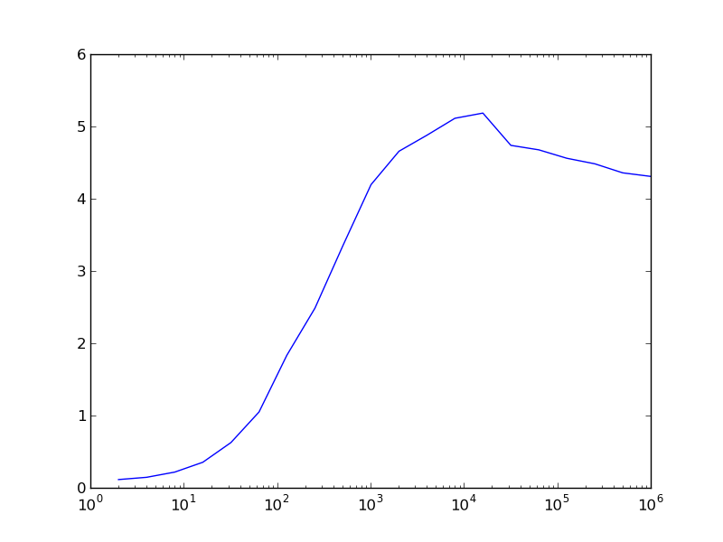

======================
Laufzeituntersuchungen
======================

-------------------------
Allgemeine Vorbemerkungen
-------------------------

Python wird immer wieder vorgeworfen, dass es im Vergleich zu einer Reihe
anderer Programmiersprachen langsam sei. Häufig stellt dies kein echtes Problem
dar, aber bei Bedarf gibt es zur Optimierung von Pythonskripten eine Reihe von
Möglichkeiten. Die konsequente Verwendung von NumPy kann bei dazu geeigneten
Anwendungen einen erheblichen Geschwindigkeitsvorteil bringen. Unter Umständen
kann es auch sinnvoll sein, besonders zeitkritische Programmteile in C zu
implementieren. In diesem Fall bietet sich die Verwendung des bereits in einem
früheren Kapitel erwähnten Cython an. Mit dessen Hilfe ist es auch sehr einfach
möglich, die Rechenzeit durch das Festlegen des Datentyps von Variablen zu
reduzieren. Alternativ bietet sich auch die »just in time«-Kompilierung zum
Beispiel mit PyPy [#pypy]_ oder Numba [#numba]_ an, die die Programmausführung
beschleunigen kann.

Im Einzelfall sollte man zunächst überlegen, ob das Laufzeitproblem wirklich
schwerwiegend ist oder ob man für die Optimierung letztlich mehr Zeit
investieren muss als man gewinnt. Es lohnt sich dabei, auf den Altmeister
Donald E. Knuth zu hören, der schon vor mehr als 40 Jahren schrieb:

   There is no doubt that the grail of efficiency leads to abuse. Programmers
   waste enormous amounts of time thinking about, or worrying about, the 
   speed of noncritical parts of their programs, and these attempts at 
   efficiency actually have a strong negative impact when debugging and
   maintentance are considered. We *should* forget about small efficiencies,
   say about 97 % of the time: premature optimization is the root of all evil.

   Yet we should not pass up our opportunities in that critical 3 %. A good
   programmer will not be lulled into complacency by such reasoning, he will
   be wise to look carefully at the critical code; but only *after* that code
   has been identified. [#rootofallevil]_

Bevor man also überhaupt mit der Optimierung eines Programms beginnt, sollte
man zunächst immer erst feststellen, wo das Programm die meiste Zeit verbringt.
Es lohnt sich nicht, Zeit in die Optimierung von Programmteilen zu investieren,
deren Laufzeit im Vergleich zur gesamten Laufzeit unerheblich ist. Nach jeder
Optimierung wird man erneut den laufzeitkritischsten Programmteil
identifizieren, um so in eventuell mehreren Schritten zu einer hoffentlich
akzeptablen Laufzeit zu kommen.

Vor der Optimierung eines Programms sollte man immer bedenken, dass sich dabei
Fehler einschleichen können. Es nützt alles nicht, wenn man das Programm
geändert hat, so dass es viel schneller läuft, dann aber nicht mehr das tut was
es eigentlich tun soll. Daher sollte man mindestens eine funktionstüchtigte
Version des Programms aufbewahren, z.B. eine Kopie, die eine Endung ``.bak``
erhält. Wesentlich besser ist es natürlich, ein Versionskontrollsystem zu
verwenden, beispielsweise Git, das wir im Kapitel :ref:`vcgit` beschrieben
haben. Außerdem ist es sinnvoll, Tests zu programmieren, die es erlauben, die
neue Programmversion auf Korrektheit zu überprüfen. Techniken hierfür werden 
im Kapitel :ref:`testing` besprochen.

Bevor wir einige Möglichkeiten diskutieren, die Laufzeit von Python-Skripten zu
bestimmen, wollen wir im nächsten Abschnitt zunächst auf einige Schwierigkeiten
bei der Laufzeitmessung hinweisen. 

-----------------------------------
Fallstricke bei der Laufzeitmessung
-----------------------------------

Python stellt mit dem Modul ``time`` eine Möglichkeit zur Verfügung, die
aktuelle Zeit und damit letztlich auch Zeitdifferenzen zu bestimmen.

.. sourcecode:: ipython

   In [1]: import time

   In [2]: time.ctime()
   Out[2]: 'Thu Dec 22 14:39:30 2016'

Auch wenn die aktuelle Zeit hier in einem gut lesbaren Format ausgegeben wird,
eignet sich dieses Ergebnis nur schlecht zur Bildung von Zeitdifferenzen. Besser
ist es, die Zahl der Sekunden seit Beginn der „Zeitrechnung“ zu bestimmen. Dabei
beginnt die Zeitrechnung auf Unix-Systemen am 1.1.1970 um 00:00:00 UTC.

.. sourcecode:: ipython

   In [3]: time.time()
   Out[3]: 1482413973.190686

Damit lässt sich nun die Zeit bestimmen, die ein bestimmter Python-Code
benötigt, wie folgendes Beispiel zeigt.

.. sourcecode:: python
   :linenos:

   import time

   summe = 0
   start = time.time()
   for n in range(1000000):
       summe = summe+1
   ende = time.time()
   print('{:5.3f}s'.format(ende-start))

Hier wird die Zeitdauer gemessen, die die Schleife in den Zeilen 5 und 6 benötigt.
Allerdings ist diese Zeit keineswegs immer genau gleich lang. Das um eine
Schleife erweiterte Skript

.. sourcecode:: python
   :linenos:

   import time

   for _ in range(10):
       summe = 0
       start = time.time()
       for n in range(1000000):
           summe = summe+1
       ende = time.time()
       print('{:5.3f}s'.format(ende-start), end='  ')

liefert zum Beispiel die folgende Ausgabe ::

   0.150s  0.108s  0.104s  0.103s  0.107s  0.106s  0.104s  0.103s  0.103s  0.103s

wobei das Ergebnis beim nächsten Lauf oder erst recht auf einem anderen Computer
deutlich anders aussehen kann. Es kann also sinnvoll sein, über mehrere Durchläufe
zu mitteln, wie es das ``timeit``-Modul tut, das wir im nächsten Abschnitt
besprechen werden.

Bei der Ermittlung von Laufzeiten ist weiter zu bedenken, dass der Prozessor
auch von anderen Aufgaben in Anspruch genommen wird, so dass wir gerade zwar
die während des Laufs verstrichene Zeit bestimmt haben, nicht aber die Zeit,
die der Prozessor hierfür tatsächlich aufgewendet hat. Dies illustrieren wir im
folgenden Beispiel, in dem wir das Skript zeitweilig pausieren lassen. Damit
wird in Zeile 9 simuliert, dass andere Prozesse für eine Unterbrechung der
Ausführung unseres Skripts sorgen. Außerdem benutzen wir in den Zeilen 5 und 11
``time.process_time()``, um die vom Prozessor aufgewandte Zeit für den Prozess
zu bestimmen, in dem unser Skript abgearbeitet wird.

.. sourcecode:: python
   :linenos:

   import time

   summe = 0
   start = time.time()
   start_proc = time.process_time()
   for n in range(10):
       for m in range(100000):
           summe = summe+1
       time.sleep(1)
   ende = time.time()
   ende_proc = time.process_time()
   print('Gesamtzeit: {:5.3f}s'.format(ende-start))
   print('Systemzeit: {:5.3f}s'.format(ende_proc-start_proc))

Die Ausgabe ::

   Gesamtzeit: 10.248s
   Systemzeit: 0.238s

zeigt, dass die Gesamtdauer des Skripts erwartungsgemäß um etwa 10 Sekunden
länger ist als die in Anspruch genommene Prozessorzeit.

Vorsicht ist auch geboten, wenn man den zu testenden Codeteil der Übersichtlichkeit
halber in eine Funktion auslagert, da dann die Zeit für den Funktionsaufruf relevant
werden kann. Dies ist besonders der Fall, wenn die eigentliche Auswertung der
Funktion nur sehr wenig Zeit erfordert. So liefert der folgende Code

.. sourcecode:: python
   :linenos:

   import time
   
   summe = 0
   start_proc = time.process_time()
   for n in range(10000000):
       summe = summe+1
   ende_proc = time.process_time()
   print('Systemzeit: {:5.3f}s'.format(ende_proc-start_proc))
   
eine Laufzeit von 1,122 Sekunden, während der äquivalente Code

.. sourcecode:: python
   :linenos:

   import time

   def increment_by_one(x):
       return x+1

   summe = 0
   start_proc = time.process_time()
   for n in range(10000000):
       increment_by_one(summe)
   ende_proc = time.process_time()
   print('Systemzeit: {:5.3f}s'.format(ende_proc-start_proc))

mit 1,529 Sekunden gemessen wurde und somit um fast 40 Prozent langsamer läuft.     

Unabhängig von den genannten Problemen bedeutet jede Laufzeitmessung immer einen
Eingriff in die Ausführung des Skripts, so dass die gemessene Laufzeit unter
Umständen deutlich gegenüber der normalen Laufzeit des entsprechenden Codes
erhöht sein kann. 

Die in den Beispielen verwendete Methode der Laufzeitbestimmung hat Nachteile.
Unter anderem erfordert sie eine explizite Modifizierung des Codes, was häufig
unerwünscht ist. Im Folgenden besprechen wir einige ausgewählte Alternativen,
die entsprechend den jeweiligen Erfordernissen eingesetzt werden können.

.. _timeit:

--------------------
Das Modul ``timeit``
--------------------

Um die Laufzeit von Einzeilern oder kleineren Codeteilen zu testen, kann man das
Python-Modul ``timeit`` heranziehen. Dies ist zum Beispiel dann nützlich, wenn
man sich ein Bild davon machen möchte, welche Codevariante die schnellere sein
wird. Im Allgemeinen wird dabei über mehrere oder sogar viele Wiederholungen
gemittelt, um zu einem möglichst zuverlässigen Ergebnis zu kommen. Die wohl
einfachste Möglichkeit, ``timeit`` einzusetzen, besteht in der Benutzung der
IPython-Shell.

Einen Laufzeitvergleich zwischen zwei Arten eine Zahl zu quadrieren, kann
man in IPython folgendermaßen vornehmen:

.. sourcecode:: ipython

   In [1]: n = 5

   In [2]: %timeit n*n
   10000000 loops, best of 3: 166 ns per loop

   In [3]: %timeit n**2
   1000000 loops, best of 3: 252 ns per loop

Das Prozentzeichen wird ``timeit`` vorangestellt, um es als so genannten
»magischen Befehl« zu kennzeichnen, also einen Befehl der IPython-Shell und
nicht ein Python-Kommando. Da ``timeit`` in diesem Fall nicht als
Python-Kommando interpretiert werden kann, könnte man sogar auf das
Prozentzeichen verzichten. Es zeigt sich, dass die Quadrierung durch
Multiplikation mit 166 Nanosekunden schneller ausgeführt wird als die
Quadrierung durch Potenzierung, die 252 Nanosekunden benötigt.  Natürlich hängt
die Laufzeit vom verwendeten Prozessor ab und ist auch nicht unbedingt auf die
letzte Stelle genau reproduzierbar.

Wie in der Ausgabe dieses Beispiels zu sehen ist, wird der Befehl, dessen
Laufzeit bestimmt werden soll, mehrfach ausgeführt. Dabei wird die Zahl der
Wiederholungen automatisch so bestimmt, dass sich eine vernünftige
Gesamtlaufzeit ergibt.

Um die Laufzeit von mehrzeiligem Code zu untersuchen, wendet man den magischen
``timeit``-Befehl auf eine ganze Zelle an, indem man ein zweites Prozentzeichen
voranstellt. Dies ist in folgendem Beispiel gezeigt.

.. sourcecode:: ipython

   In [4]: %%timeit
      ...: summe = 0
      ...: for n in range(1000):
      ...:     summe = summe+n
      ...:                                                                                                                                                                      
   10000 loops, best of 3: 104 us per loop                                                                                                                                      
   In [5]: %timeit sum(range(1000))                                                                                                                                            
   10000 loops, best of 3: 22.2 us per loop

Im ersten Fall verwenden wir ``%%timeit`` mit zwei Prozentzeichen, damit
sich dieser Befehl auf die nächsten drei Zeilen und nicht nur die nächste
Zeile bezieht. Im zweiten Fall genügt dagegen wiederum ``%timeit``. In
diesem Beispiel liegt die Ausführungszeit im Mikrosekundenbereich, wobei
die explizite Schleife fast fünfmal mehr Zeit benötigt.

Auch wenn man mit der IPython-Shell sehr bequem die Laufzeit von Codestücken
untersuchen kann, mag es gelegentlich notwendig sein, das ``timeit``-Modul
direkt in einem Python-Skript einzusetzen. Daher wollen wir uns nun die
Anwendung dieses Moduls ansehen.

Das folgende Beispiel untersucht den Laufzeitunterschied bei der Berechnung
des Sinus mit Hilfe des ``math``-Moduls und mit NumPy in Abhängigkeit von
der Anzahl der Funktionsargumente.

.. sourcecode:: python
   :linenos:

   import numpy as np
   import math
   import timeit
   import matplotlib.pyplot as plt
   
   def f_numpy(nmax):
       x = np.linspace(0, np.pi, nmax)
       result = np.sin(x)
   
   def f_math(nmax):
       dx = math.pi/(nmax-1)
       result = [math.sin(n*dx) for n in range(nmax)]
   
   x = []
   y = []
   for n in np.logspace(0.31, 6, 20):
       nint = int(n)
       t_numpy = timeit.timeit("f_numpy({})".format(nint),
                               "from __main__ import f_numpy",
                               number=20)
       t_math = timeit.timeit("f_math({})".format(nint),
                               "from __main__ import f_math",
                               number=20)
       x.append(nint)
       y.append(t_math/t_numpy)
   plt.plot(x, y)
   plt.xscale("log")
   plt.show()

Zunächst definieren wir in den Zeilen 6 bis 12 zwei Funktionen, die jeweils den
Sinus für eine vorgegebene Anzahl von Argumenten berechnen, einmal mit Hilfe
von NumPy und einmal mit Hilfe des ``math``-Moduls. In den Zeilen 16 bis 25
wird für verschiedene Argumentanzahlen die Laufzeit für die beiden Varianten
bestimmt. Sehen wir uns einen der Aufrufe zur Laufzeitbestimmung genauer an,
konkret den Code in den Zeilen 18 bis 20. Nachdem wir in Zeile 3 das
``timeit``-Modul geladen hatten, können wir in Zeile 18 die ``timeit``-Funktion
aus diesem Modul aufrufen. Das erste Argument enthält den auszuführenden Code,
in unserem Fall also einfach den Funktionsaufruf von ``f_numpy``.

Nachdem der Code als String zu übergeben ist, können wir problemlos in der gezeigten
Weise ein Argument oder auch mehrere übergeben. Da die von ``timeit``
aufgerufenen Funktion keinen Zugriff auf den Namensraum des umgebenden Skripts
besitzt, würde es nicht funktionieren, das Argument einfach als ``nint`` in dem
String unterzubringen. Tatsächlich ist nicht einmal die Funktion ``f_numpy``
bekannt. Der ``timeit``-Funktion wird daher in Zeile 19 explizit mitgeteilt,
dass zunächst aus unserem Hauptskript, auf das mit ``__main__`` Bezug genommen
wird, ``f_numpy`` zu importieren ist. In Zeile 20 verlangen wir schließlich noch,
dass zwanzig Funktionsläufe durchgeführt werden sollen, um eine gemittelte
Laufzeit berechnen zu können. Eine automatische Bestimmung einer sinnvollen
Zahl von Wiederholungen nimmt ``timeit`` hier im Gegensatz zur Verwendung in
IPython nicht vor.

Wie die folgende Abbildung zeigt, bietet NumPy für sehr kleine Argumentanzahlen
keinen Geschwindigkeitsvorteil, ganz im Gegenteil. Dies hängt damit zusammen,
dass im Zusammenhang mit der Verwendung von Arrays einiges an Zusatzarbeit
anfällt. Bei mehr als etwa 100 Argumenten erlaubt NumPy in unserem Fall jedoch
eine schnellere Berechnung des Sinus. Der Geschwindigkeitsvorteil kann auf der
hier verwendeten Hardware immerhin einen Faktor 4 bis 5 betragen.

.. _cProfile:

----------------------
Das Modul ``cProfile``
----------------------

Das ``timeit``-Modul, das wir gerade beschrieben haben, ist sehr gut geeignet,
um die Laufzeit eines bestimmten Codesegments zu untersuchen. Bei der Optimierung
eines Programms interessiert man sich jedoch vor allem dafür, welche Teile des
Programms wieviel Zeit benötigen. Dann können die rechenintensiven Codeteile
identifiziert und gezielt optimiert werden.

Häufig ist dies jedoch nicht nötig, und es genügt festzustellen, wieviel Zeit
in den einzelnen Funktionen oder Methoden verbracht wurde. Dies funktioniert
dann besonders gut, wenn man den Code sinnvoll modularisiert, was ja auch im
Hinblick auf das Testen von Vorteil ist, wie wir im Kapitel :ref:`testing`
betont hatten. Im Folgenden werden wir beschreiben, wie man mit Hilfe des
Moduls ``cProfile`` feststellen kann, wieviel Zeit in welchen Funktionen
während des Programmlaufs verbracht wird.

Als Beispiel ziehen wir das folgende Skript mit Namen ``pi.py`` zur Berechnung
der Kreiszahl π heran, wobei eine Berechnung auf 100.000 Stellen durchgeführt
wird. Das Skript basiert auf dem 
`Gauss-Legendre oder Brent-Salamin-Algorithmus <https://en.wikipedia.org/wiki/Gauss%E2%80%93Legendre_algorithm>`_
und nutzt aus, dass Python beliebig lange Integers zulässt.

.. sourcecode:: python
   :linenos:

   from math import sqrt
   
   def division(numerator, denominator, stellen):
       resultat = str(numerator//denominator)+"."
       for n in range(stellen):
           numerator = (numerator % denominator)*10
           resultat = "%s%s" % (resultat, numerator//denominator)
       return resultat
   
   def wurzel_startwert(quadrat):
       """bestimme näherungsweise die Wurzel aus einem langen Integer
   
          Es wird die Wurzel auf der Basis der ersten 12 oder 13 Stellen
          mit Hilfe des entsprechenden Floats gezogen.
       """
       str_quadrat = str(quadrat)
       nrdigits = len(str_quadrat)
       keepdigits = 12
       if nrdigits % 2:
           keepdigits = keepdigits+1
       lead_sqrt_estimate = sqrt(float(str_quadrat[:keepdigits]))
       return int(lead_sqrt_estimate)*10**((nrdigits-keepdigits)//2)+1
   
   def wurzel(quadrat):
       x = wurzel_startwert(quadrat)
       xold = 0
       while x != xold:
           xold = x
           x = (x*x+quadrat)//(2*x)
       return x
   
   def agm_iteration(a, b):
       return (a+b)//2, wurzel(a*b)
   
   def ausgabe(x, zeilenlaenge=80):
       str_x = "\u03c0="+str(x)+"\u2026"
       while len(str_x) > 0:
           print(str_x[:zeilenlaenge])
           str_x = str_x[zeilenlaenge:]
   
   stellen = 100000
   skalenfaktor = 10**(stellen+6)
   a = skalenfaktor
   b = wurzel(skalenfaktor**2//2)
   c_sum = 0
   faktor_two = 2
   while a != b:
       a, b = agm_iteration(a, b)
       faktor_two = faktor_two*2
       c_sum = c_sum+faktor_two*(a*a-b*b)
   numerator = 4*a**2
   denominator = skalenfaktor**2-c_sum
   ergebnis = division(numerator, denominator, stellen)
   ausgabe(ergebnis)

Die gesamte Ausgabe ist zu lang, um sie hier vollständig wiederzugeben, so dass
wir uns auf die ersten beiden Zeilen beschränken. ::

   π=3.1415926535897932384626433832795028841971693993751058209749445923078164062862
   08998628034825342117067982148086513282306647093844609550582231725359408128481117

Von den verschiedenen Varianten, ``cProfile`` zu benutzen, wählen wir hier eine,
bei der wir das zu untersuchende Programm nicht modifizieren müssen. Dazu
rufen wir das Modul mit geeigneten Argumenten auf::

   $ python -m cProfile -o pi.prof pi.py

Hierbei wird das Programm ``pi.py`` unter der Kontrolle des ``cProfile``-Moduls
ausgeführt. Die Option ``-o`` legt fest, dass die Ergebnisse in der Datei
``pi.prof`` gespeichert werden sollen. Dabei handelt es sich um eine
Binärdatei, die mit Hilfe des ``pstats``-Moduls analysiert werden kann. Dazu
geht man folgendermaßen vor:

.. code-block:: ipython

   In [1]: import pstats

   In [2]: p = pstats.Stats('pi.prof')
   
   In [3]: p.sort_stats('time').print_stats(8)
   Fri Dec 23 15:36:56 2016    pi.prof
   
            2882 function calls in 68.377 seconds
   
      Ordered by: internal time
      List reduced from 76 to 8 due to restriction <8>
   
      ncalls  tottime  percall  cumtime  percall filename:lineno(function)
          18   41.008    2.278   49.819    2.768 pi.py:27(wurzel)
           1   17.776   17.776   17.776   17.776 pi.py:4(division)
          18    8.812    0.490    8.812    0.490 pi.py:12(wurzel_startwert)
           1    0.424    0.424   68.377   68.377 pi.py:1(<module>)
          17    0.320    0.019   47.346    2.785 pi.py:36(agm_iteration)
           1    0.024    0.024    0.037    0.037 pi.py:40(ausgabe)
        1251    0.011    0.000    0.011    0.000 {built-in method builtins.print}
        1270    0.002    0.000    0.002    0.000 {built-in method builtins.len}
   
   Out[3]: <pstats.Stats at 0x7f1a26ed4ac8>

Nachdem in Eingabe 1 das ``pstats``-Modul geladen wurde, wird in Eingabe 2 die
zuvor erzeugte binäre Datei ``pi.prof`` eingelesen. Man erhält so eine
``pstats.Stats``-Instanz, die nun analysiert werden kann. In den meisten Fällen
wird man die Daten nach der benötigten Zeit sortieren und auch nur die obersten
Datensätze ausgeben wollen, da die Gesamtliste unter Umständen recht lang sein
kann.  In Eingabe 3 sortieren wir mit der ``sort_stats``-Methode nach der Zeit,
die in der jeweiligen Funktion verbracht wurde. Anschließend wird mit der
``print_stats``-Methode dafür gesorgt, dass nur die ersten acht Zeilen
ausgegeben werden. 

Das Schlüsselwort ``time`` in der ``sort_stats``-Methode verlangt eine
Sortierung nach der Zeit, die in der jeweiligen Funktion verbracht wurde. Wird
von einer Funktion aus eine andere Funktion aufgerufen, so wird die Uhr für die
aufrufende Funktion angehalten. Dies ist zum Beispiel in der Funktion ``wurzel``
der Fall, die in Zeile 25 die Funktion ``wurzel_startwert`` aufruft.  Für die
Funktion ``wurzel`` wurde gemäß der obigen Ausgabe eine Zeit ``tottime`` von
41,008 Sekunden gemessen. Diese enthält nicht die 8,812 Sekunden, die von
``wurzel_startwert`` benötigt werden. Die von ``wurzel`` benötigte Gesamtzeit
lässt sich in der Spalte ``cumtime`` (*cumulative time*, also aufsummierte Zeit)
zu 49,819 Sekunden ablesen. Dies entspricht bis auf einen Rundungsfehler der
Summe der Zeiten, die in ``wurzel`` und ``wurzel_startwert`` verbracht wurden.
Ist man an den aufsummierten Zeiten interessiert, so kann man das Schlüsselwort
``cumtime`` in der ``sort_stats``-Methode verwenden.

.. code-block:: ipython

   In [4]: p.sort_stats('cumtime').print_stats(8)
   Fri Dec 23 15:36:56 2016    pi.prof
   
            2882 function calls in 68.377 seconds
   
      Ordered by: cumulative time
      List reduced from 76 to 8 due to restriction <8>
   
      ncalls  tottime  percall  cumtime  percall filename:lineno(function)
           1    0.000    0.000   68.377   68.377 {built-in method builtins.exec}
           1    0.424    0.424   68.377   68.377 pi.py:1(<module>)
          18   41.008    2.278   49.819    2.768 pi.py:27(wurzel)
          17    0.320    0.019   47.346    2.785 pi.py:36(agm_iteration)
           1   17.776   17.776   17.776   17.776 pi.py:4(division)
          18    8.812    0.490    8.812    0.490 pi.py:12(wurzel_startwert)
           1    0.024    0.024    0.037    0.037 pi.py:40(ausgabe)
        1251    0.011    0.000    0.011    0.000 {built-in method builtins.print}
   
   Out[4]: <pstats.Stats at 0x7f1a26ed4ac8>

Die Ausgabe zeigt auch, dass es nicht immer auf die Zeit ankommt, die pro Aufruf
einer Funktion benötigt wird. Diese Information findet sich in der Spalte
``percall``. So benötigt ``division`` in unserem Beispiel 17,776 Sekunden je
Aufruf, während ``wurzel`` nur 2,278 Sekunden je Aufruf benötigt. Allerdings
wird ``division`` nur einmal aufgerufen, während ``wurzel`` achtzehnmal
aufgerufen wird. Damit ist der Beitrag von ``wurzel`` zur Gesamtlaufzeit
erheblich größer als der Beitrag von ``division``.

Es kann sinnvoll sein, die in der Spalte ``ncalls`` angegebene Anzahl der
Aufrufe einer Funktion auf Plausibilität zu überprüfen. Gelegentlich stellt
sich dabei heraus, dass eine Funktion unnötigerweise mehrfach aufgerufen
wird. So kann es vorkommen, dass eine Funktion in einer Schleife aufgerufen
wird, obwohl sich die Funktionsargumente in der Schleife nicht ändern.
Eine entsprechende Anpassung des Programms kann dann auf einfache
Weise zu einer Beschleunigung führen.

Mit den beschriebenen Ausgaben lässt sich nun feststellen, in welchen Teilen
des Programms der größte Anteil der Rechenzeit verstreicht. Man kann sich somit
bei der Optimierung des Programms auf diese Teile konzentrieren. Dabei kann es
natürlich vorkommen, dass nach einer Optimierung andere Programmteile in den
Fokus rücken. Es kann aber auch sein, dass man feststellen muss, dass die
meiste Rechenzeit in einem Programmteil benötigt wird, der sich nicht mehr
optimieren lässt. Dann muss man sich die Frage stellen, ob es sinnvoll ist, die
Optimierungsbemühungen überhaupt fortzusetzen, da eine Optimierung der
anderen Programmteile kaum eine Auswirkung auf die Gesamtrechenzeit haben
wird. Um die Situation einschätzen zu können, sind Laufzeitanalysen, wie wir
sie hier vorgestellt haben, praktisch unerlässlich.

------------------------------------
Zeilenorientierte Laufzeitbestimmung
------------------------------------

Gelegentlich kann es vorkommen, dass die im letzten Abschnitt beschriebene
funktionsbasierte Laufzeitauswertung nicht ausreicht, um ein in Hinblick auf
die Laufzeit kritisches Codestück zu identifizieren. In diesem Fall kann man
zu einer zeilenorientierten Laufzeitmessung greifen. Wir beschreiben hier
das von Robert Kern entwickelte Modul ``line_profiler`` [#kern]_.

Der besseren Übersichtlichkeit wegen empfiehlt es sich, eine zeilenorientierte
Laufzeitmessung auf eine einzelne Funktion oder nur wenige Funktionen zu
beschränken. Dazu bestimmt man am besten mit den zuvor beschriebenen Methoden
die zeitkritischsten Funktionen. Für Funktionen, die mit einem
``@profile``-Dekorator versehen sind, wird eine zeilenorientierte
Laufzeitmessung durchgeführt. Wir wollen speziell die Funktionen ``wurzel`` und
``wurzel_startwert`` betrachten. Der entsprechende Codeteil sieht dann
folgendermaßen aus.

.. sourcecode:: python
   :linenos:

      @profile
      def wurzel_startwert(quadrat):
          str_quadrat = str(quadrat)
          nrdigits = len(str_quadrat)
          keepdigits = 12
          if nrdigits % 2:
              keepdigits = keepdigits+1
          lead_sqrt_estimate = sqrt(float(str_quadrat[:keepdigits]))
          return int(lead_sqrt_estimate)*10**((nrdigits-keepdigits)//2)+1
      
      @profile
      def wurzel(quadrat):
          x = wurzel_startwert(quadrat)
          xold = 0
          while x != xold:
              xold = x
              x = xold*xold+quadrat
              x = x//(2*xold)
          return x
   
Der restliche Code bleibt unverändert. Wesentlich sind hier die beiden
``@profile``-Dekoratoren. Für die folgende Diskussion haben wir den
Iterationsschritt des Newton-Verfahrens in zwei Zeilen (17 und 18) 
aufgeteilt. Außerdem haben wir einen Docstring entfernt, der hier nicht
wesentlich ist.

Von der Befehlszeile kann man nun das Skript unter Verwendung der zeilenorientierten
Laufzeitmessung ausführen::

   kernprof -l -v pi.py

``kernprof`` ist der Name eines Skripts, das die Verwendung des Moduls
``line_profiler`` automatisiert, wenn man die Option ``-l`` angibt. Die
Option ``-v`` gibt man an, wenn die Ausgabe direkt angezeigt werden soll.
In jedem Fall werden die relevanten Daten ähnlich wie beim ``cProfile``-Modul
in eine Binärdatei geschrieben. Sofern nicht mit der Option ``-o`` etwas
anderes angegeben wird, ergibt sich der Name der Datei durch Anhängen der
Endung ``.lprof``. In unserem Falle heißt sie also ``pi.py.lprof``. Aus
ihr kann man mit ::

   python -m line_profiler pi.py.lprof

die folgende Ausgabe erzeugen::

   Timer unit: 1e-06 s
   
   Total time: 8.71038 s
   File: pi.py
   Function: wurzel_startwert at line 10
   
   Line #      Hits         Time  Per Hit   % Time  Line Contents
   ==============================================================
       10                                           @profile
       11                                           def wurzel_startwert(quadrat):
       12        18      8621108 478950.4     99.0      str_quadrat = str(quadrat)
       13        18           61      3.4      0.0      nrdigits = len(str_quadrat)
       14        18           20      1.1      0.0      keepdigits = 12
       15        18           39      2.2      0.0      if nrdigits % 2:
       16                                                   keepdigits = keepdigits+1
       17        18          207     11.5      0.0      lead_sqrt_estimate =
                                                          sqrt(float(str_quadrat[:keepdigits]))
       18        18        88949   4941.6      1.0      return int(lead_sqrt_estimate)
                                                          *10**((nrdigits-keepdigits)//2)+1
   
   Total time: 49.5045 s
   File: pi.py
   Function: wurzel at line 20
   
   Line #      Hits         Time  Per Hit   % Time  Line Contents
   ==============================================================
       20                                           @profile
       21                                           def wurzel(quadrat):
       22        18      8710713 483928.5     17.6      x = wurzel_startwert(quadrat)
       23        18           31      1.7      0.0      xold = 0
       24       288          898      3.1      0.0      while x != xold:
       25       270          254      0.9      0.0          xold = x
       26       270      3026189  11208.1      6.1          x = xold*xold+quadrat
       27       270     37766390 139875.5     76.3          x = x//(2*xold)
       28        18           31      1.7      0.0      return x

In der Ausgabe zur Funktion ``wurzel_startwert`` haben wir die Zeilen 17 und 18 wegen
der Zeilenlänge nachträglich umgebrochen. Die Ausgabe zeigt uns in der Funktion
``wurzel_startwert`` nun deutlich, welcher Teil der Funktion für die Ausführungsdauer
von fast 9 Sekunden verantwortlich ist, nämlich die Umwandlung eines Integers in einen
String. Dieser Schritt ist hier erforderlich, um die Zahl der Ziffern in dem Integer
``quadrat`` zu bestimmen.

Interessant ist auch die Funktion ``wurzel``, die für einen größten Teil der Laufzeit
verantwortlich ist. In den Zeilen 26 und 27 sehen wir, dass der Großteil der Zeit im
Newton-Iterationsschritt verbracht wird. Dabei spielt die Berechnung des Quadrats von
``xold`` kaum eine Rolle. Es ist vielmehr die Division in Zeile 27, die einen sehr hohen
Zeitaufwand erfordert. Zwar ist die Zeit für die Berechnung des Startwerts in Zeile 22
auf einen einzelnen Aufruf bezogen größer, aber nachdem die Division 270-mal aufgerufen
wird, ist sie für mehr als Dreiviertel der Laufzeit der Funktion ``wurzel`` verantwortlich.

Bei der Programmentwicklung kann es praktisch sein, das Modul ``line_profiler`` in 
IPython zu verwenden. Im Folgenden ist ein Beispiel gezeigt, das einen Vergleich 
zwischen der Wurzelfunktion aus dem ``math``-Modul und der Wurzelberechnung mit Hilfe
des Newton-Verfahrens anstellt.

.. sourcecode:: ipython

   In [1]: %load_ext line_profiler

   In [2]: import math
   
   In [3]: def newton_sqrt(quadrat):
      ...:     x = 1
      ...:     while abs(quadrat-x*x) > 1e-13:
      ...:         x = 0.5*(x*x+quadrat)/x
      ...:     return x
      ...: 
   
   In [4]: def comparison(x):
      ...:     sqrt1 = math.sqrt(x)
      ...:     sqrt2 = newton_sqrt(x)
      ...:     print(sqrt1, sqrt2)
      ...:     
   
   In [5]: %lprun -f newton_sqrt comparison(500)
   22.360679774997898 22.360679774997898
   Timer unit: 1e-06 s
   
   Total time: 7e-05 s
   File: <ipython-input-3-e6f13bf0d844>
   Function: newton_sqrt at line 1
   
   Line #      Hits         Time  Per Hit   % Time  Line Contents
   ==============================================================
        1                                           def newton_sqrt(quadrat):
        2         1            4      4.0      5.7      x = 1
        3        10           34      3.4     48.6      while abs(quadrat-x*x) > 1e-13:
        4         9           29      3.2     41.4          x = 0.5*(x*x+quadrat)/x
        5         1            3      3.0      4.3      return x

Zunächst lädt man in Eingabe 1 ``line_profiler`` als Erweiterung. Nachdem man
die nötigen Funktionen definiert und für dieses Beispiel auch noch das ``math``-Modul
geladen hat, kann man in Eingabe 5 mit Hilfe von ``%lprun`` die zeilenorientierte
Laufzeitmessung ausführen. Dazu gibt man mit der Option ``-f`` die Funktion an,
in der die Laufzeitmessung benötigt wird. Diese Option ersetzt also den ``@profile``-Dekorator.
Bei Bedarf kann die Option ``-f`` auch mehrfach angegeben werden. Am Ende steht der
Aufruf der Funktion, mit der der gewünschte Code ausgeführt wird, hier also
``comparison(500)``.

Nachdem wir uns in diesem Kapitel auf die Messung von Laufzeiten konzentriert
hatten, sei abschließend noch angemerkt, dass man auch die Entwicklung des
Speicherbedarfs während der Ausführung eines Skripts messen kann. Dies ist
besonders dann nützlich, wenn man mit größeren Arrays arbeitet oder an die
Grenzen des Arbeitsspeichers stößt. Um im Skript zeilenweise die Entwicklung
des Speicherbedarfs messen zu können, verwendet man das Modul ``memory_profiler``.

.. [#rootofallevil] D. E. Knuth, Computing Surveys **6**, 261 (1974). Das
           angegebene Zitat befindet sich auf Seite 268.
.. [#pypy] Weitere Informationen zu diesem Projekt findet man unter
           `www.pypy.org <http://www.pypy.org>`_.
.. [#numba] Weitere Informationen zu diesem Projekt findet man unter
            `numba.pydata.org <http://numba.pydata.org>`_.
.. [#kern] Die Quellen zu diesem Modul findet man unter
           https://github.com/rkern/line_profiler.
