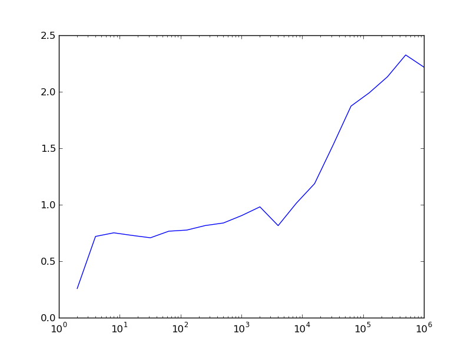

======================
Laufzeituntersuchungen
======================

-------------------------
Allgemeine Vorbemerkungen
-------------------------

Python wird immer wieder vorgeworfen, dass es im Vergleich zu einer Reihe
anderer Programmiersprachen langsam sei. Häufig stellt dies kein echtes Problem
dar, aber bei Bedarf gibt es zur Optimierung von Pythonskripten eine Reihe von
Möglichkeiten. Die konsequente Verwendung von NumPy kann bei dazu geeigneten
Anwendungen einen erheblichen Geschwindigkeitsvorteil bringen. Unter Umständen
kann es auch sinnvoll sein, besonders zeitkritische Programmteile in C zu
implementieren. In diesem Fall bietet sich die Verwendung des bereits in einem
früheren Kapitel erwähnten Cython an. Mit dessen Hilfe ist es auch sehr einfach
möglich, die Rechenzeit durch das Festlegen des Datentyps von Variablen zu
reduzieren. Alternativ bietet sich auch die »just in time«-Kompilierung zum
Beispiel mit PyPy [#pypy]_ oder Numba [#numba]_ an, die die Programmausführung
beschleunigen kann.

Im Einzelfall sollte man zunächst überlegen, ob das Laufzeitproblem wirklich
schwerwiegend ist oder ob man für die Optimierung letztlich mehr Zeit
investieren muss als man gewinnt. Es lohnt sich dabei, auf den Altmeister
Donald E. Knuth zu hören, der schon vor mehr als 40 Jahren schrieb:

   There is no doubt that the grail of efficiency leads to abuse. Programmers
   waste enormous amounts of time thinking about, or worrying about, the 
   speed of noncritical parts of their programs, and these attempts at 
   efficiency actually have a strong negative impact when debugging and
   maintentance are considered. We *should* forget about small efficiencies,
   say about 97 % of the time: premature optimization is the root of all evil.

   Yet we should not pass up our opportunities in that critical 3 %. A good
   programmer will not be lulled into complacency by such reasoning, he will
   be wise to look carefully at the critical code; but only *after* that code
   has been identified. [#rootofallevil]_

Bevor man also überhaupt mit der Optimierung eines Programms beginnt, sollte
man zunächst immer erst feststellen, wo das Programm die meiste Zeit verbringt.
Es lohnt sich nicht, Zeit in die Optimierung von Programmteilen zu investieren,
deren Laufzeit im Vergleich zur gesamten Laufzeit unerheblich ist. Nach jeder
Optimierung wird man erneut den laufzeitkritischsten Programmteil
identifizieren, um so in eventuell mehreren Schritten zu einer hoffentlich
akzeptablen Laufzeit zu kommen.

Vor der Optimierung eines Programms sollte man immer bedenken, dass sich dabei
Fehler einschleichen können. Es nützt alles nicht, wenn man das Programm
geändert hat, so dass es viel schneller läuft, dann aber nicht mehr das tut was
es eigentlich tun soll. Daher sollte man mindestens eine funktionstüchtigte
Version des Programms aufbewahren, z.B. eine Kopie, die eine Endung ``.bak``
erhält. Wesentlich besser ist es natürlich, ein Versionskontrollsystem zu
verwenden, beispielsweise Subversion oder Git, das wir im Kapitel
:ref:`vcgit` beschrieben haben. Außerdem ist es sinnvoll, Tests zu
programmieren, die es erlauben, die neue Programmversion auf Korrektheit zu
überprüfen. Techniken hierfür hatten wir im Kapitel :ref:`testing` besprochen.

Wenden wir uns nun einigen wichtigen Möglichkeiten zu, die Laufzeit von
Python-Skripten zu analysieren.

.. _timeit:

--------------------
Das Modul ``timeit``
--------------------

Um die Laufzeit von Einzeilern oder kleineren Codeteilen zu testen, kann
man das Python-Modul ``timeit`` heranziehen. Dies ist zum Beispiel dann
nützlich, wenn man sich ein Bild davon machen möchte, welche Codevariante
die schnellere sein wird. Die wohl einfachste Möglichkeit, ``timeit``
einzusetzen, besteht in der Benutzung der IPython-Shell.

Einen Laufzeitvergleich zwischen zwei Arten eine Zahl zu quadrieren, kann
man in IPython folgendermaßen vornehmen:

.. sourcecode:: ipython

   In [1]: n = 5

   In [2]: %timeit n*n
   10000000 loops, best of 3: 166 ns per loop

   In [3]: %timeit n**2
   1000000 loops, best of 3: 252 ns per loop

Das Prozentzeichen wird ``timeit`` vorangestellt, um es als so genannten
»magischen Befehl« zu kennzeichnen, also einen Befehl der IPython-Shell und
nicht ein Python-Kommando. Da ``timeit`` in diesem Fall nicht als
Python-Kommando interpretiert werden kann, könnte man sogar auf das
Prozentzeichen verzichten. Wie im obigen Beispiel zu sehen ist, wird der
Befehl, dessen Laufzeit bestimmt werden soll, mehrfach ausgeführt, wobei die
Zahl der Wiederholungen von der Laufzeit abhängt. Es zeigt sich, dass die
Quadrierung durch Multiplikation mit 166 Nanosekunden schneller ausgeführt wird
als die Quadrierung durch Potenzierung, die 252 Nanosekunden benötigt.
Natürlich hängt die Laufzeit vom verwendeten Prozessor ab und ist auch nicht
unbedingt auf die letzte Stelle genau reproduzierbar.

Um die Laufzeit von mehrzeiligem Code zu untersuchen, wendet man den magischen
``timeit``-Befehl auf eine ganze Zelle an, indem man ein zweites Prozentzeichen
voranstellt. Dies ist in folgendem Beispiel gezeigt.

.. sourcecode:: ipython

   In [4]: %%timeit
      ...: summe = 0
      ...: for n in range(1000):
      ...:     summe = summe+n
      ...:                                                                                                                                                                      
   10000 loops, best of 3: 104 us per loop                                                                                                                                      
   In [5]: %timeit sum(range(1000))                                                                                                                                            
   10000 loops, best of 3: 22.2 us per loop

Im ersten Fall verwenden wir ``%%timeit`` mit zwei Prozentzeichen, damit
sich dieser Befehl auf die nächsten drei Zeilen und nicht nur die nächste
Zeile bezieht. Im zweiten Fall genügt dagegen wiederum ``%timeit``. In
diesem Beispiel liegt die Ausführungszeit im Mikrosekundenbereich, wobei
die explizite Schleife fast fünfmal mehr Zeit benötigt.

Auch wenn man mit der IPython-Shell sehr bequem die Laufzeit von Codestücken
untersuchen kann, mag es gelegentlich notwendig sein, das ``timeit``-Modul
direkt in einem Python-Skript einzusetzen. Daher wollen wir uns nun die
Anwendung dieses Moduls ansehen.

Das folgende Beispiel untersucht den Laufzeitunterschied bei der Berechnung
des Sinus mit Hilfe des ``math``-Moduls und mit NumPy in Abhängigkeit von
der Anzahl der Funktionsargumente.

.. sourcecode:: python
   :linenos:

   import numpy as np
   import math
   import timeit
   import matplotlib.pyplot as plt
   
   def f_numpy(nmax):
       x = np.linspace(0, np.pi, nmax)
       result = np.sin(x)
   
   def f_math(nmax):
       dx = math.pi/(nmax-1)
       result = [math.sin(n*dx) for n in range(nmax)]
   
   x = []
   y = []
   for n in np.logspace(0.31, 6, 20):
       nint = int(n)
       t_numpy = timeit.timeit("f_numpy({})".format(nint),
                               "from __main__ import f_numpy",
                               number=20)
       t_math = timeit.timeit("f_math({})".format(nint),
                               "from __main__ import f_math",
                               number=20)
       x.append(nint)
       y.append(t_math/t_numpy)
   plt.plot(x, y)
   plt.xscale("log")
   plt.show()

Zunächst definieren wir in den Zeilen 6 bis 12 zwei Funktionen, die jeweils den
Sinus für eine vorgegebene Anzahl von Argumenten berechnen, einmal mit Hilfe
von NumPy und einmal mit Hilfe des ``math``-Moduls. In den Zeilen 16 bis 25
wird für verschiedene Argumentanzahlen die Laufzeit für die beiden Varianten
bestimmt. Sehen wir uns einen der Aufrufe zur Laufzeitbestimmung genauer an,
konkret den Code in den Zeilen 18 bis 20. Nachdem wir in Zeile 3 das
``timeit``-Modul geladen hatten, können wir in Zeile 18 die ``timeit``-Funktion
aus diesem Modul aufrufen. Das erste Argument enthält den auszuführenden Code,
in unserem Fall also einfach den Funktionsaufruf von ``f_numpy``.

Nachdem der Code als String zu übergeben ist, können wir problemlos in der gezeigten
Weise ein Argument oder auch mehrere übergeben. Da die von ``timeit``
aufgerufenen Funktion keinen Zugriff auf den Namensraum des umgebenden Skripts
besitzt, würde es nicht funktionieren, das Argument einfach als ``nint`` in dem
String unterzubringen. Tatsächlich ist nicht einmal die Funktion ``f_numpy``
bekannt. Der ``timeit``-Funktion wird daher in Zeile 19 explizit mitgeteilt,
das zunächst aus unserem Hauptskript, auf das mit ``__main__`` Bezug genommen
wird, ``f_numpy`` zu importieren ist. In Zeile 20 verlangen wir schließlich noch,
dass zwanzig Funktionsläufe durchgeführt werden sollen, um eine gemittelte
Laufzeit berechnen zu können.

Wie die folgende Abbildung zeigt, bietet NumPy für sehr kleine Argumentanzahlen
keinen Geschwindigkeitsvorteil, ganz im Gegenteil. Dies hängt damit zusammen,
dass im Zusammenhang mit der Verwendung von Arrays einiges an Zusatzarbeit
anfällt. Bei mehr als etwa 100 Argumenten erlaubt NumPy in unserem Fall jedoch
eine schnellere Berechnung des Sinus. Der Geschwindigkeitsvorteil kann auf der
hier verwendeten Hardware immerhin einen Faktor 4 bis 5 betragen.

.. image:: images/profiling/profiling_1.png
   :width: 7cm
   :align: center

Das nächste Beispiel bietet bezüglich des ``timeit``-Moduls nichts Neues.  Es
soll vielmehr zeigen, dass es auch jenseits von NumPy noch
Optimierungsmöglichkeiten gibt. Dies hängt damit zusammen, dass NumPy
beispielsweise beim Berechnen von Polynomen temporäre Arrays anlegt, was
man bei einer genaueren Analyse des Codes vermeiden könnte. Damit wird die
Laufzeit also unnötig lang. Sofern man es mit großen Arrays zu tun hat,
kann das Modul ``numexpr`` Vorteile bieten. Es bekommt den auszuwertenden
Ausdruck als String übergeben und analysiert diesen zunächst, um eine
effizientere Auswertung zu ermöglichen.

.. sourcecode:: python

   import numpy as np
   import numexpr as ne
   import timeit
   import matplotlib.pyplot as plt
   
   def f_numpy(nmax):
       x = np.linspace(0, 1, nmax)
       result = ((5*x-2)*x+1)*x-7
   
   def f_numexpr(nmax):
       x = np.linspace(0, 1, nmax)
       result = ne.evaluate("5*x**3-2*x**2+x-7")
   
   x = []
   y = []
   for n in np.logspace(0.31, 6, 20):
       nint = int(n)
       t_numpy = timeit.timeit("f_numpy({})".format(nint),
                               "from __main__ import f_numpy",
                               number=20)
       t_numexpr = timeit.timeit("f_numexpr({})".format(nint),
                               "from __main__ import f_numexpr",
                               number=20)
       x.append(nint)
       y.append(t_numpy/t_numexpr)
   plt.plot(x, y)
   plt.xscale("log")
   plt.show()

Die folgende Abbildung zeigt, dass man auf diese Weise unter Umständen die
Laufzeit halbieren kann. Zu beachten ist allerdings, dass das Polynom in
``f_numpy`` bereits geschickt geschrieben wurde, um die aufwändige Berechnung
von Potenzen zu vermeiden. Sonst könnte man auf der hier verwendeten Hardware
sogar eine Beschleunigung von etwa einem Faktor 4 erhalten.

----------------------
Das Modul ``cProfile``
----------------------

Das ``timeit``-Modul, das wir gerade beschrieben haben, ist sehr gut geeignet,
um die Laufzeit eines bestimmten Codesegments zu untersuchen. Bei der Optimierung
eines Programms interessiert man sich jedoch vor allem dafür, welche Teile des
Programms wieviel Zeit benötigen. Dann können die rechenintensiven Codeteile
identifiziert und gezielt optimiert werden. Man kann hier bis auf einzelne
Codezeilen heruntergehen, wenn man zum Beispiel ``line_profiler`` benutzt
[#lineprofiler]_.

Häufig ist dies jedoch nicht nötig, und es genügt festzustellen, wieviel Zeit
in den einzelnen Funktionen oder Methoden verbracht wurde. Dies funktioniert
dann besonders gut, wenn man den Code gut modularisiert, was ja auch im
Hinblick auf das Testen von Vorteil ist, wie wir im Kapitel :ref:`testing`
betont hatten. Im Folgenden werden wir beschreiben, wie man mit Hilfe des
Moduls ``cProfile`` feststellen kann, wieviel Zeit in welchen Funktionen
während des Programmlaufs verbracht wird.

Als zu analysierendes Beispielprogramm benutzen wir im Folgenden ``pystone.py``
[#pystone]_, ein Programm zur Geschwindigkeitsbeurteilung von Hardware. Ob und
in welchem Umfang der eigentliche Zweck des Programms erfüllt wird, ist hier
nicht von Interesse. Es geht vielmehr darum herauszufinden, wieviel Rechenzeit
in den einzelnen Funktionen, die sich auch untereinander aufrufen, benötigt
wird.  Um die Rechenzeiten etwas deutlicher zu machen, haben wir die Zahl der
Schleifen in ``pystone.py`` um einen Faktor 10 hochgesetzt [#loops]_.

Von den verschiedenen Varianten, ``cProfile`` zu benutzen, wählen wir hier eine,
bei der wir das zu untersuchende Programm nicht modifizieren müssen. Dazu
rufen wir das Modul mit geeigneten Argumenten auf::

   $ python -m cProfile -o pystone.prof pystone.py

Hierbei wird das Programm ``pystone.py`` unter der Kontrolle des
``cProfile``-Moduls ausgeführt. Die Option ``-o`` legt fest, dass die
Ergebnisse in der Datei ``pystone.prof`` gespeichert werden sollen. Dabei
handelt es sich um eine Binärdatei, die mit Hilfe des ``pstats``-Moduls
analysiert werden kann. Dazu geht man folgendermaßen vor:

.. code-block:: ipython

   In [1]: import pstats

   In [2]: p = pstats.Stats("pystone.prof")
   
   In [3]: p.sort_stats("time").print_stats(10)

   Sun Jan 18 19:46:17 2015    pystone.prof

         10500020 function calls in 23.829 seconds

   Ordered by: internal time
   List reduced from 29 to 10 due to restriction <10>

   ncalls  tottime  percall  cumtime  percall filename:lineno(function)
        1    7.358    7.358   23.829   23.829 pystone.py:86(Proc0)
   500000    3.602    0.000    8.764    0.000 pystone.py:144(Proc1)
   500000    2.644    0.000    2.644    0.000 pystone.py:219(Proc8)
   500000    1.498    0.000    2.404    0.000 pystone.py:60(copy)
   500000    1.336    0.000    1.674    0.000 pystone.py:240(Func2)
   500000    0.959    0.000    1.271    0.000 pystone.py:171(Proc3)
  1500000    0.950    0.000    0.950    0.000 pystone.py:232(Func1)
   500002    0.906    0.000    0.906    0.000 pystone.py:52(__init__)
  1500000    0.894    0.000    0.894    0.000 pystone.py:214(Proc7)
   500000    0.893    0.000    1.208    0.000 pystone.py:195(Proc6)

Nachdem in Eingabe 1 das ``pstats``-Modul geladen wurde, wird in Eingabe 2 die
zuvor erzeugte binäre Datei ``pystone.prof`` eingelesen. Man erhält so eine
``pstats.Stats``-Instanz, die nun analysiert werden kann. In den meisten Fällen
wird man die Daten nach der benötigten Zeit sortieren und auch nur die obersten
Daten ausgeben wollen, da die Gesamtliste unter Umständen recht lang sein kann.
In Eingabe 3 sortieren wir mit der ``sort_stats``-Methode nach der Zeit, die in
der jeweiligen Funktion verbracht wurde. Anschließend wird mit der
``print_stats``-Methode dafür gesorgt, dass nur die ersten zehn Zeilen ausgegeben
werden. 

Das Schlüsselwort ``"time"`` in der ``sort_stats``-Methode verlangt eine
Sortierung nach der totalen Zeit, die in der jeweiligen Funktion verbracht
wurde.  Nun ruft aber beispielsweise die Funktion ``Proc0`` eine Reihe anderer
Funktionen auf.  Mit totaler Zeit ist dann die Zeit gemeint, die tatsächlich in
``Proc0`` verbracht wurde. Wird zwischendurch Zeit in einer anderen Funktion
verbracht, so wird gewissermaßen die Uhr für ``Proc0`` angehalten. 

Nicht immer ist diese Art der Zeitmessung erwünscht. Daher gibt es auch die
Möglichkeit, mit dem Schlüsselwort ``"cumtime"`` die kumulative Zeit zu betrachten.
Dies ist die Zeit, die in einer Funktion vom Eintreten bis zum Verlassen verbracht
wird. Die für ``Proc0`` angegebenen 23.829 Sekunden in der folgenden Übersicht
enthalten daher auch die bei ``Proc1`` angegebenen 8.764 Sekunden, da ``Proc1``
von ``Proc0`` und sonst von keiner weiteren Funktion aufgerufen wird.

.. code-block:: ipython

   In [4]: p.sort_stats("cumtime").print_stats(10)
   Sun Jan 18 19:46:17 2015    pystone.prof

         10500020 function calls in 23.829 seconds

   Ordered by: cumulative time
   List reduced from 29 to 10 due to restriction <10>

   ncalls  tottime  percall  cumtime  percall filename:lineno(function)
        1    0.000    0.000   23.829   23.829 {built-in method exec}
        1    0.000    0.000   23.829   23.829 pystone.py:40(<module>)
        1    0.000    0.000   23.829   23.829 pystone.py:67(main)
        1    0.000    0.000   23.829   23.829 pystone.py:74(pystones)
        1    7.358    7.358   23.829   23.829 pystone.py:86(Proc0)
   500000    3.602    0.000    8.764    0.000 pystone.py:144(Proc1)
   500000    2.644    0.000    2.644    0.000 pystone.py:219(Proc8)
   500000    1.498    0.000    2.404    0.000 pystone.py:60(copy)
   500000    1.336    0.000    1.674    0.000 pystone.py:240(Func2)
   500000    0.959    0.000    1.271    0.000 pystone.py:171(Proc3)

Die Ausgabe zeigt auch, dass Funktionen, in denen je Aufruf (Spalte
``percall``) nur sehr wenig Zeit verbracht wird, relevant sein können, wenn die
Zahl der Aufrufe (Spalte ``ncalls``) entsprechend groß wird. Es empfiehlt sich,
für die Funktionen, die für die Rechenzeit besonders relevant ist, die Zahl der
Aufrufe zu überprüfen.  Dabei stellt man gelegentlich fest, dass eine Funktion
scheinbar unerklärlich oft aufgerufen wird, beispielsweise weil sie
unnötigerweise in einer Schleife statt außerhalb der Schleife aufgerufen wird. 

Mit den beschriebenen Ausgaben lässt sich nun feststellen, in welchen Teilen
des Programms der größte Anteil der Rechenzeit verstreicht. Man kann sich somit
bei der Optimierung des Programms auf diese Teile konzentrieren. Dabei kann es
natürlich vorkommen, dass nach einer Optimierung andere Programmteile in den
Fokus rücken. Es kann aber auch sein, dass man feststellen muss, dass die
meiste Rechenzeit in einem Programmteil benötigt wird, der sich nicht mehr
optimieren lässt. Dann muss man sich die Frage stellen, ob es sinnvoll ist, die
Optimierungsbemühungen überhaupt fortzusetzen, da eine Optimierung der
anderen Programmteile kaum eine Auswirkung auf die Gesamtrechenzeit haben
wird. Um die Situation einschätzen zu können, sind Laufzeitanalysen, wie wir
sie hier vorgestellt haben, praktisch unerlässlich.

.. [#rootofallevil] D. E. Knuth, Computing Surveys **6**, 261 (1974). Das
           angegebene Zitat befindet sich auf Seite 268.
.. [#pypy] Weitere Informationen zu diesem Projekt findet man unter
           `www.pypy.org <http://www.pypy.org>`_.
.. [#numba] Weitere Informationen zu diesem Projekt findet man unter
            `numba.pydata.org <http://numba.pydata.org>`_.
.. [#lineprofiler] Für eine genauere Beschreibung siehe
      `line_profiler and kernprof <https://github.com/rkern/line_profiler/>`_.
.. [#pystone] ``pystone.py`` befindet sich im Verzeichnis ``Lib/test`` des
      Python-Quellcodes.
.. [#loops] Hierzu wurde die Variable ``LOOPS`` zu Beginn des Skripts auf den
      Wert ``500000`` gesetzt.
